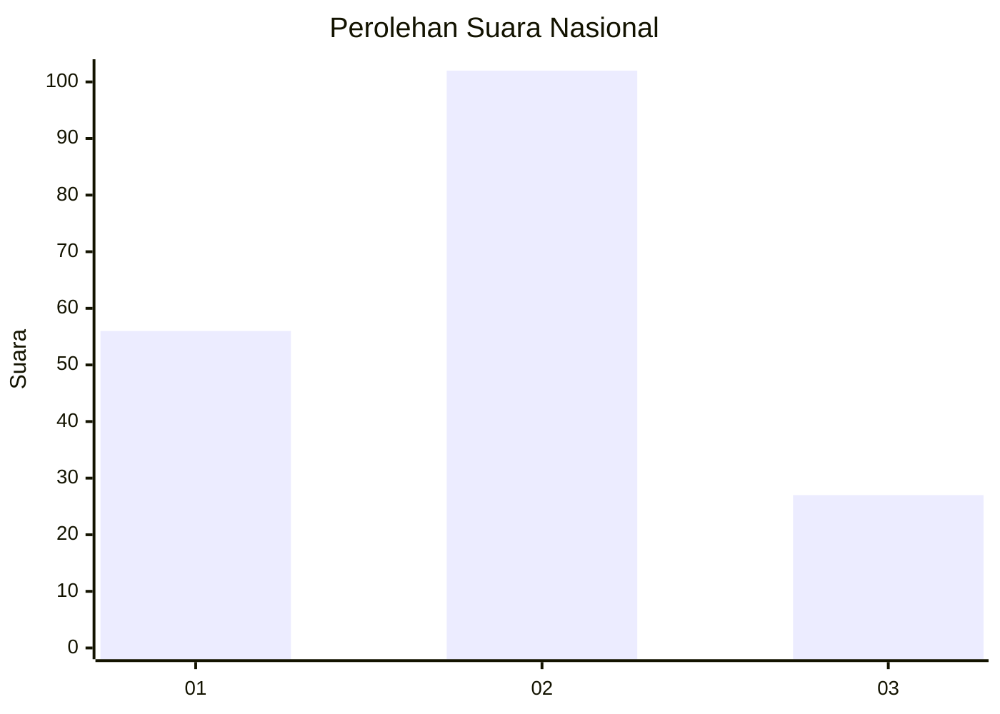
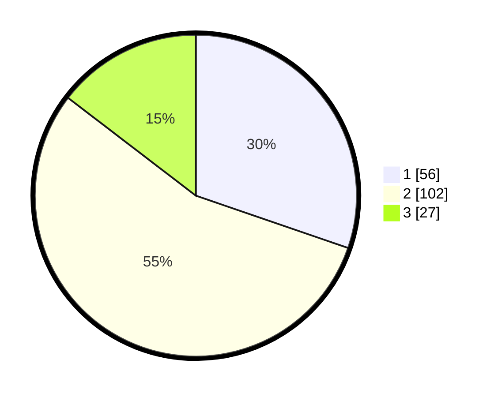

# Hasil

## Grafik

## Tabel

| No.    | Nama Paslon    | Suara | Suara (raw) | Persentase |
|:------ |:-------------- | -----:| -----------:| ----------:|
| 100025 | ANIES MUHAIMIN | 56    | [56][p-1]   | 30,27      |
| 100026 | PRABOWO GIBRAN | 102   | [102][p-2]  | 55,14      |
| 100027 | GANJAR MAHFUD  | 27    | [27][p-3]   | 14,59      |

[p-1]: https://github.com/gigit-pemilu/pemilu-2024/blob/main/pilpres/hitung-suara/sub/31-dki-jakarta/sub/75-jakarta-timur/sub/09-ciracas/sub/1001-ciracas/sub/121-tps/sub/paslon-1.txt
[p-2]: https://github.com/gigit-pemilu/pemilu-2024/blob/main/pilpres/hitung-suara/sub/31-dki-jakarta/sub/75-jakarta-timur/sub/09-ciracas/sub/1001-ciracas/sub/121-tps/sub/paslon-2.txt
[p-3]: https://github.com/gigit-pemilu/pemilu-2024/blob/main/pilpres/hitung-suara/sub/31-dki-jakarta/sub/75-jakarta-timur/sub/09-ciracas/sub/1001-ciracas/sub/121-tps/sub/paslon-3.txt

## Foto C Plano

https://sirekap-obj-formc.kpu.go.id/d57c/pemilu/ppwp/31/75/09/10/01/3175091001121-20240214-225610--0435142e-8c91-46e2-9f72-d9418b776489.jpg

https://sirekap-obj-formc.kpu.go.id/d57c/pemilu/ppwp/31/75/09/10/01/3175091001121-20240214-222631--341c46b8-91b4-47f7-a066-8feba141f1c6.jpg

https://sirekap-obj-formc.kpu.go.id/d57c/pemilu/ppwp/31/75/09/10/01/3175091001121-20240214-222657--13bc69a6-fdf8-40e0-b15d-01f1257969af.jpg

## Metadata

| Key        | Value               |
| ---------- | ------------------- |
| Time Stamp | 2024-02-24 22:31:28 |

