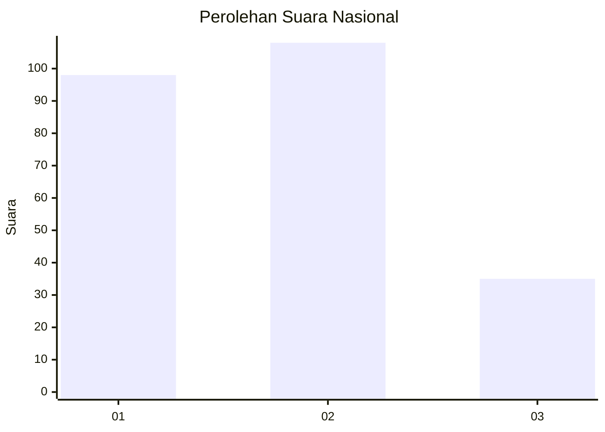
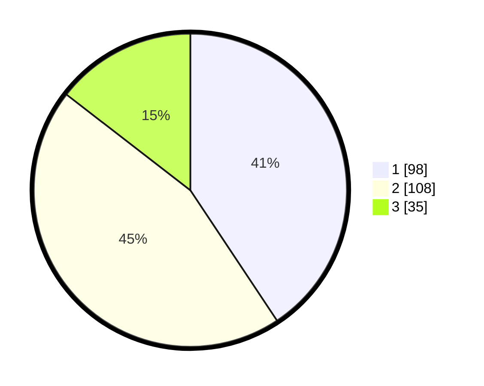

# Hasil

## Grafik

## Tabel

| No.    | Nama Paslon    | Suara | Suara (raw) | Persentase |
|:------ |:-------------- | -----:| -----------:| ----------:|
| 100025 | ANIES MUHAIMIN | 98    | [98][p-1]   | 40,66      |
| 100026 | PRABOWO GIBRAN | 108   | [108][p-2]  | 44,81      |
| 100027 | GANJAR MAHFUD  | 35    | [35][p-3]   | 14,52      |

[p-1]: https://github.com/gigit-pemilu/pemilu-2024/blob/main/pilpres/hitung-suara/sub/31-dki-jakarta/sub/75-jakarta-timur/sub/09-ciracas/sub/1001-ciracas/sub/130-tps/sub/paslon-1.txt
[p-2]: https://github.com/gigit-pemilu/pemilu-2024/blob/main/pilpres/hitung-suara/sub/31-dki-jakarta/sub/75-jakarta-timur/sub/09-ciracas/sub/1001-ciracas/sub/130-tps/sub/paslon-2.txt
[p-3]: https://github.com/gigit-pemilu/pemilu-2024/blob/main/pilpres/hitung-suara/sub/31-dki-jakarta/sub/75-jakarta-timur/sub/09-ciracas/sub/1001-ciracas/sub/130-tps/sub/paslon-3.txt

## Foto C Plano

https://sirekap-obj-formc.kpu.go.id/a73b/pemilu/ppwp/31/75/09/10/01/3175091001130-20240214-203222--15fb14f7-fca9-4a9d-b59f-61669398668d.jpg

https://sirekap-obj-formc.kpu.go.id/a73b/pemilu/ppwp/31/75/09/10/01/3175091001130-20240214-195748--d7749724-3d76-444e-901d-0b6802a5b8c5.jpg

https://sirekap-obj-formc.kpu.go.id/a73b/pemilu/ppwp/31/75/09/10/01/3175091001130-20240214-201550--c760b229-d96f-4b7e-a8ba-959265c7f0b6.jpg

## Metadata

| Key        | Value               |
| ---------- | ------------------- |
| Time Stamp | 2024-02-15 12:00:28 |

