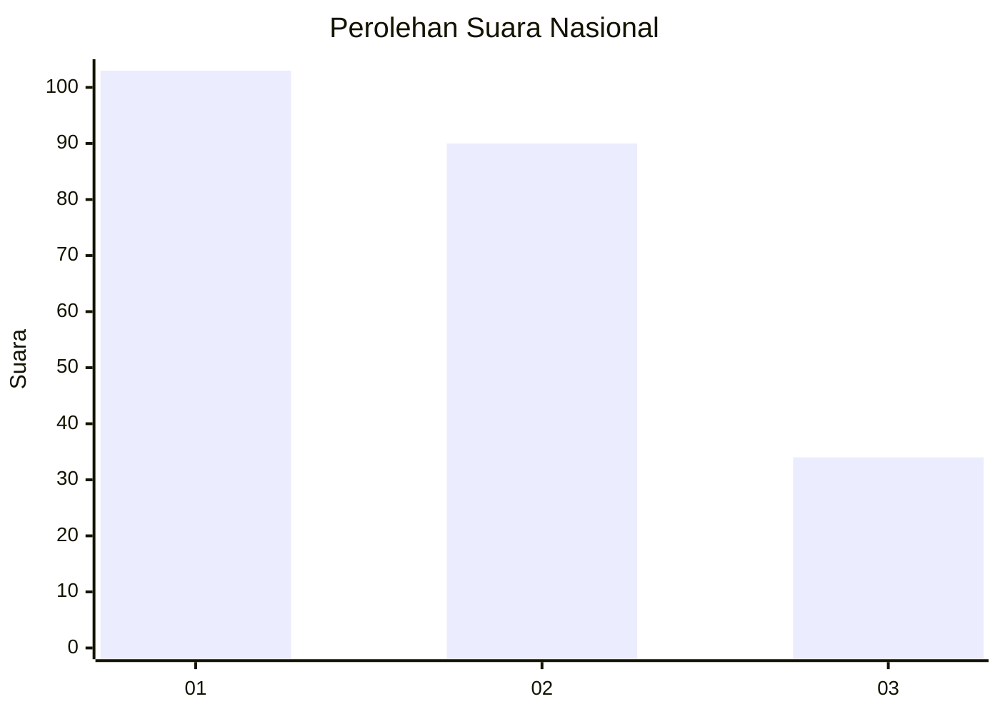
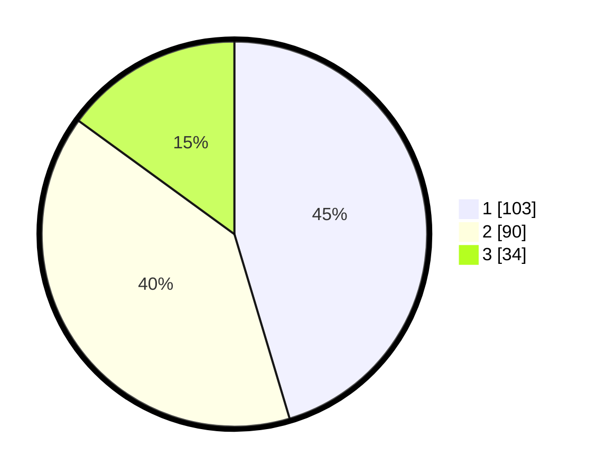

# Hasil

## Grafik

## Tabel

| No.    | Nama Paslon    | Suara | Suara (raw) | Persentase |
|:------ |:-------------- | -----:| -----------:| ----------:|
| 100025 | ANIES MUHAIMIN | 103   | [103][p-1]  | 45,37      |
| 100026 | PRABOWO GIBRAN | 90    | [90][p-2]   | 39,65      |
| 100027 | GANJAR MAHFUD  | 34    | [34][p-3]   | 14,98      |

[p-1]: https://github.com/gigit-pemilu/pemilu-2024/blob/main/pilpres/hitung-suara/sub/31-dki-jakarta/sub/75-jakarta-timur/sub/09-ciracas/sub/1001-ciracas/sub/167-tps/sub/paslon-1.txt
[p-2]: https://github.com/gigit-pemilu/pemilu-2024/blob/main/pilpres/hitung-suara/sub/31-dki-jakarta/sub/75-jakarta-timur/sub/09-ciracas/sub/1001-ciracas/sub/167-tps/sub/paslon-2.txt
[p-3]: https://github.com/gigit-pemilu/pemilu-2024/blob/main/pilpres/hitung-suara/sub/31-dki-jakarta/sub/75-jakarta-timur/sub/09-ciracas/sub/1001-ciracas/sub/167-tps/sub/paslon-3.txt

## Foto C Plano

https://sirekap-obj-formc.kpu.go.id/05f7/pemilu/ppwp/31/75/09/10/01/3175091001167-20240215-173800--55800dac-ba6f-411a-9287-75ff5635205f.jpg

https://sirekap-obj-formc.kpu.go.id/05f7/pemilu/ppwp/31/75/09/10/01/3175091001167-20240215-173928--09ebb47e-982f-4fd1-949a-24107be10d6b.jpg

https://sirekap-obj-formc.kpu.go.id/05f7/pemilu/ppwp/31/75/09/10/01/3175091001167-20240215-174028--fa9fcd41-c688-4ad5-9b95-2af3c58543b2.jpg

## Metadata

| Key        | Value               |
| ---------- | ------------------- |
| Time Stamp | 2024-02-20 12:00:00 |

