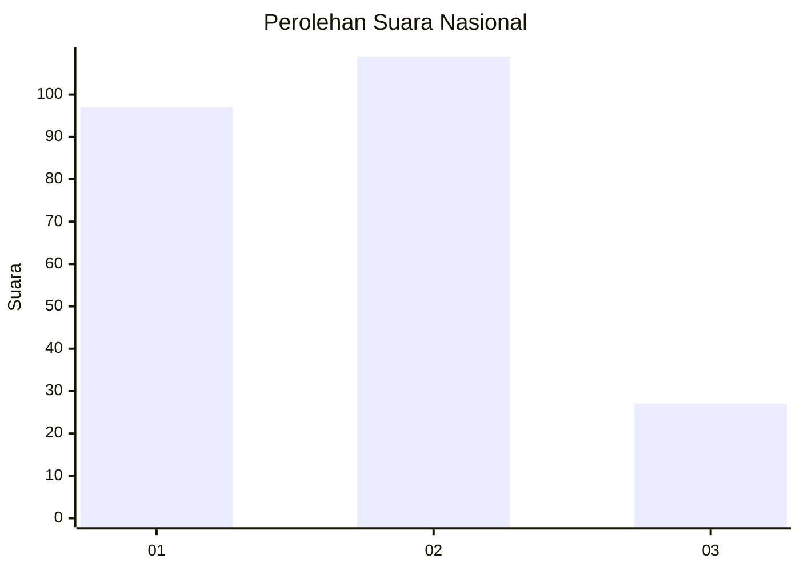
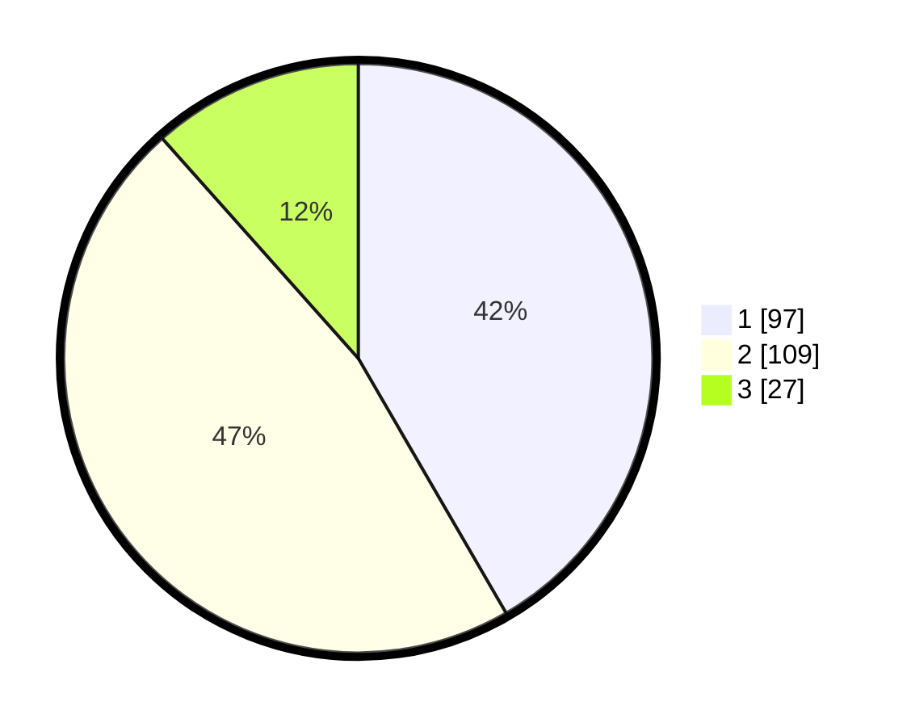

# Hasil

## Grafik

## Tabel

| No.    | Nama Paslon    | Suara | Suara (raw) | Persentase |
|:------ |:-------------- | -----:| -----------:| ----------:|
| 100025 | ANIES MUHAIMIN | 97    | [97][p-1]   | 41,63      |
| 100026 | PRABOWO GIBRAN | 109   | [109][p-2]  | 46,78      |
| 100027 | GANJAR MAHFUD  | 27    | [27][p-3]   | 11,59      |

[p-1]: https://github.com/gigit-pemilu/pemilu-2024/blob/main/pilpres/hitung-suara/sub/31-dki-jakarta/sub/75-jakarta-timur/sub/09-ciracas/sub/1001-ciracas/sub/186-tps/sub/paslon-1.txt
[p-2]: https://github.com/gigit-pemilu/pemilu-2024/blob/main/pilpres/hitung-suara/sub/31-dki-jakarta/sub/75-jakarta-timur/sub/09-ciracas/sub/1001-ciracas/sub/186-tps/sub/paslon-2.txt
[p-3]: https://github.com/gigit-pemilu/pemilu-2024/blob/main/pilpres/hitung-suara/sub/31-dki-jakarta/sub/75-jakarta-timur/sub/09-ciracas/sub/1001-ciracas/sub/186-tps/sub/paslon-3.txt

## Foto C Plano

https://sirekap-obj-formc.kpu.go.id/e508/pemilu/ppwp/31/75/09/10/01/3175091001186-20240215-031907--7b5f30ba-799d-4582-b8b6-c390600b98d9.jpg

https://sirekap-obj-formc.kpu.go.id/e508/pemilu/ppwp/31/75/09/10/01/3175091001186-20240215-032028--e2de49ae-0890-4a83-a8f8-2aa023f80608.jpg

https://sirekap-obj-formc.kpu.go.id/e508/pemilu/ppwp/31/75/09/10/01/3175091001186-20240215-032131--96330800-bd9b-475f-bad7-de5e5871399f.jpg

## Metadata

| Key        | Value               |
| ---------- | ------------------- |
| Time Stamp | 2024-02-24 22:31:28 |

