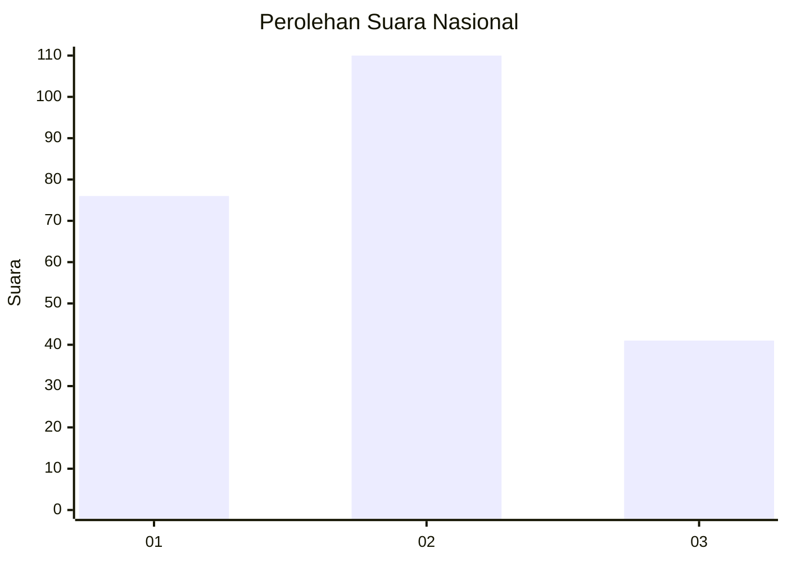
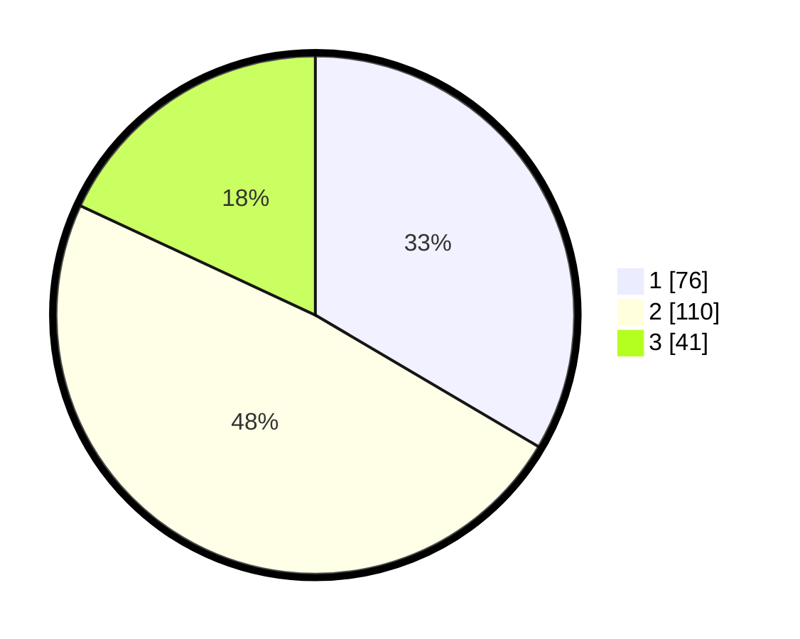

# Hasil

## Grafik

## Tabel

| No.    | Nama Paslon    | Suara | Suara (raw) | Persentase |
|:------ |:-------------- | -----:| -----------:| ----------:|
| 100025 | ANIES MUHAIMIN | 76    | [76][p-1]   | 33,48      |
| 100026 | PRABOWO GIBRAN | 110   | [110][p-2]  | 48,46      |
| 100027 | GANJAR MAHFUD  | 41    | [41][p-3]   | 18,06      |

[p-1]: https://github.com/gigit-pemilu/pemilu-2024/blob/main/pilpres/hitung-suara/sub/31-dki-jakarta/sub/75-jakarta-timur/sub/09-ciracas/sub/1001-ciracas/sub/192-tps/sub/paslon-1.txt
[p-2]: https://github.com/gigit-pemilu/pemilu-2024/blob/main/pilpres/hitung-suara/sub/31-dki-jakarta/sub/75-jakarta-timur/sub/09-ciracas/sub/1001-ciracas/sub/192-tps/sub/paslon-2.txt
[p-3]: https://github.com/gigit-pemilu/pemilu-2024/blob/main/pilpres/hitung-suara/sub/31-dki-jakarta/sub/75-jakarta-timur/sub/09-ciracas/sub/1001-ciracas/sub/192-tps/sub/paslon-3.txt

## Foto C Plano

https://sirekap-obj-formc.kpu.go.id/f70a/pemilu/ppwp/31/75/09/10/01/3175091001192-20240217-022654--66476910-7350-483a-88da-8233ef257048.jpg

https://sirekap-obj-formc.kpu.go.id/f70a/pemilu/ppwp/31/75/09/10/01/3175091001192-20240216-212658--1c8d3606-da49-4a39-b041-c5579128b070.jpg

https://sirekap-obj-formc.kpu.go.id/f70a/pemilu/ppwp/31/75/09/10/01/3175091001192-20240216-213145--ae4a703a-60c3-490e-bd38-31427ac1fb5d.jpg

## Metadata

| Key        | Value               |
| ---------- | ------------------- |
| Time Stamp | 2024-02-19 06:16:00 |

