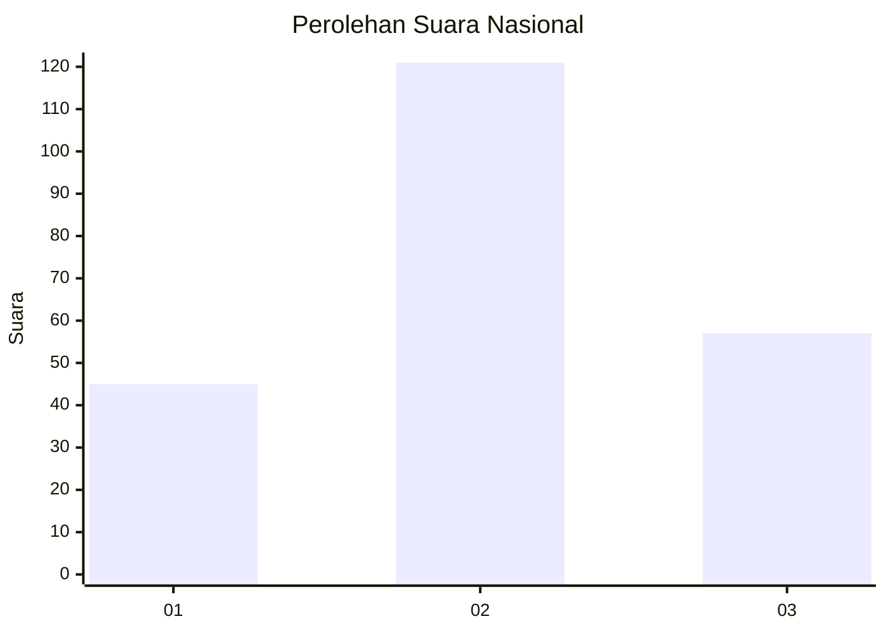
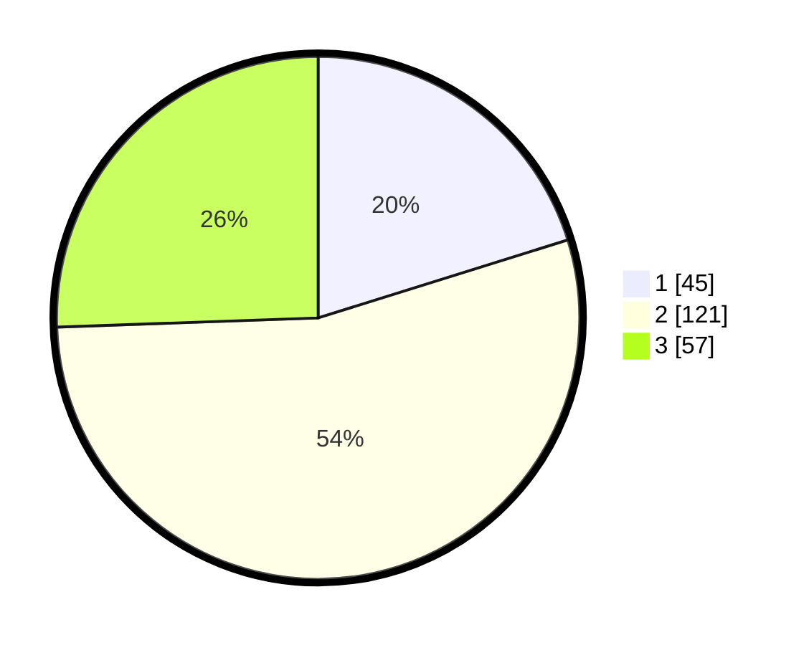

# Hasil

## Grafik

## Tabel

| No.    | Nama Paslon    | Suara | Suara (raw) | Persentase |
|:------ |:-------------- | -----:| -----------:| ----------:|
| 100025 | ANIES MUHAIMIN | 45    | [45][p-1]   | 20,18      |
| 100026 | PRABOWO GIBRAN | 121   | [121][p-2]  | 54,26      |
| 100027 | GANJAR MAHFUD  | 57    | [57][p-3]   | 25,56      |

[p-1]: https://github.com/gigit-pemilu/pemilu-2024/blob/main/pilpres/hitung-suara/sub/31-dki-jakarta/sub/75-jakarta-timur/sub/09-ciracas/sub/1002-cibubur/sub/001-tps/sub/paslon-1.txt
[p-2]: https://github.com/gigit-pemilu/pemilu-2024/blob/main/pilpres/hitung-suara/sub/31-dki-jakarta/sub/75-jakarta-timur/sub/09-ciracas/sub/1002-cibubur/sub/001-tps/sub/paslon-2.txt
[p-3]: https://github.com/gigit-pemilu/pemilu-2024/blob/main/pilpres/hitung-suara/sub/31-dki-jakarta/sub/75-jakarta-timur/sub/09-ciracas/sub/1002-cibubur/sub/001-tps/sub/paslon-3.txt

## Foto C Plano

https://sirekap-obj-formc.kpu.go.id/3f75/pemilu/ppwp/31/75/09/10/02/3175091002001-20240215-001556--231c6dd1-e656-4370-833d-ab15f6021a3e.jpg

https://sirekap-obj-formc.kpu.go.id/3f75/pemilu/ppwp/31/75/09/10/02/3175091002001-20240215-001707--6bb48baf-db34-4d28-9829-80b89158c6d5.jpg

https://sirekap-obj-formc.kpu.go.id/3f75/pemilu/ppwp/31/75/09/10/02/3175091002001-20240215-001916--23b5656b-987f-403e-a2d9-8bdf40102ec3.jpg

## Metadata

| Key        | Value               |
| ---------- | ------------------- |
| Time Stamp | 2024-02-15 20:00:44 |

