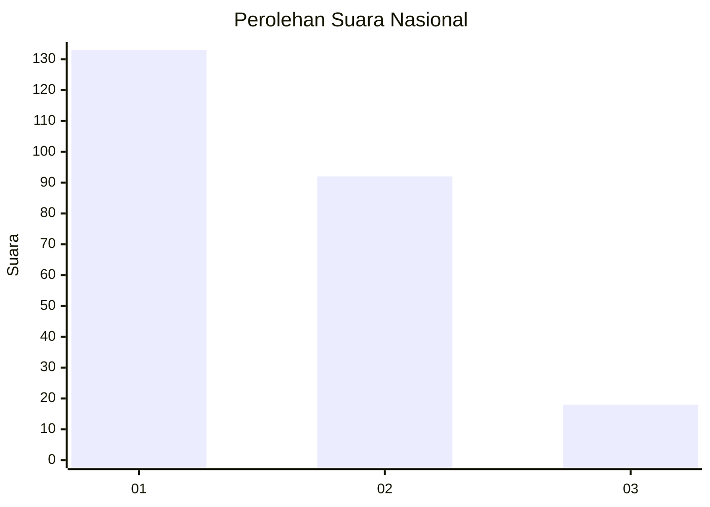
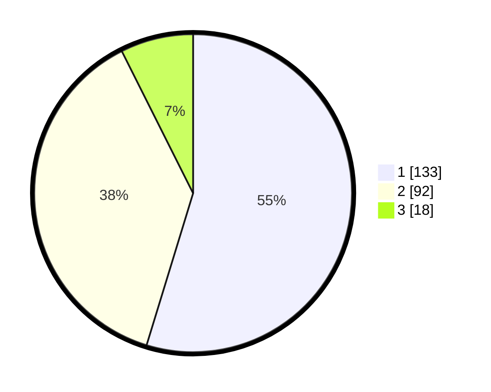

# Hasil

## Grafik

## Tabel

| No.    | Nama Paslon    | Suara | Suara (raw) | Persentase |
|:------ |:-------------- | -----:| -----------:| ----------:|
| 100025 | ANIES MUHAIMIN | 133   | [133][p-1]  | 54,73      |
| 100026 | PRABOWO GIBRAN | 92    | [92][p-2]   | 37,86      |
| 100027 | GANJAR MAHFUD  | 18    | [18][p-3]   | 7,41       |

[p-1]: https://github.com/gigit-pemilu/pemilu-2024/blob/main/pilpres/hitung-suara/sub/31-dki-jakarta/sub/75-jakarta-timur/sub/09-ciracas/sub/1002-cibubur/sub/026-tps/sub/paslon-1.txt
[p-2]: https://github.com/gigit-pemilu/pemilu-2024/blob/main/pilpres/hitung-suara/sub/31-dki-jakarta/sub/75-jakarta-timur/sub/09-ciracas/sub/1002-cibubur/sub/026-tps/sub/paslon-2.txt
[p-3]: https://github.com/gigit-pemilu/pemilu-2024/blob/main/pilpres/hitung-suara/sub/31-dki-jakarta/sub/75-jakarta-timur/sub/09-ciracas/sub/1002-cibubur/sub/026-tps/sub/paslon-3.txt

## Foto C Plano

https://sirekap-obj-formc.kpu.go.id/301c/pemilu/ppwp/31/75/09/10/02/3175091002026-20240214-234933--64ef27d5-ff89-4ce2-a4b8-be4e8a041a15.jpg

https://sirekap-obj-formc.kpu.go.id/301c/pemilu/ppwp/31/75/09/10/02/3175091002026-20240214-235021--8df6d557-bed1-4986-aeef-948bc5da187b.jpg

https://sirekap-obj-formc.kpu.go.id/301c/pemilu/ppwp/31/75/09/10/02/3175091002026-20240214-235142--03e0beac-7f2f-4473-8731-11edbb2964bf.jpg

## Metadata

| Key        | Value               |
| ---------- | ------------------- |
| Time Stamp | 2024-02-15 17:30:25 |

