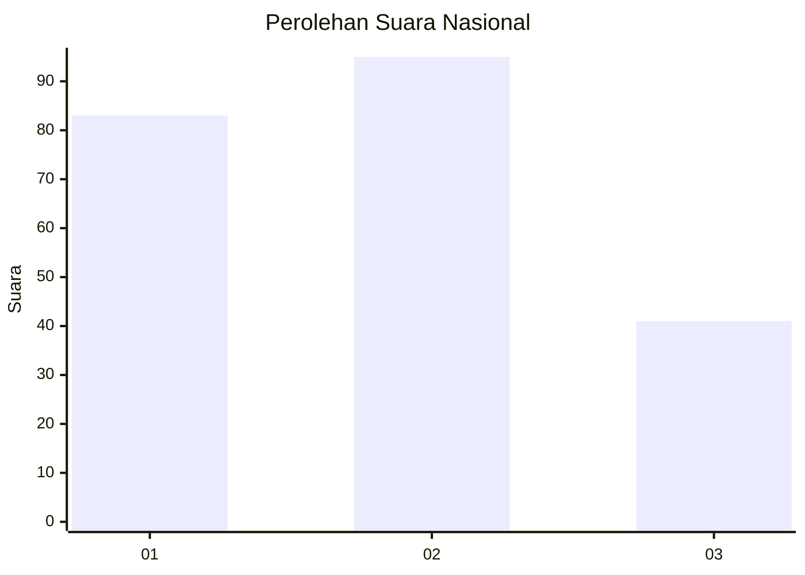
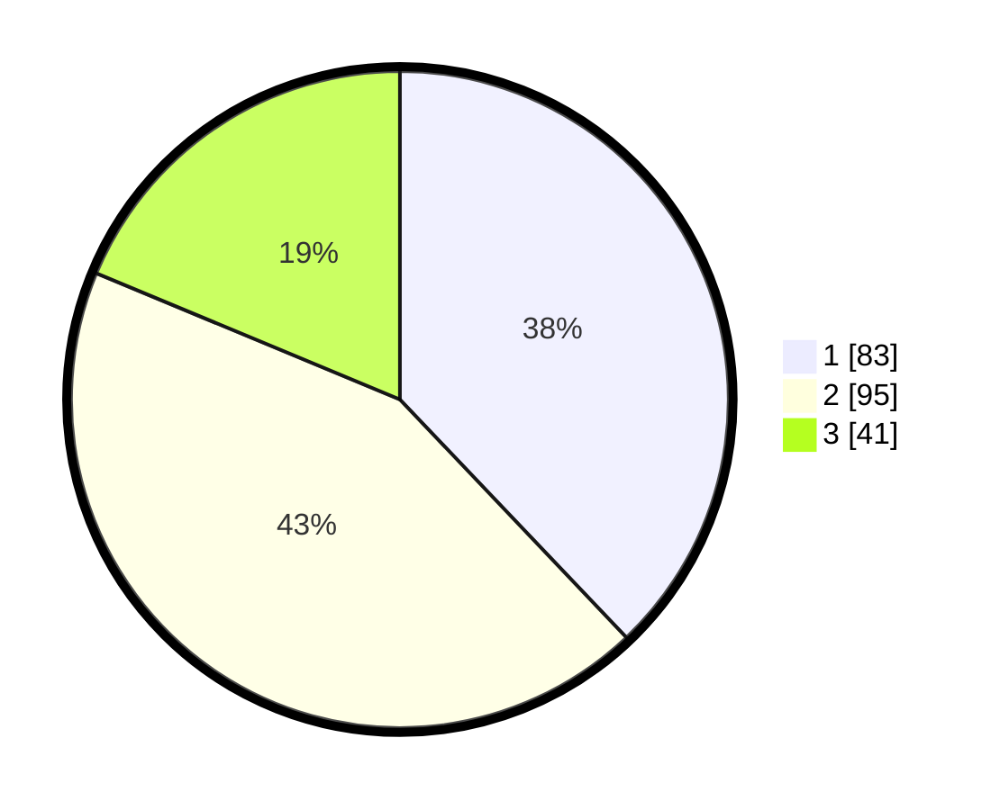

# Hasil

## Grafik

## Tabel

| No.    | Nama Paslon    | Suara | Suara (raw) | Persentase |
|:------ |:-------------- | -----:| -----------:| ----------:|
| 100025 | ANIES MUHAIMIN | 83    | [83][p-1]   | 37,90      |
| 100026 | PRABOWO GIBRAN | 95    | [95][p-2]   | 43,38      |
| 100027 | GANJAR MAHFUD  | 41    | [41][p-3]   | 18,72      |

[p-1]: https://github.com/gigit-pemilu/pemilu-2024/blob/main/pilpres/hitung-suara/sub/31-dki-jakarta/sub/75-jakarta-timur/sub/09-ciracas/sub/1002-cibubur/sub/027-tps/sub/paslon-1.txt
[p-2]: https://github.com/gigit-pemilu/pemilu-2024/blob/main/pilpres/hitung-suara/sub/31-dki-jakarta/sub/75-jakarta-timur/sub/09-ciracas/sub/1002-cibubur/sub/027-tps/sub/paslon-2.txt
[p-3]: https://github.com/gigit-pemilu/pemilu-2024/blob/main/pilpres/hitung-suara/sub/31-dki-jakarta/sub/75-jakarta-timur/sub/09-ciracas/sub/1002-cibubur/sub/027-tps/sub/paslon-3.txt

## Foto C Plano

https://sirekap-obj-formc.kpu.go.id/1750/pemilu/ppwp/31/75/09/10/02/3175091002027-20240214-222240--3ef98e6d-15fc-44b1-95e6-7764293d1490.jpg

https://sirekap-obj-formc.kpu.go.id/1750/pemilu/ppwp/31/75/09/10/02/3175091002027-20240214-222308--d47f525f-e7fd-4ecc-9a45-bd3ebbfc74bb.jpg

https://sirekap-obj-formc.kpu.go.id/1750/pemilu/ppwp/31/75/09/10/02/3175091002027-20240214-222334--8cdfa73d-9b34-49d7-9049-f6d01bdcb5a3.jpg

## Metadata

| Key        | Value               |
| ---------- | ------------------- |
| Time Stamp | 2024-02-25 11:00:00 |

