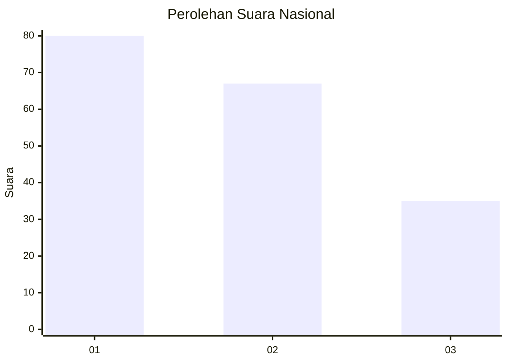
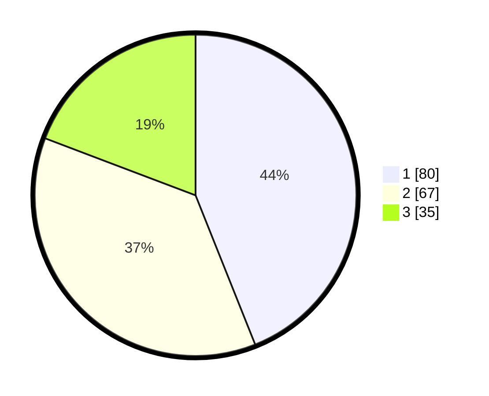

# Hasil

## Grafik

## Tabel

| No.    | Nama Paslon    | Suara | Suara (raw) | Persentase |
|:------ |:-------------- | -----:| -----------:| ----------:|
| 100025 | ANIES MUHAIMIN | 80    | [80][p-1]   | 43,96      |
| 100026 | PRABOWO GIBRAN | 67    | [67][p-2]   | 36,81      |
| 100027 | GANJAR MAHFUD  | 35    | [35][p-3]   | 19,23      |

[p-1]: https://github.com/gigit-pemilu/pemilu-2024/blob/main/pilpres/hitung-suara/sub/31-dki-jakarta/sub/75-jakarta-timur/sub/09-ciracas/sub/1002-cibubur/sub/047-tps/sub/paslon-1.txt
[p-2]: https://github.com/gigit-pemilu/pemilu-2024/blob/main/pilpres/hitung-suara/sub/31-dki-jakarta/sub/75-jakarta-timur/sub/09-ciracas/sub/1002-cibubur/sub/047-tps/sub/paslon-2.txt
[p-3]: https://github.com/gigit-pemilu/pemilu-2024/blob/main/pilpres/hitung-suara/sub/31-dki-jakarta/sub/75-jakarta-timur/sub/09-ciracas/sub/1002-cibubur/sub/047-tps/sub/paslon-3.txt

## Foto C Plano

https://sirekap-obj-formc.kpu.go.id/3508/pemilu/ppwp/31/75/09/10/02/3175091002047-20240214-230155--a1cb7481-81e5-4751-9117-3d732796ec77.jpg

https://sirekap-obj-formc.kpu.go.id/3508/pemilu/ppwp/31/75/09/10/02/3175091002047-20240214-184511--2cfec06c-8dad-49fa-bd16-3fad0b1f2009.jpg

https://sirekap-obj-formc.kpu.go.id/3508/pemilu/ppwp/31/75/09/10/02/3175091002047-20240214-184748--35884f37-3125-476d-a140-8f7aa5632664.jpg

## Metadata

| Key        | Value               |
| ---------- | ------------------- |
| Time Stamp | 2024-02-15 15:00:29 |

