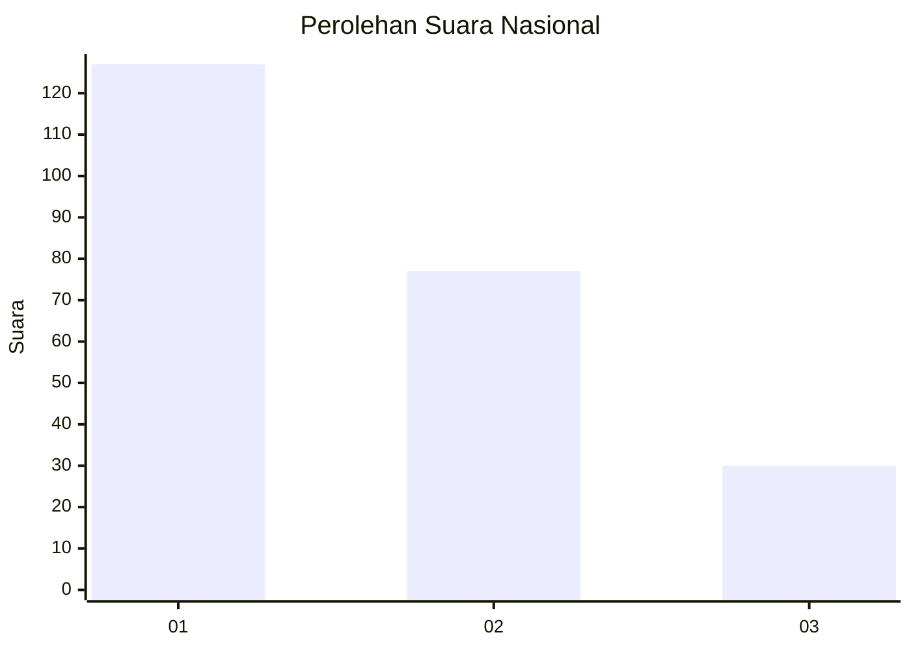
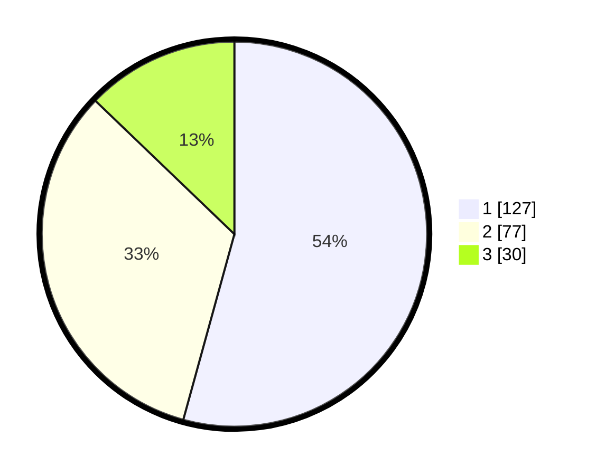

# Hasil

## Grafik

## Tabel

| No.    | Nama Paslon    | Suara | Suara (raw) | Persentase |
|:------ |:-------------- | -----:| -----------:| ----------:|
| 100025 | ANIES MUHAIMIN | 127   | [127][p-1]  | 54,27      |
| 100026 | PRABOWO GIBRAN | 77    | [77][p-2]   | 32,91      |
| 100027 | GANJAR MAHFUD  | 30    | [30][p-3]   | 12,82      |

[p-1]: https://github.com/gigit-pemilu/pemilu-2024/blob/main/pilpres/hitung-suara/sub/31-dki-jakarta/sub/75-jakarta-timur/sub/09-ciracas/sub/1002-cibubur/sub/060-tps/sub/paslon-1.txt
[p-2]: https://github.com/gigit-pemilu/pemilu-2024/blob/main/pilpres/hitung-suara/sub/31-dki-jakarta/sub/75-jakarta-timur/sub/09-ciracas/sub/1002-cibubur/sub/060-tps/sub/paslon-2.txt
[p-3]: https://github.com/gigit-pemilu/pemilu-2024/blob/main/pilpres/hitung-suara/sub/31-dki-jakarta/sub/75-jakarta-timur/sub/09-ciracas/sub/1002-cibubur/sub/060-tps/sub/paslon-3.txt

## Foto C Plano

https://sirekap-obj-formc.kpu.go.id/e777/pemilu/ppwp/31/75/09/10/02/3175091002060-20240214-230136--8bd581e7-5ae6-4b1a-a626-6f457d59f94a.jpg

https://sirekap-obj-formc.kpu.go.id/e777/pemilu/ppwp/31/75/09/10/02/3175091002060-20240214-230300--f9e69845-4291-47f0-a0b3-8e7d4d02b56d.jpg

https://sirekap-obj-formc.kpu.go.id/e777/pemilu/ppwp/31/75/09/10/02/3175091002060-20240214-230444--3fb1d757-92cd-433f-9b4b-26cc2d2b68c3.jpg

## Metadata

| Key        | Value               |
| ---------- | ------------------- |
| Time Stamp | 2024-02-24 22:31:28 |

