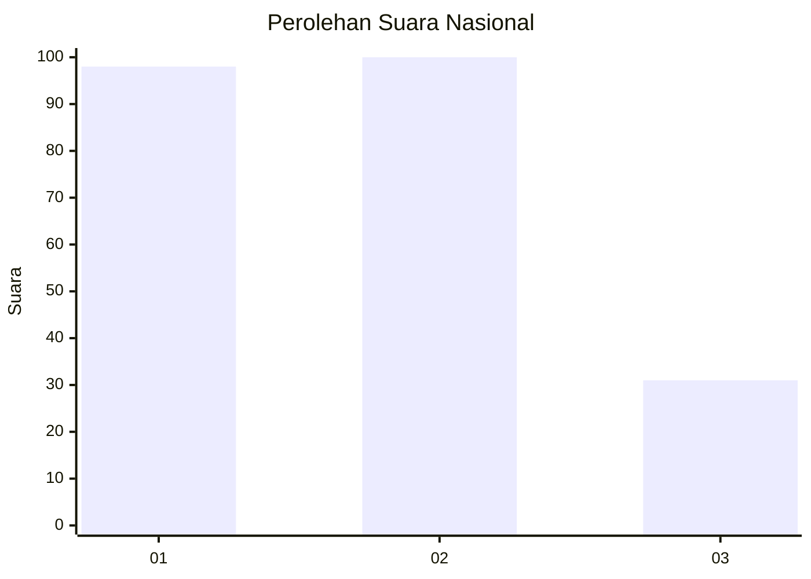
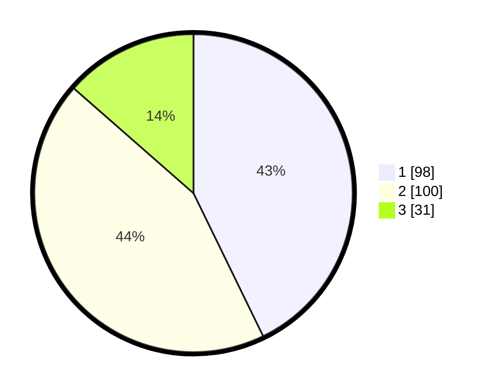

# Hasil

## Grafik

## Tabel

| No.    | Nama Paslon    | Suara | Suara (raw) | Persentase |
|:------ |:-------------- | -----:| -----------:| ----------:|
| 100025 | ANIES MUHAIMIN | 98    | [98][p-1]   | 42,79      |
| 100026 | PRABOWO GIBRAN | 100   | [100][p-2]  | 43,67      |
| 100027 | GANJAR MAHFUD  | 31    | [31][p-3]   | 13,54      |

[p-1]: https://github.com/gigit-pemilu/pemilu-2024/blob/main/pilpres/hitung-suara/sub/31-dki-jakarta/sub/75-jakarta-timur/sub/09-ciracas/sub/1002-cibubur/sub/065-tps/sub/paslon-1.txt
[p-2]: https://github.com/gigit-pemilu/pemilu-2024/blob/main/pilpres/hitung-suara/sub/31-dki-jakarta/sub/75-jakarta-timur/sub/09-ciracas/sub/1002-cibubur/sub/065-tps/sub/paslon-2.txt
[p-3]: https://github.com/gigit-pemilu/pemilu-2024/blob/main/pilpres/hitung-suara/sub/31-dki-jakarta/sub/75-jakarta-timur/sub/09-ciracas/sub/1002-cibubur/sub/065-tps/sub/paslon-3.txt

## Foto C Plano

https://sirekap-obj-formc.kpu.go.id/675e/pemilu/ppwp/31/75/09/10/02/3175091002065-20240216-141936--3f8861c6-ab43-4aa8-91f6-8caed1936ea5.jpg

https://sirekap-obj-formc.kpu.go.id/675e/pemilu/ppwp/31/75/09/10/02/3175091002065-20240216-142357--dfe36e9e-c094-4df2-bd42-f04dbf52d9f4.jpg

https://sirekap-obj-formc.kpu.go.id/675e/pemilu/ppwp/31/75/09/10/02/3175091002065-20240214-205422--c7d85d23-930b-4ca0-9644-ebf86e42fca7.jpg

## Metadata

| Key        | Value               |
| ---------- | ------------------- |
| Time Stamp | 2024-02-20 12:00:00 |

