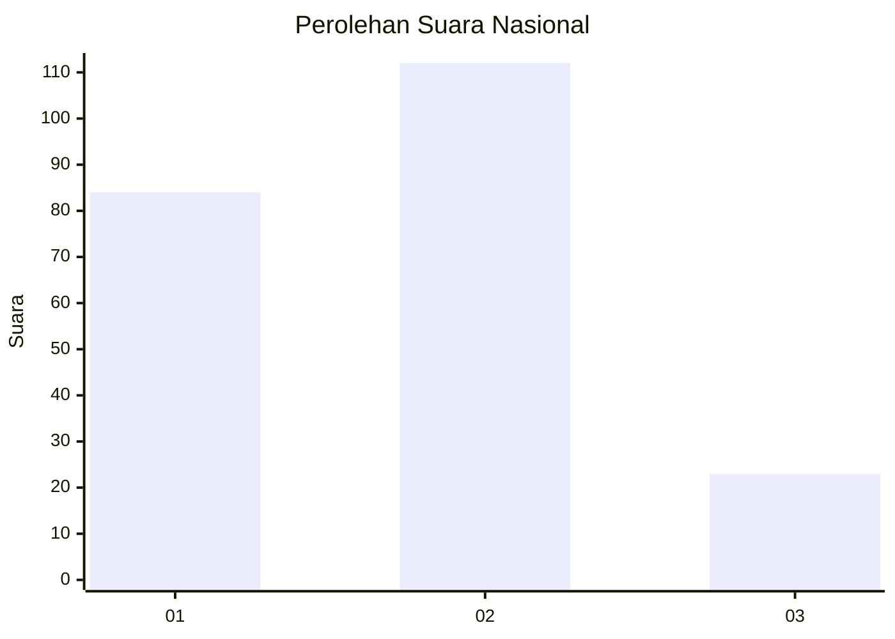
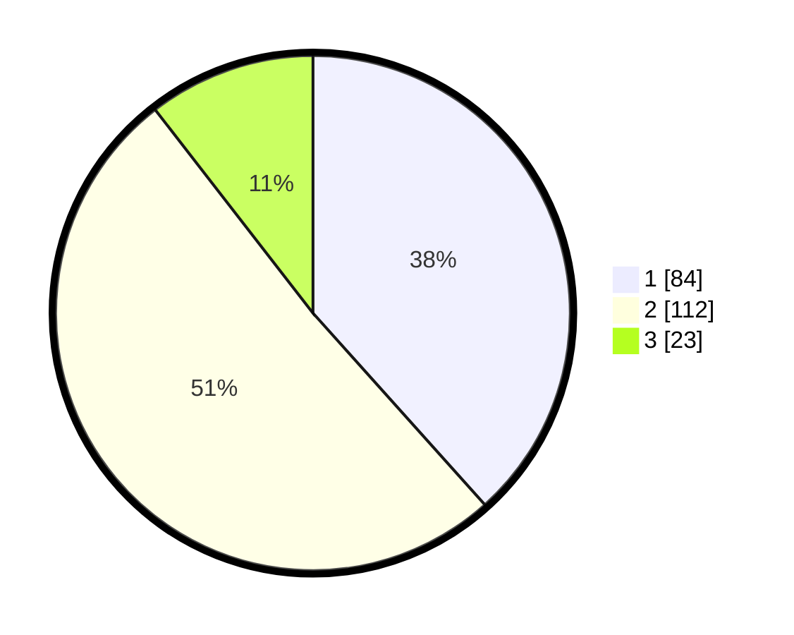

# Hasil

## Grafik

## Tabel

| No.    | Nama Paslon    | Suara | Suara (raw) | Persentase |
|:------ |:-------------- | -----:| -----------:| ----------:|
| 100025 | ANIES MUHAIMIN | 84    | [84][p-1]   | 38,36      |
| 100026 | PRABOWO GIBRAN | 112   | [112][p-2]  | 51,14      |
| 100027 | GANJAR MAHFUD  | 23    | [23][p-3]   | 10,50      |

[p-1]: https://github.com/gigit-pemilu/pemilu-2024/blob/main/pilpres/hitung-suara/sub/31-dki-jakarta/sub/75-jakarta-timur/sub/09-ciracas/sub/1002-cibubur/sub/067-tps/sub/paslon-1.txt
[p-2]: https://github.com/gigit-pemilu/pemilu-2024/blob/main/pilpres/hitung-suara/sub/31-dki-jakarta/sub/75-jakarta-timur/sub/09-ciracas/sub/1002-cibubur/sub/067-tps/sub/paslon-2.txt
[p-3]: https://github.com/gigit-pemilu/pemilu-2024/blob/main/pilpres/hitung-suara/sub/31-dki-jakarta/sub/75-jakarta-timur/sub/09-ciracas/sub/1002-cibubur/sub/067-tps/sub/paslon-3.txt

## Foto C Plano

https://sirekap-obj-formc.kpu.go.id/b1ff/pemilu/ppwp/31/75/09/10/02/3175091002067-20240214-195549--f574e5fe-b2d9-45ef-a5c4-3b9a81ee5e48.jpg

https://sirekap-obj-formc.kpu.go.id/b1ff/pemilu/ppwp/31/75/09/10/02/3175091002067-20240214-155005--9e72337e-98b5-4072-bd8f-fb51444ad365.jpg

https://sirekap-obj-formc.kpu.go.id/b1ff/pemilu/ppwp/31/75/09/10/02/3175091002067-20240214-155742--c803a85b-7a67-4344-bf8c-5312ea957d8f.jpg

## Metadata

| Key        | Value               |
| ---------- | ------------------- |
| Time Stamp | 2024-02-14 21:46:01 |

