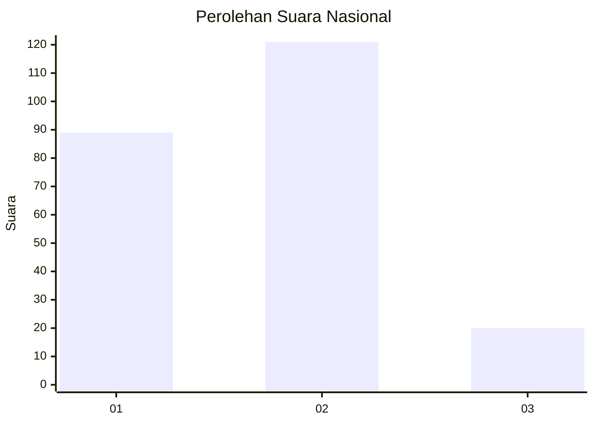
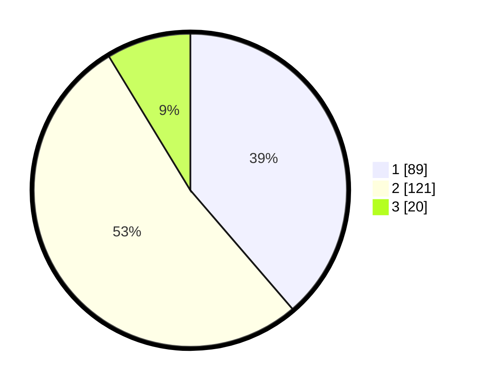

# Hasil

## Grafik

## Tabel

| No.    | Nama Paslon    | Suara | Suara (raw) | Persentase |
|:------ |:-------------- | -----:| -----------:| ----------:|
| 100025 | ANIES MUHAIMIN | 89    | [89][p-1]   | 38,70      |
| 100026 | PRABOWO GIBRAN | 121   | [121][p-2]  | 52,61      |
| 100027 | GANJAR MAHFUD  | 20    | [20][p-3]   | 8,70       |

[p-1]: https://github.com/gigit-pemilu/pemilu-2024/blob/main/pilpres/hitung-suara/sub/31-dki-jakarta/sub/75-jakarta-timur/sub/09-ciracas/sub/1002-cibubur/sub/069-tps/sub/paslon-1.txt
[p-2]: https://github.com/gigit-pemilu/pemilu-2024/blob/main/pilpres/hitung-suara/sub/31-dki-jakarta/sub/75-jakarta-timur/sub/09-ciracas/sub/1002-cibubur/sub/069-tps/sub/paslon-2.txt
[p-3]: https://github.com/gigit-pemilu/pemilu-2024/blob/main/pilpres/hitung-suara/sub/31-dki-jakarta/sub/75-jakarta-timur/sub/09-ciracas/sub/1002-cibubur/sub/069-tps/sub/paslon-3.txt

## Foto C Plano

https://sirekap-obj-formc.kpu.go.id/ab32/pemilu/ppwp/31/75/09/10/02/3175091002069-20240214-214256--d8ea125a-45dd-439d-8861-ff7dcf4459ac.jpg

https://sirekap-obj-formc.kpu.go.id/ab32/pemilu/ppwp/31/75/09/10/02/3175091002069-20240214-224458--312ea440-263e-48af-a269-e9f254a3f73b.jpg

https://sirekap-obj-formc.kpu.go.id/ab32/pemilu/ppwp/31/75/09/10/02/3175091002069-20240214-224306--bff5d3a0-81f0-4b5b-8171-c84f1193f655.jpg

## Metadata

| Key        | Value               |
| ---------- | ------------------- |
| Time Stamp | 2024-02-20 15:00:00 |

