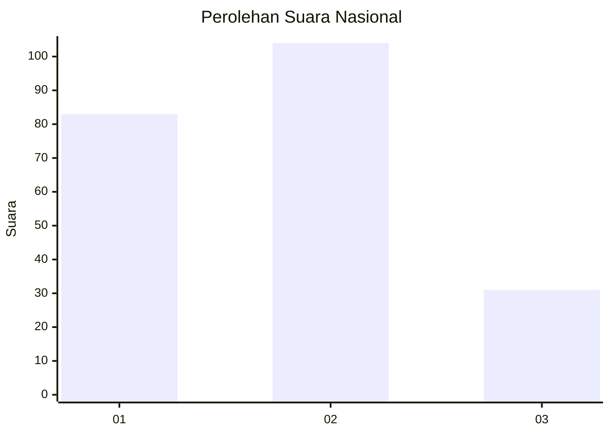
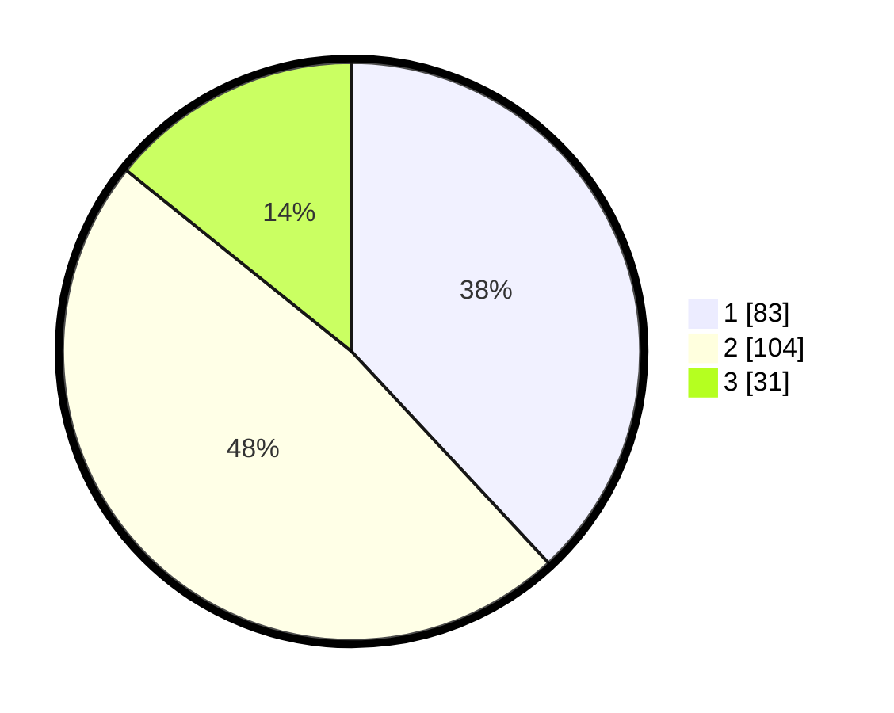

# Hasil

## Grafik

## Tabel

| No.    | Nama Paslon    | Suara | Suara (raw) | Persentase |
|:------ |:-------------- | -----:| -----------:| ----------:|
| 100025 | ANIES MUHAIMIN | 83    | [83][p-1]   | 38,07      |
| 100026 | PRABOWO GIBRAN | 104   | [104][p-2]  | 47,71      |
| 100027 | GANJAR MAHFUD  | 31    | [31][p-3]   | 14,22      |

[p-1]: https://github.com/gigit-pemilu/pemilu-2024/blob/main/pilpres/hitung-suara/sub/31-dki-jakarta/sub/75-jakarta-timur/sub/09-ciracas/sub/1002-cibubur/sub/070-tps/sub/paslon-1.txt
[p-2]: https://github.com/gigit-pemilu/pemilu-2024/blob/main/pilpres/hitung-suara/sub/31-dki-jakarta/sub/75-jakarta-timur/sub/09-ciracas/sub/1002-cibubur/sub/070-tps/sub/paslon-2.txt
[p-3]: https://github.com/gigit-pemilu/pemilu-2024/blob/main/pilpres/hitung-suara/sub/31-dki-jakarta/sub/75-jakarta-timur/sub/09-ciracas/sub/1002-cibubur/sub/070-tps/sub/paslon-3.txt

## Foto C Plano

https://sirekap-obj-formc.kpu.go.id/cd43/pemilu/ppwp/31/75/09/10/02/3175091002070-20240214-155850--6c127151-8f6f-43d1-a1bf-65aa99a5ceb0.jpg

https://sirekap-obj-formc.kpu.go.id/cd43/pemilu/ppwp/31/75/09/10/02/3175091002070-20240214-160101--22685f97-5f41-4368-bfe5-ab758c1646ea.jpg

https://sirekap-obj-formc.kpu.go.id/cd43/pemilu/ppwp/31/75/09/10/02/3175091002070-20240214-160118--797df58e-fb15-45f3-b5f4-95c7e815d55a.jpg

## Metadata

| Key        | Value               |
| ---------- | ------------------- |
| Time Stamp | 2024-02-24 22:31:28 |

