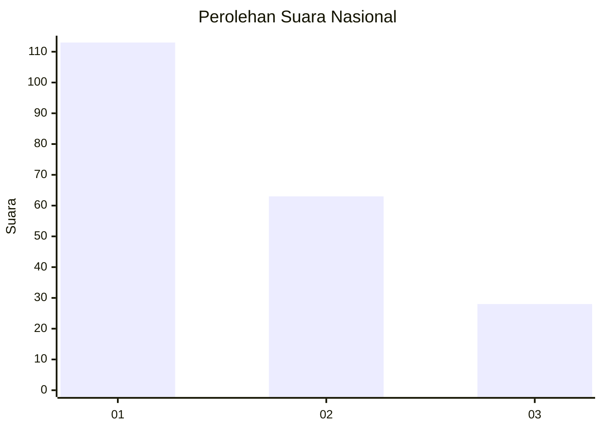
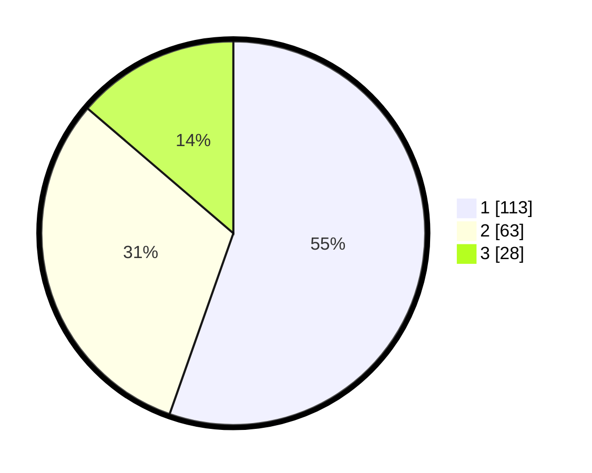

# Hasil

## Grafik

## Tabel

| No.    | Nama Paslon    | Suara | Suara (raw) | Persentase |
|:------ |:-------------- | -----:| -----------:| ----------:|
| 100025 | ANIES MUHAIMIN | 113   | [113][p-1]  | 55,39      |
| 100026 | PRABOWO GIBRAN | 63    | [63][p-2]   | 30,88      |
| 100027 | GANJAR MAHFUD  | 28    | [28][p-3]   | 13,73      |

[p-1]: https://github.com/gigit-pemilu/pemilu-2024/blob/main/pilpres/hitung-suara/sub/31-dki-jakarta/sub/75-jakarta-timur/sub/09-ciracas/sub/1002-cibubur/sub/075-tps/sub/paslon-1.txt
[p-2]: https://github.com/gigit-pemilu/pemilu-2024/blob/main/pilpres/hitung-suara/sub/31-dki-jakarta/sub/75-jakarta-timur/sub/09-ciracas/sub/1002-cibubur/sub/075-tps/sub/paslon-2.txt
[p-3]: https://github.com/gigit-pemilu/pemilu-2024/blob/main/pilpres/hitung-suara/sub/31-dki-jakarta/sub/75-jakarta-timur/sub/09-ciracas/sub/1002-cibubur/sub/075-tps/sub/paslon-3.txt

## Foto C Plano

https://sirekap-obj-formc.kpu.go.id/022d/pemilu/ppwp/31/75/09/10/02/3175091002075-20240214-225541--9dd84431-a475-42ac-aa31-1dd4770753c4.jpg

https://sirekap-obj-formc.kpu.go.id/022d/pemilu/ppwp/31/75/09/10/02/3175091002075-20240214-225617--40111ae0-c773-472c-bfd7-abe3991571b5.jpg

https://sirekap-obj-formc.kpu.go.id/022d/pemilu/ppwp/31/75/09/10/02/3175091002075-20240214-225647--071cdc1b-b208-4e12-b119-5b7c16643169.jpg

## Metadata

| Key        | Value               |
| ---------- | ------------------- |
| Time Stamp | 2024-02-24 22:31:28 |

