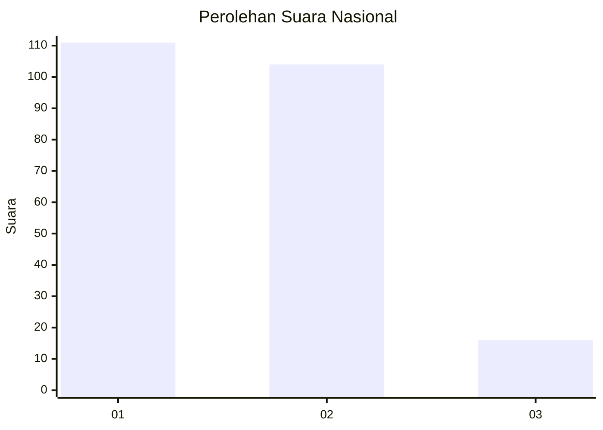
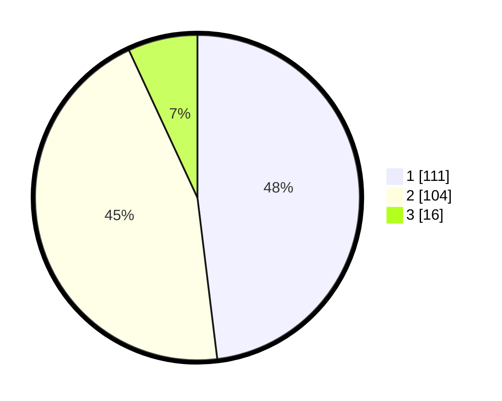

# Hasil

## Grafik

## Tabel

| No.    | Nama Paslon    | Suara | Suara (raw) | Persentase |
|:------ |:-------------- | -----:| -----------:| ----------:|
| 100025 | ANIES MUHAIMIN | 111   | [111][p-1]  | 48,05      |
| 100026 | PRABOWO GIBRAN | 104   | [104][p-2]  | 45,02      |
| 100027 | GANJAR MAHFUD  | 16    | [16][p-3]   | 6,93       |

[p-1]: https://github.com/gigit-pemilu/pemilu-2024/blob/main/pilpres/hitung-suara/sub/31-dki-jakarta/sub/75-jakarta-timur/sub/09-ciracas/sub/1002-cibubur/sub/093-tps/sub/paslon-1.txt
[p-2]: https://github.com/gigit-pemilu/pemilu-2024/blob/main/pilpres/hitung-suara/sub/31-dki-jakarta/sub/75-jakarta-timur/sub/09-ciracas/sub/1002-cibubur/sub/093-tps/sub/paslon-2.txt
[p-3]: https://github.com/gigit-pemilu/pemilu-2024/blob/main/pilpres/hitung-suara/sub/31-dki-jakarta/sub/75-jakarta-timur/sub/09-ciracas/sub/1002-cibubur/sub/093-tps/sub/paslon-3.txt

## Foto C Plano

https://sirekap-obj-formc.kpu.go.id/30f9/pemilu/ppwp/31/75/09/10/02/3175091002093-20240214-155302--0d32f3c4-79bd-440b-b1c0-5681a7cd3bb2.jpg

https://sirekap-obj-formc.kpu.go.id/30f9/pemilu/ppwp/31/75/09/10/02/3175091002093-20240214-155028--f0f12713-9538-47c1-a494-4eb1d85ced39.jpg

https://sirekap-obj-formc.kpu.go.id/30f9/pemilu/ppwp/31/75/09/10/02/3175091002093-20240214-155459--e9645bc2-1c13-453c-80c2-9f24ed811b1b.jpg

## Metadata

| Key        | Value               |
| ---------- | ------------------- |
| Time Stamp | 2024-02-25 12:00:00 |

