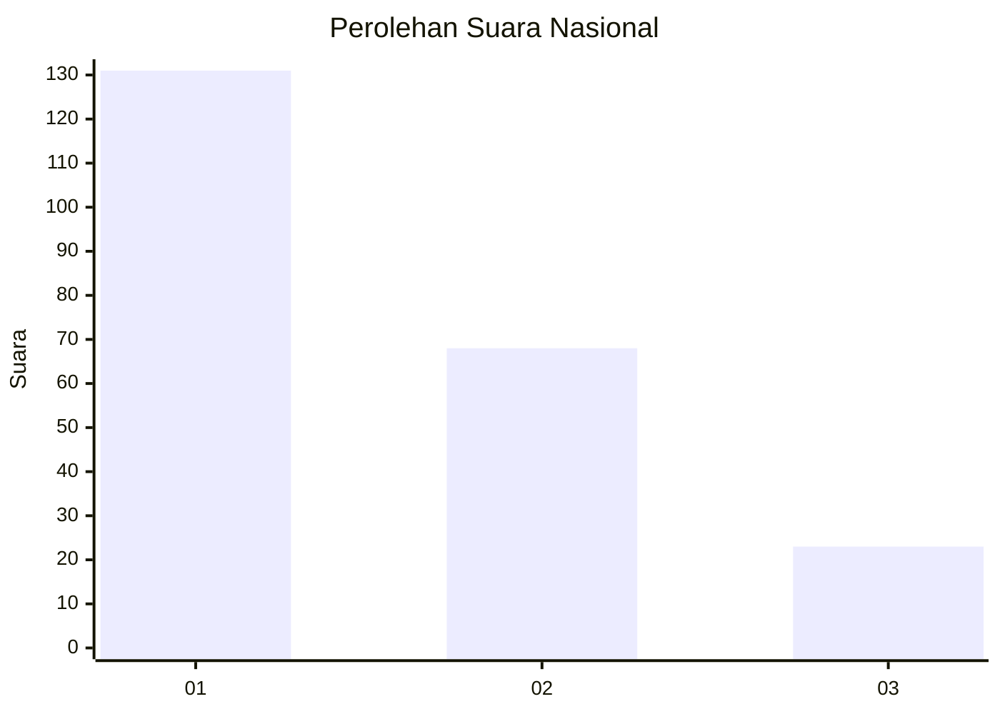
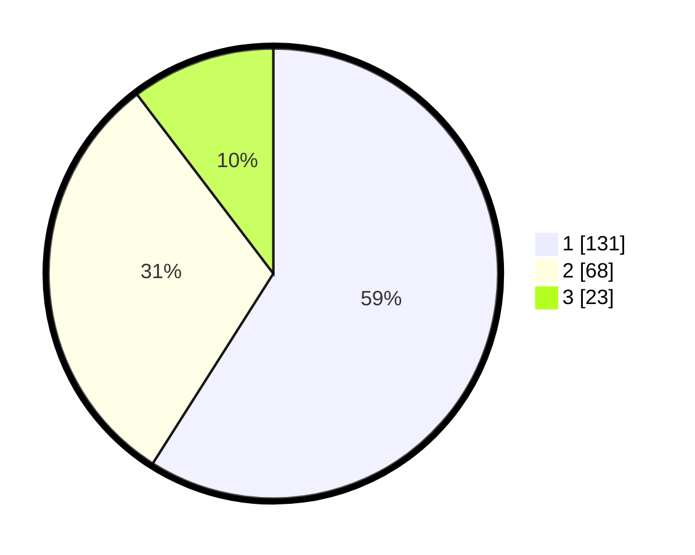

# Hasil

## Grafik

## Tabel

| No.    | Nama Paslon    | Suara | Suara (raw) | Persentase |
|:------ |:-------------- | -----:| -----------:| ----------:|
| 100025 | ANIES MUHAIMIN | 131   | [131][p-1]  | 59,01      |
| 100026 | PRABOWO GIBRAN | 68    | [68][p-2]   | 30,63      |
| 100027 | GANJAR MAHFUD  | 23    | [23][p-3]   | 10,36      |

[p-1]: https://github.com/gigit-pemilu/pemilu-2024/blob/main/pilpres/hitung-suara/sub/31-dki-jakarta/sub/75-jakarta-timur/sub/09-ciracas/sub/1002-cibubur/sub/099-tps/sub/paslon-1.txt
[p-2]: https://github.com/gigit-pemilu/pemilu-2024/blob/main/pilpres/hitung-suara/sub/31-dki-jakarta/sub/75-jakarta-timur/sub/09-ciracas/sub/1002-cibubur/sub/099-tps/sub/paslon-2.txt
[p-3]: https://github.com/gigit-pemilu/pemilu-2024/blob/main/pilpres/hitung-suara/sub/31-dki-jakarta/sub/75-jakarta-timur/sub/09-ciracas/sub/1002-cibubur/sub/099-tps/sub/paslon-3.txt

## Foto C Plano

https://sirekap-obj-formc.kpu.go.id/73ab/pemilu/ppwp/31/75/09/10/02/3175091002099-20240214-155749--f36c6987-f7d1-4373-8b82-c7509d3d3a95.jpg

https://sirekap-obj-formc.kpu.go.id/73ab/pemilu/ppwp/31/75/09/10/02/3175091002099-20240214-155101--7b7879a8-ef22-4634-90ee-e77f5a407961.jpg

https://sirekap-obj-formc.kpu.go.id/73ab/pemilu/ppwp/31/75/09/10/02/3175091002099-20240214-155643--a8d46d3a-2b20-4d49-99b9-c7711586a21f.jpg

## Metadata

| Key        | Value               |
| ---------- | ------------------- |
| Time Stamp | 2024-02-24 22:31:28 |

