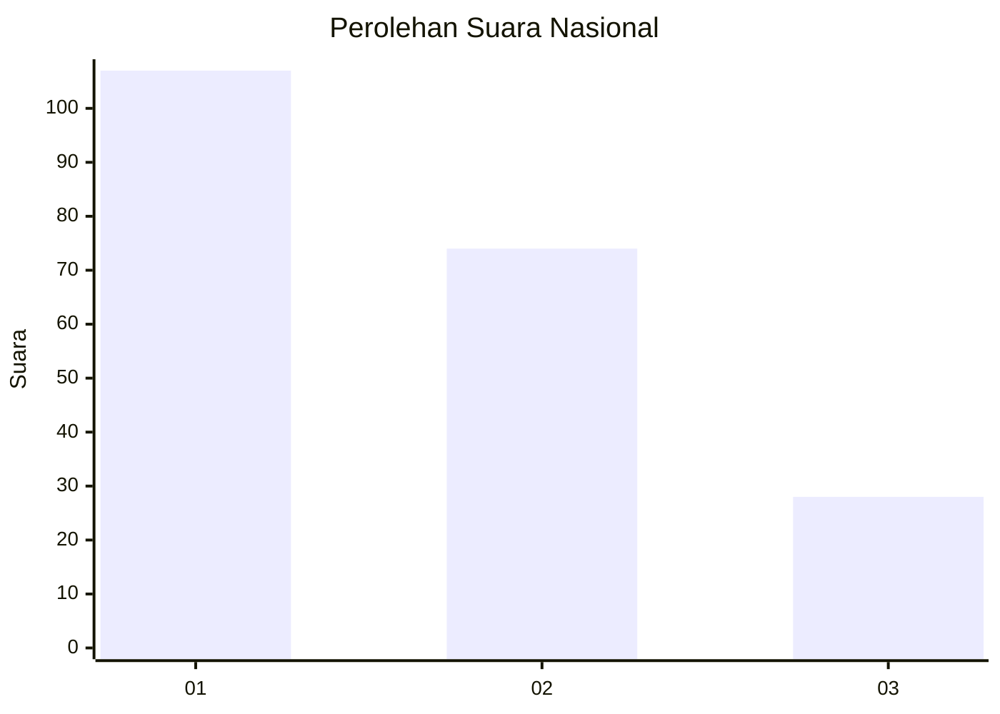
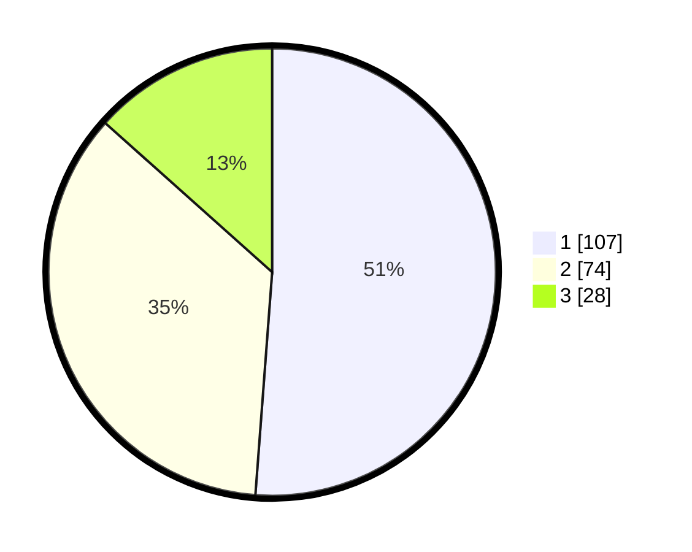

# Hasil

## Grafik

## Tabel

| No.    | Nama Paslon    | Suara | Suara (raw) | Persentase |
|:------ |:-------------- | -----:| -----------:| ----------:|
| 100025 | ANIES MUHAIMIN | 107   | [107][p-1]  | 51,20      |
| 100026 | PRABOWO GIBRAN | 74    | [74][p-2]   | 35,41      |
| 100027 | GANJAR MAHFUD  | 28    | [28][p-3]   | 13,40      |

[p-1]: https://github.com/gigit-pemilu/pemilu-2024/blob/main/pilpres/hitung-suara/sub/31-dki-jakarta/sub/75-jakarta-timur/sub/09-ciracas/sub/1002-cibubur/sub/106-tps/sub/paslon-1.txt
[p-2]: https://github.com/gigit-pemilu/pemilu-2024/blob/main/pilpres/hitung-suara/sub/31-dki-jakarta/sub/75-jakarta-timur/sub/09-ciracas/sub/1002-cibubur/sub/106-tps/sub/paslon-2.txt
[p-3]: https://github.com/gigit-pemilu/pemilu-2024/blob/main/pilpres/hitung-suara/sub/31-dki-jakarta/sub/75-jakarta-timur/sub/09-ciracas/sub/1002-cibubur/sub/106-tps/sub/paslon-3.txt

## Foto C Plano

https://sirekap-obj-formc.kpu.go.id/8d40/pemilu/ppwp/31/75/09/10/02/3175091002106-20240214-222455--37314b7e-1df0-45be-946b-b5285d3a0e13.jpg

https://sirekap-obj-formc.kpu.go.id/8d40/pemilu/ppwp/31/75/09/10/02/3175091002106-20240215-102440--8bafccbb-db65-4291-a0fc-64f6cac42cbd.jpg

https://sirekap-obj-formc.kpu.go.id/8d40/pemilu/ppwp/31/75/09/10/02/3175091002106-20240214-222751--a7c500b0-58bb-475e-873a-3ed40e75c990.jpg

## Metadata

| Key        | Value               |
| ---------- | ------------------- |
| Time Stamp | 2024-02-24 22:31:28 |

