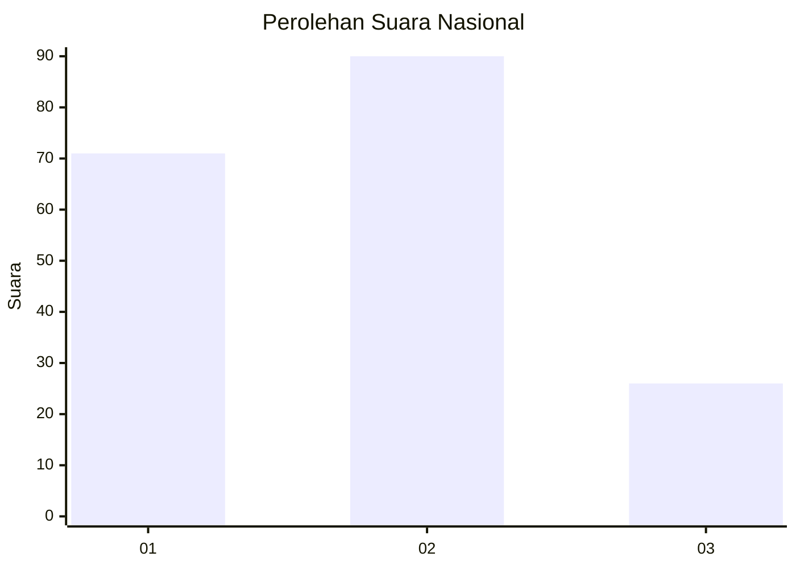
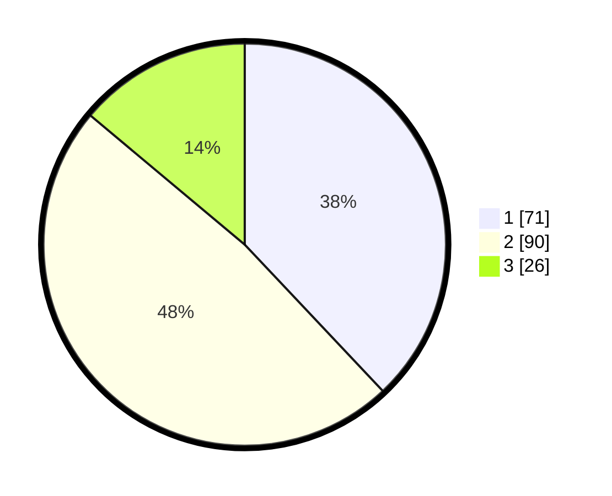

# Hasil

## Grafik

## Tabel

| No.    | Nama Paslon    | Suara | Suara (raw) | Persentase |
|:------ |:-------------- | -----:| -----------:| ----------:|
| 100025 | ANIES MUHAIMIN | 71    | [71][p-1]   | 37,97      |
| 100026 | PRABOWO GIBRAN | 90    | [90][p-2]   | 48,13      |
| 100027 | GANJAR MAHFUD  | 26    | [26][p-3]   | 13,90      |

[p-1]: https://github.com/gigit-pemilu/pemilu-2024/blob/main/pilpres/hitung-suara/sub/31-dki-jakarta/sub/75-jakarta-timur/sub/09-ciracas/sub/1002-cibubur/sub/111-tps/sub/paslon-1.txt
[p-2]: https://github.com/gigit-pemilu/pemilu-2024/blob/main/pilpres/hitung-suara/sub/31-dki-jakarta/sub/75-jakarta-timur/sub/09-ciracas/sub/1002-cibubur/sub/111-tps/sub/paslon-2.txt
[p-3]: https://github.com/gigit-pemilu/pemilu-2024/blob/main/pilpres/hitung-suara/sub/31-dki-jakarta/sub/75-jakarta-timur/sub/09-ciracas/sub/1002-cibubur/sub/111-tps/sub/paslon-3.txt

## Foto C Plano

https://sirekap-obj-formc.kpu.go.id/b2a5/pemilu/ppwp/31/75/09/10/02/3175091002111-20240214-221223--06f8093c-63c3-44dd-9026-5ca7b3aef763.jpg

https://sirekap-obj-formc.kpu.go.id/b2a5/pemilu/ppwp/31/75/09/10/02/3175091002111-20240214-221555--bcd2d2fc-f44e-4a16-ba01-a1c4fae91c7e.jpg

https://sirekap-obj-formc.kpu.go.id/b2a5/pemilu/ppwp/31/75/09/10/02/3175091002111-20240214-221819--3112ca00-1c8c-45dc-9bd1-b3683c9dd495.jpg

## Metadata

| Key        | Value               |
| ---------- | ------------------- |
| Time Stamp | 2024-02-16 14:00:34 |

