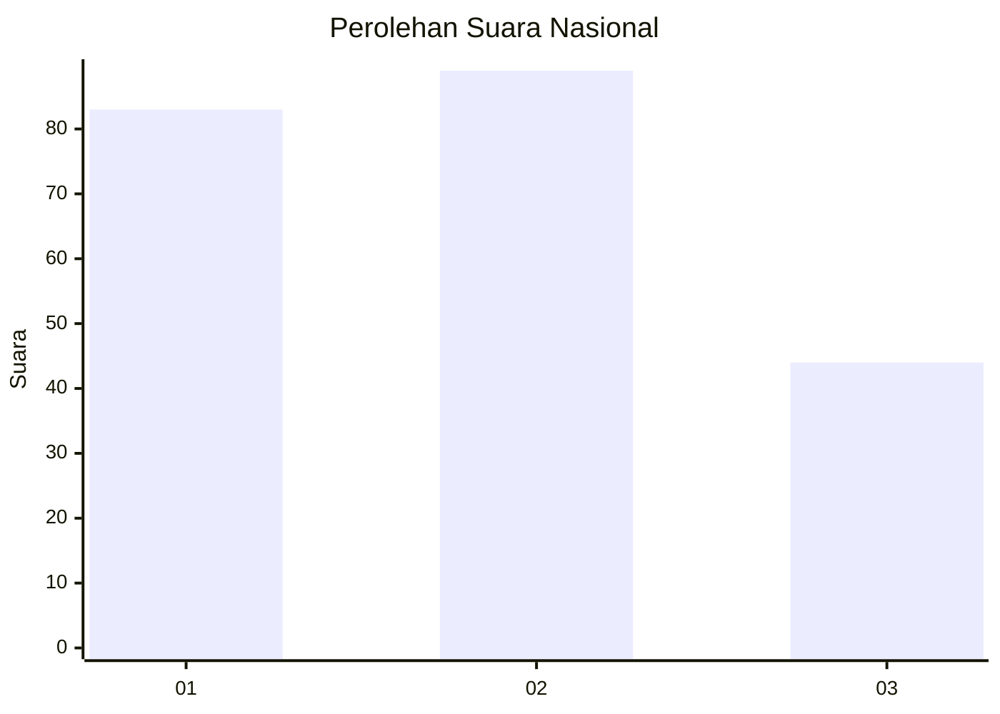
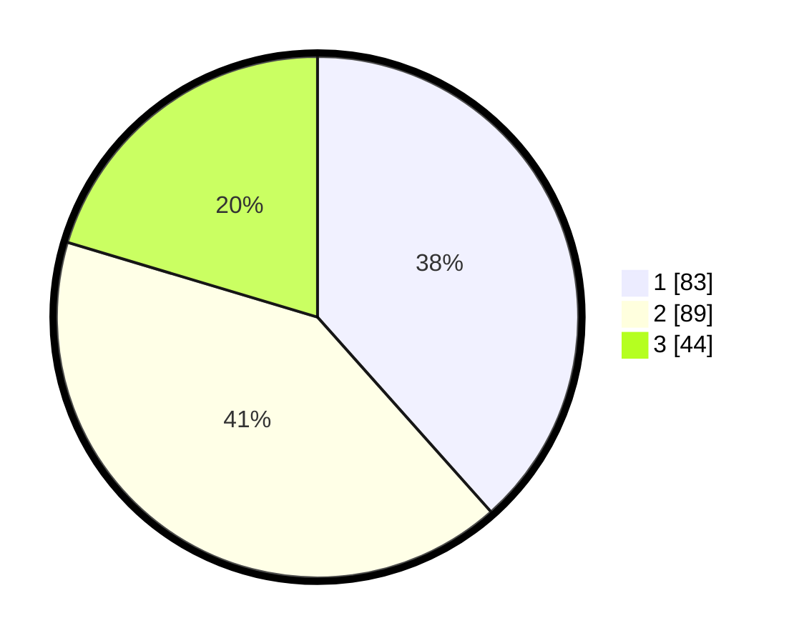

# Hasil

## Grafik

## Tabel

| No.    | Nama Paslon    | Suara | Suara (raw) | Persentase |
|:------ |:-------------- | -----:| -----------:| ----------:|
| 100025 | ANIES MUHAIMIN | 83    | [83][p-1]   | 38,43      |
| 100026 | PRABOWO GIBRAN | 89    | [89][p-2]   | 41,20      |
| 100027 | GANJAR MAHFUD  | 44    | [44][p-3]   | 20,37      |

[p-1]: https://github.com/gigit-pemilu/pemilu-2024/blob/main/pilpres/hitung-suara/sub/31-dki-jakarta/sub/75-jakarta-timur/sub/09-ciracas/sub/1002-cibubur/sub/112-tps/sub/paslon-1.txt
[p-2]: https://github.com/gigit-pemilu/pemilu-2024/blob/main/pilpres/hitung-suara/sub/31-dki-jakarta/sub/75-jakarta-timur/sub/09-ciracas/sub/1002-cibubur/sub/112-tps/sub/paslon-2.txt
[p-3]: https://github.com/gigit-pemilu/pemilu-2024/blob/main/pilpres/hitung-suara/sub/31-dki-jakarta/sub/75-jakarta-timur/sub/09-ciracas/sub/1002-cibubur/sub/112-tps/sub/paslon-3.txt

## Foto C Plano

https://sirekap-obj-formc.kpu.go.id/51f8/pemilu/ppwp/31/75/09/10/02/3175091002112-20240214-231618--b0c1e4fd-ff9c-4ab5-a857-d2c74ee8ad3f.jpg

https://sirekap-obj-formc.kpu.go.id/51f8/pemilu/ppwp/31/75/09/10/02/3175091002112-20240214-231717--cf8f7f97-f620-434c-b7e6-b60ab4508e56.jpg

https://sirekap-obj-formc.kpu.go.id/51f8/pemilu/ppwp/31/75/09/10/02/3175091002112-20240214-231814--57f4c9ac-1621-451c-810e-09a8ff9cea5b.jpg

## Metadata

| Key        | Value               |
| ---------- | ------------------- |
| Time Stamp | 2024-02-25 18:00:00 |

