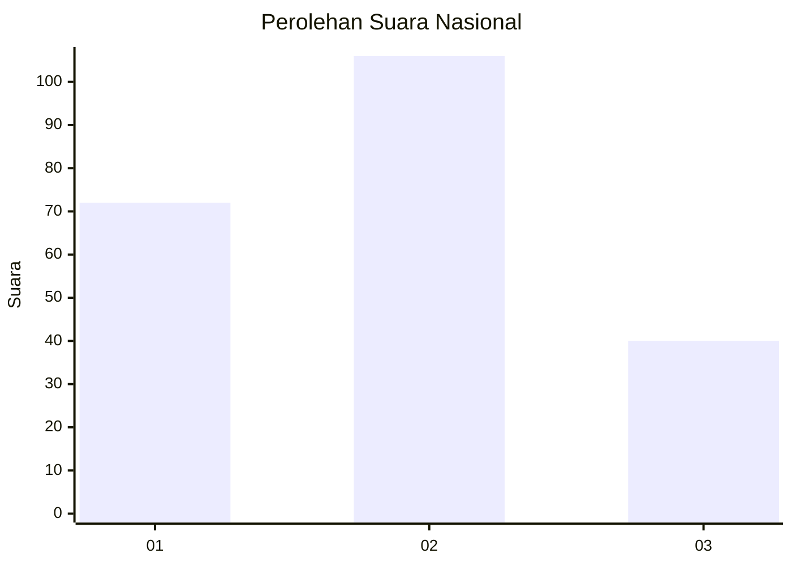
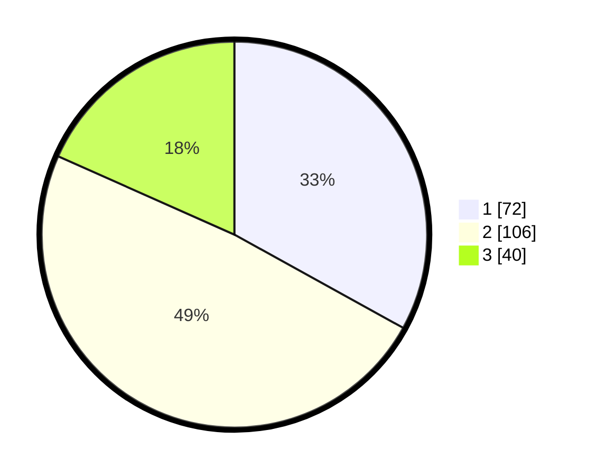

# Hasil

## Grafik

## Tabel

| No.    | Nama Paslon    | Suara | Suara (raw) | Persentase |
|:------ |:-------------- | -----:| -----------:| ----------:|
| 100025 | ANIES MUHAIMIN | 72    | [72][p-1]   | 33,03      |
| 100026 | PRABOWO GIBRAN | 106   | [106][p-2]  | 48,62      |
| 100027 | GANJAR MAHFUD  | 40    | [40][p-3]   | 18,35      |

[p-1]: https://github.com/gigit-pemilu/pemilu-2024/blob/main/pilpres/hitung-suara/sub/31-dki-jakarta/sub/75-jakarta-timur/sub/09-ciracas/sub/1002-cibubur/sub/117-tps/sub/paslon-1.txt
[p-2]: https://github.com/gigit-pemilu/pemilu-2024/blob/main/pilpres/hitung-suara/sub/31-dki-jakarta/sub/75-jakarta-timur/sub/09-ciracas/sub/1002-cibubur/sub/117-tps/sub/paslon-2.txt
[p-3]: https://github.com/gigit-pemilu/pemilu-2024/blob/main/pilpres/hitung-suara/sub/31-dki-jakarta/sub/75-jakarta-timur/sub/09-ciracas/sub/1002-cibubur/sub/117-tps/sub/paslon-3.txt

## Foto C Plano

https://sirekap-obj-formc.kpu.go.id/e4d7/pemilu/ppwp/31/75/09/10/02/3175091002117-20240214-185145--22cefb3e-8df0-4f25-a20c-3edc42daf908.jpg

https://sirekap-obj-formc.kpu.go.id/e4d7/pemilu/ppwp/31/75/09/10/02/3175091002117-20240214-185148--33d71fa6-96ba-4779-b928-670947635b22.jpg

https://sirekap-obj-formc.kpu.go.id/e4d7/pemilu/ppwp/31/75/09/10/02/3175091002117-20240214-185152--266d885e-35c0-4a5f-b354-ac773ae1b7b0.jpg

## Metadata

| Key        | Value               |
| ---------- | ------------------- |
| Time Stamp | 2024-02-25 21:00:00 |

