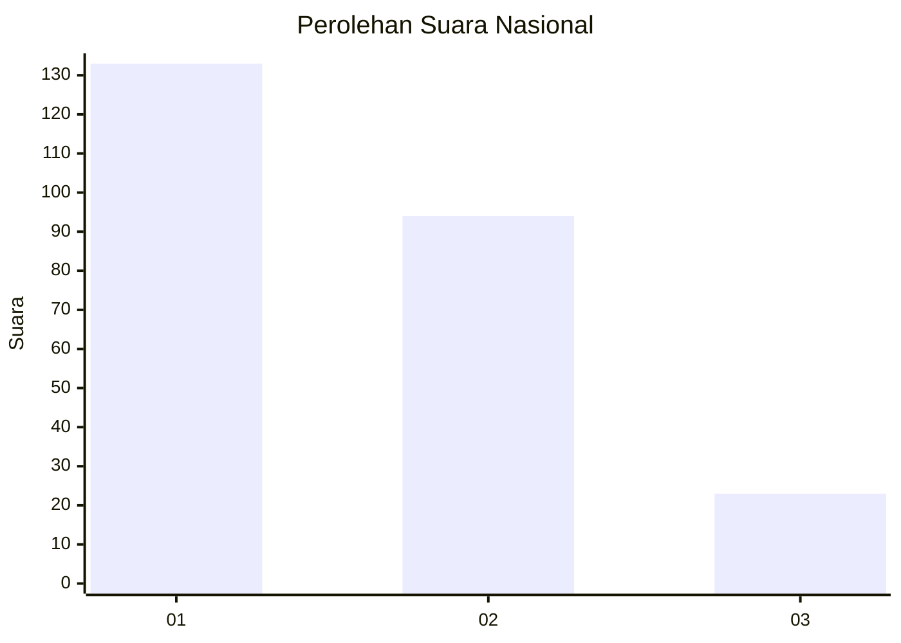
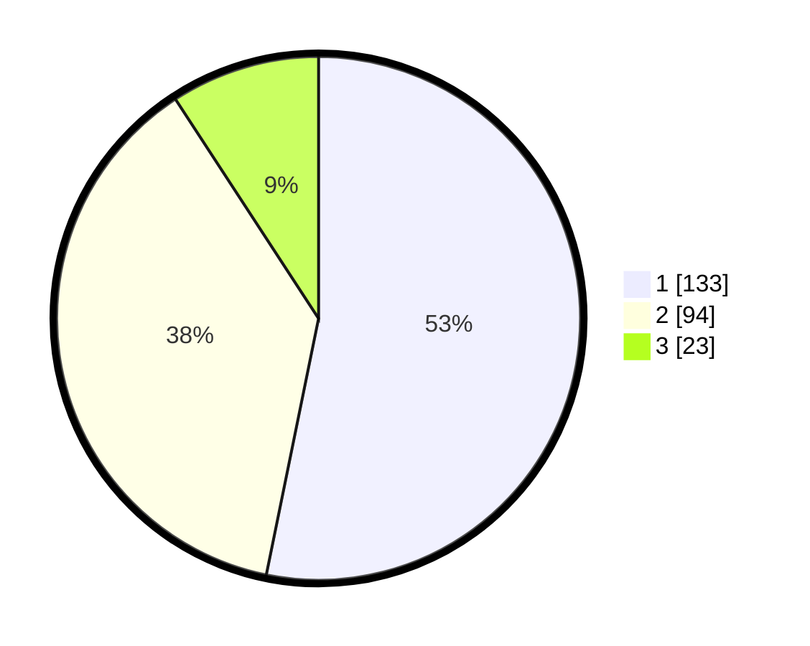

# Hasil

## Grafik

## Tabel

| No.    | Nama Paslon    | Suara | Suara (raw) | Persentase |
|:------ |:-------------- | -----:| -----------:| ----------:|
| 100025 | ANIES MUHAIMIN | 133   | [133][p-1]  | 53,20      |
| 100026 | PRABOWO GIBRAN | 94    | [94][p-2]   | 37,60      |
| 100027 | GANJAR MAHFUD  | 23    | [23][p-3]   | 9,20       |

[p-1]: https://github.com/gigit-pemilu/pemilu-2024/blob/main/pilpres/hitung-suara/sub/31-dki-jakarta/sub/75-jakarta-timur/sub/09-ciracas/sub/1002-cibubur/sub/126-tps/sub/paslon-1.txt
[p-2]: https://github.com/gigit-pemilu/pemilu-2024/blob/main/pilpres/hitung-suara/sub/31-dki-jakarta/sub/75-jakarta-timur/sub/09-ciracas/sub/1002-cibubur/sub/126-tps/sub/paslon-2.txt
[p-3]: https://github.com/gigit-pemilu/pemilu-2024/blob/main/pilpres/hitung-suara/sub/31-dki-jakarta/sub/75-jakarta-timur/sub/09-ciracas/sub/1002-cibubur/sub/126-tps/sub/paslon-3.txt

## Foto C Plano

https://sirekap-obj-formc.kpu.go.id/d12d/pemilu/ppwp/31/75/09/10/02/3175091002126-20240214-210742--04bda801-0468-4a43-9ae5-e3dde56b7135.jpg

https://sirekap-obj-formc.kpu.go.id/d12d/pemilu/ppwp/31/75/09/10/02/3175091002126-20240214-210553--39584436-14b3-4d47-9fad-bcf3d325a1d9.jpg

https://sirekap-obj-formc.kpu.go.id/d12d/pemilu/ppwp/31/75/09/10/02/3175091002126-20240214-210645--d90fc110-fd90-407c-b370-c6272acd988f.jpg

## Metadata

| Key        | Value               |
| ---------- | ------------------- |
| Time Stamp | 2024-02-24 22:31:28 |

