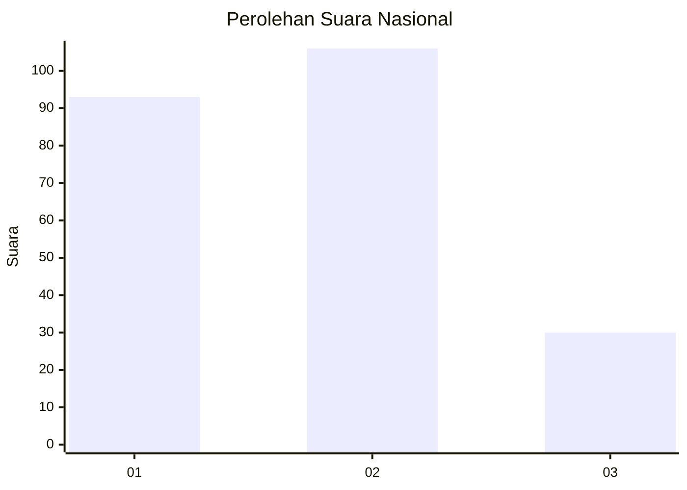
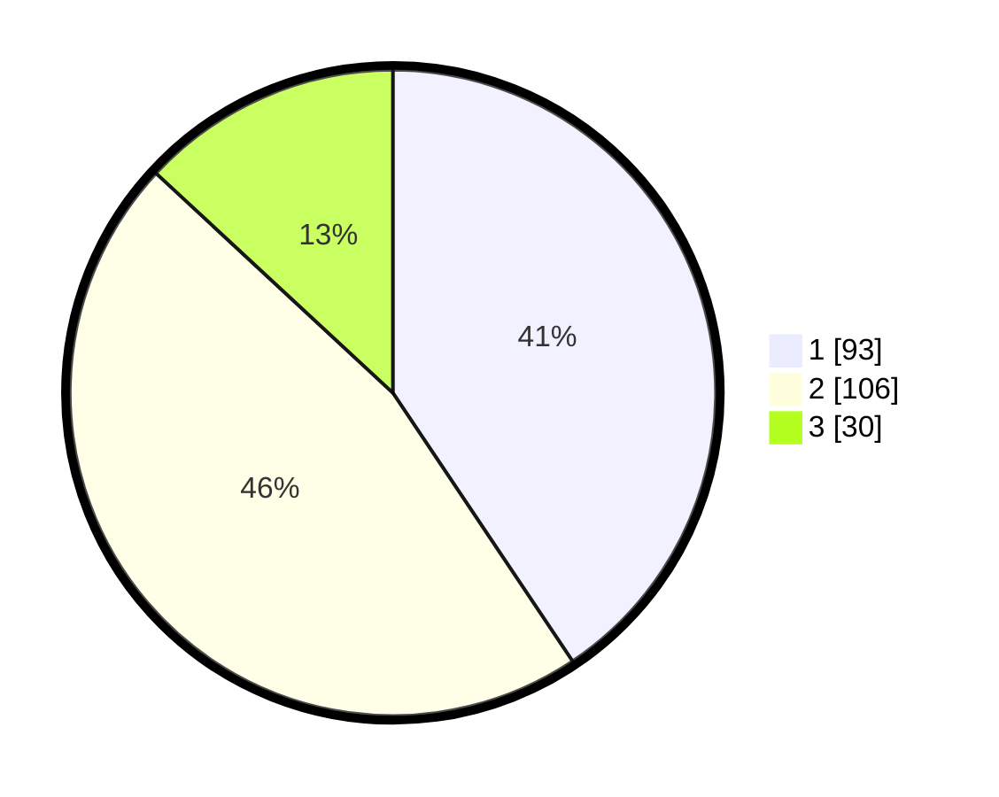

# Hasil

## Grafik

## Tabel

| No.    | Nama Paslon    | Suara | Suara (raw) | Persentase |
|:------ |:-------------- | -----:| -----------:| ----------:|
| 100025 | ANIES MUHAIMIN | 93    | [93][p-1]   | 40,61      |
| 100026 | PRABOWO GIBRAN | 106   | [106][p-2]  | 46,29      |
| 100027 | GANJAR MAHFUD  | 30    | [30][p-3]   | 13,10      |

[p-1]: https://github.com/gigit-pemilu/pemilu-2024/blob/main/pilpres/hitung-suara/sub/31-dki-jakarta/sub/75-jakarta-timur/sub/09-ciracas/sub/1002-cibubur/sub/140-tps/sub/paslon-1.txt
[p-2]: https://github.com/gigit-pemilu/pemilu-2024/blob/main/pilpres/hitung-suara/sub/31-dki-jakarta/sub/75-jakarta-timur/sub/09-ciracas/sub/1002-cibubur/sub/140-tps/sub/paslon-2.txt
[p-3]: https://github.com/gigit-pemilu/pemilu-2024/blob/main/pilpres/hitung-suara/sub/31-dki-jakarta/sub/75-jakarta-timur/sub/09-ciracas/sub/1002-cibubur/sub/140-tps/sub/paslon-3.txt

## Foto C Plano

https://sirekap-obj-formc.kpu.go.id/1abc/pemilu/ppwp/31/75/09/10/02/3175091002140-20240214-215421--eb93a8ab-5fdb-44ec-9736-ca84c32f1345.jpg

https://sirekap-obj-formc.kpu.go.id/1abc/pemilu/ppwp/31/75/09/10/02/3175091002140-20240214-215855--40b14522-9601-4d39-ad17-af8f2caaad15.jpg

https://sirekap-obj-formc.kpu.go.id/1abc/pemilu/ppwp/31/75/09/10/02/3175091002140-20240215-015013--c2e9db0c-0d3b-4f30-b475-86f4e81ce313.jpg

## Metadata

| Key        | Value               |
| ---------- | ------------------- |
| Time Stamp | 2024-02-24 22:31:28 |

