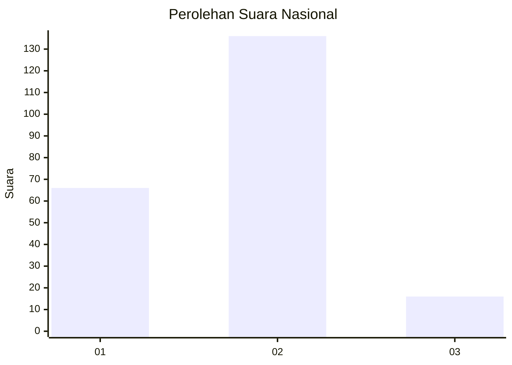
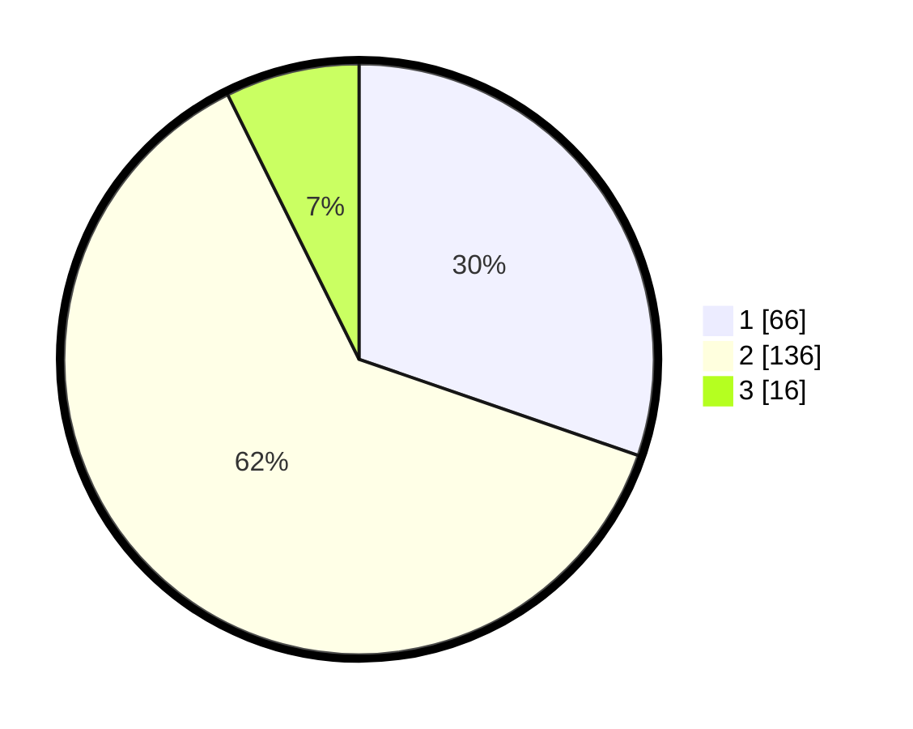

# Hasil

## Grafik

## Tabel

| No.    | Nama Paslon    | Suara | Suara (raw) | Persentase |
|:------ |:-------------- | -----:| -----------:| ----------:|
| 100025 | ANIES MUHAIMIN | 66    | [66][p-1]   | 30,28      |
| 100026 | PRABOWO GIBRAN | 136   | [136][p-2]  | 62,39      |
| 100027 | GANJAR MAHFUD  | 16    | [16][p-3]   | 7,34       |

[p-1]: https://github.com/gigit-pemilu/pemilu-2024/blob/main/pilpres/hitung-suara/sub/31-dki-jakarta/sub/75-jakarta-timur/sub/09-ciracas/sub/1002-cibubur/sub/143-tps/sub/paslon-1.txt
[p-2]: https://github.com/gigit-pemilu/pemilu-2024/blob/main/pilpres/hitung-suara/sub/31-dki-jakarta/sub/75-jakarta-timur/sub/09-ciracas/sub/1002-cibubur/sub/143-tps/sub/paslon-2.txt
[p-3]: https://github.com/gigit-pemilu/pemilu-2024/blob/main/pilpres/hitung-suara/sub/31-dki-jakarta/sub/75-jakarta-timur/sub/09-ciracas/sub/1002-cibubur/sub/143-tps/sub/paslon-3.txt

## Foto C Plano

https://sirekap-obj-formc.kpu.go.id/d4ed/pemilu/ppwp/31/75/09/10/02/3175091002143-20240215-000842--4ea266f8-7e5b-4044-8cc3-9930ca8fe498.jpg

https://sirekap-obj-formc.kpu.go.id/d4ed/pemilu/ppwp/31/75/09/10/02/3175091002143-20240215-000828--bb87160a-46e4-44ce-970b-1a80a9e1e66a.jpg

https://sirekap-obj-formc.kpu.go.id/d4ed/pemilu/ppwp/31/75/09/10/02/3175091002143-20240215-000925--1ff7ddf4-4a7f-400b-a6d0-68ebcd730f18.jpg

## Metadata

| Key        | Value               |
| ---------- | ------------------- |
| Time Stamp | 2024-02-20 15:00:00 |

