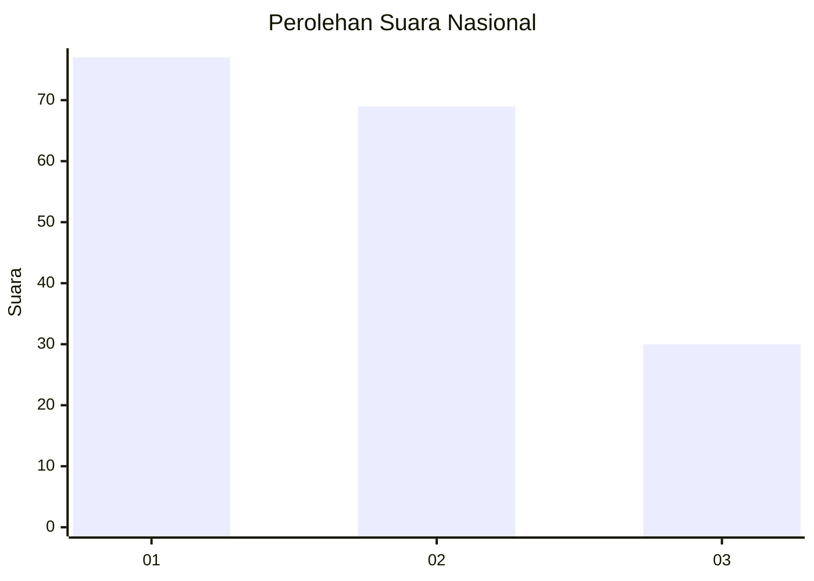
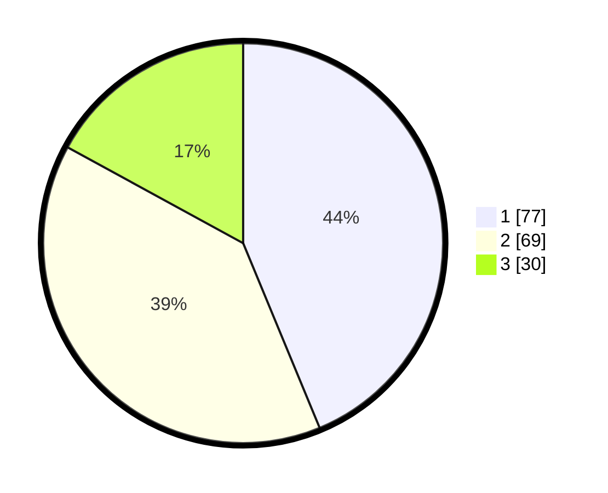

# Hasil

## Grafik

## Tabel

| No.    | Nama Paslon    | Suara | Suara (raw) | Persentase |
|:------ |:-------------- | -----:| -----------:| ----------:|
| 100025 | ANIES MUHAIMIN | 77    | [77][p-1]   | 43,75      |
| 100026 | PRABOWO GIBRAN | 69    | [69][p-2]   | 39,20      |
| 100027 | GANJAR MAHFUD  | 30    | [30][p-3]   | 17,05      |

[p-1]: https://github.com/gigit-pemilu/pemilu-2024/blob/main/pilpres/hitung-suara/sub/31-dki-jakarta/sub/75-jakarta-timur/sub/09-ciracas/sub/1002-cibubur/sub/150-tps/sub/paslon-1.txt
[p-2]: https://github.com/gigit-pemilu/pemilu-2024/blob/main/pilpres/hitung-suara/sub/31-dki-jakarta/sub/75-jakarta-timur/sub/09-ciracas/sub/1002-cibubur/sub/150-tps/sub/paslon-2.txt
[p-3]: https://github.com/gigit-pemilu/pemilu-2024/blob/main/pilpres/hitung-suara/sub/31-dki-jakarta/sub/75-jakarta-timur/sub/09-ciracas/sub/1002-cibubur/sub/150-tps/sub/paslon-3.txt

## Foto C Plano

https://sirekap-obj-formc.kpu.go.id/b0b5/pemilu/ppwp/31/75/09/10/02/3175091002150-20240214-234908--97f08a66-a9a6-4a40-a5ca-01b0d5e9d16e.jpg

https://sirekap-obj-formc.kpu.go.id/b0b5/pemilu/ppwp/31/75/09/10/02/3175091002150-20240214-235031--f572b8d0-d6a9-4e27-85a5-2008d70c6ec9.jpg

https://sirekap-obj-formc.kpu.go.id/b0b5/pemilu/ppwp/31/75/09/10/02/3175091002150-20240214-235138--21261e14-6e49-4321-84ad-ebbd0e863202.jpg

## Metadata

| Key        | Value               |
| ---------- | ------------------- |
| Time Stamp | 2024-02-20 12:00:00 |

