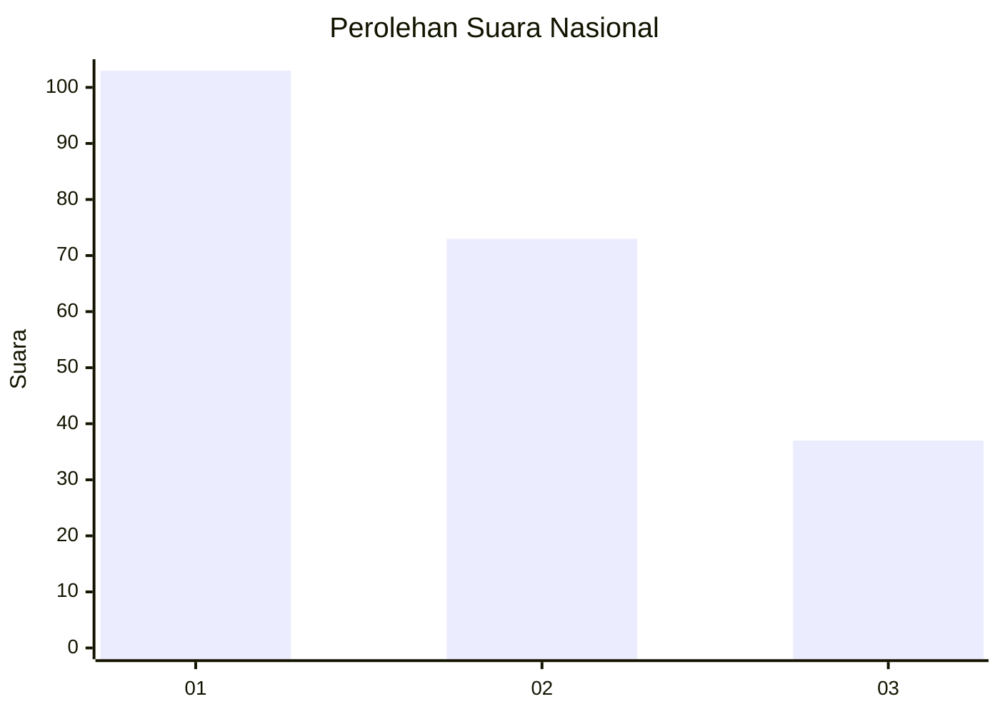
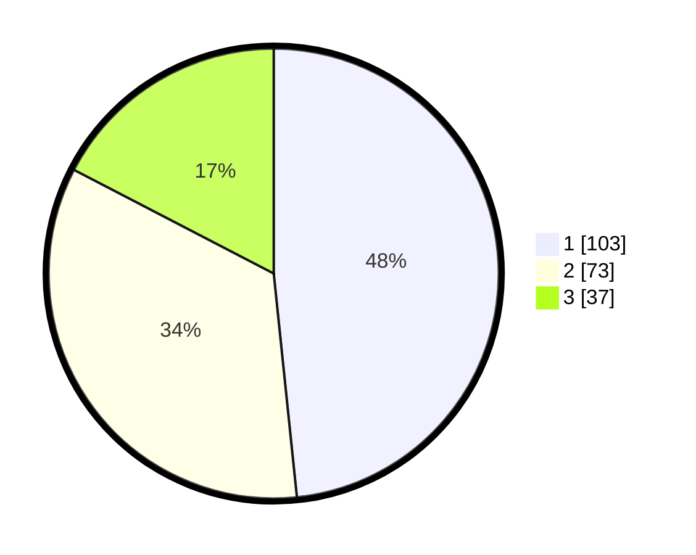

# Hasil

## Grafik

## Tabel

| No.    | Nama Paslon    | Suara | Suara (raw) | Persentase |
|:------ |:-------------- | -----:| -----------:| ----------:|
| 100025 | ANIES MUHAIMIN | 103   | [103][p-1]  | 48,36      |
| 100026 | PRABOWO GIBRAN | 73    | [73][p-2]   | 34,27      |
| 100027 | GANJAR MAHFUD  | 37    | [37][p-3]   | 17,37      |

[p-1]: https://github.com/gigit-pemilu/pemilu-2024/blob/main/pilpres/hitung-suara/sub/31-dki-jakarta/sub/75-jakarta-timur/sub/09-ciracas/sub/1002-cibubur/sub/175-tps/sub/paslon-1.txt
[p-2]: https://github.com/gigit-pemilu/pemilu-2024/blob/main/pilpres/hitung-suara/sub/31-dki-jakarta/sub/75-jakarta-timur/sub/09-ciracas/sub/1002-cibubur/sub/175-tps/sub/paslon-2.txt
[p-3]: https://github.com/gigit-pemilu/pemilu-2024/blob/main/pilpres/hitung-suara/sub/31-dki-jakarta/sub/75-jakarta-timur/sub/09-ciracas/sub/1002-cibubur/sub/175-tps/sub/paslon-3.txt

## Foto C Plano

https://sirekap-obj-formc.kpu.go.id/c8c6/pemilu/ppwp/31/75/09/10/02/3175091002175-20240214-211036--e7e7c8e7-85ad-49cc-b523-0870de0d0883.jpg

https://sirekap-obj-formc.kpu.go.id/c8c6/pemilu/ppwp/31/75/09/10/02/3175091002175-20240214-155054--2c5e79ea-8459-4c61-a655-520e1de6914e.jpg

https://sirekap-obj-formc.kpu.go.id/c8c6/pemilu/ppwp/31/75/09/10/02/3175091002175-20240214-141631--053f9c45-a9c7-42f0-9a17-7598e05db366.jpg

## Metadata

| Key        | Value               |
| ---------- | ------------------- |
| Time Stamp | 2024-02-15 00:41:44 |

