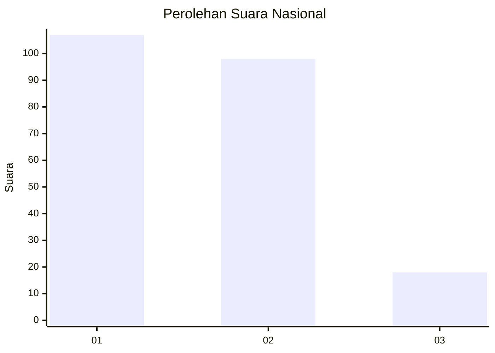
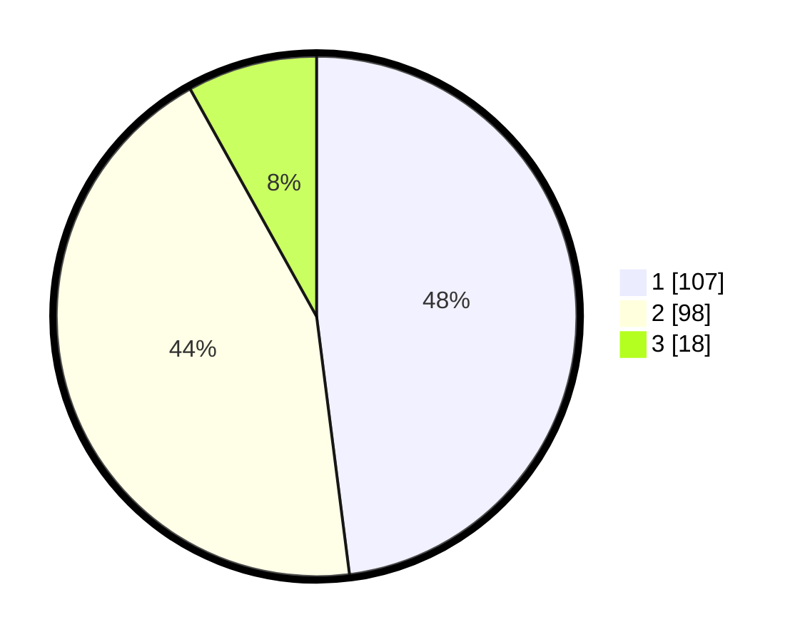

# Hasil

## Grafik

## Tabel

| No.    | Nama Paslon    | Suara | Suara (raw) | Persentase |
|:------ |:-------------- | -----:| -----------:| ----------:|
| 100025 | ANIES MUHAIMIN | 107   | [107][p-1]  | 47,98      |
| 100026 | PRABOWO GIBRAN | 98    | [98][p-2]   | 43,95      |
| 100027 | GANJAR MAHFUD  | 18    | [18][p-3]   | 8,07       |

[p-1]: https://github.com/gigit-pemilu/pemilu-2024/blob/main/pilpres/hitung-suara/sub/31-dki-jakarta/sub/75-jakarta-timur/sub/09-ciracas/sub/1002-cibubur/sub/192-tps/sub/paslon-1.txt
[p-2]: https://github.com/gigit-pemilu/pemilu-2024/blob/main/pilpres/hitung-suara/sub/31-dki-jakarta/sub/75-jakarta-timur/sub/09-ciracas/sub/1002-cibubur/sub/192-tps/sub/paslon-2.txt
[p-3]: https://github.com/gigit-pemilu/pemilu-2024/blob/main/pilpres/hitung-suara/sub/31-dki-jakarta/sub/75-jakarta-timur/sub/09-ciracas/sub/1002-cibubur/sub/192-tps/sub/paslon-3.txt

## Foto C Plano

https://sirekap-obj-formc.kpu.go.id/2ff3/pemilu/ppwp/31/75/09/10/02/3175091002192-20240214-234037--158985c7-6fae-4aab-bec2-04754f794003.jpg

https://sirekap-obj-formc.kpu.go.id/2ff3/pemilu/ppwp/31/75/09/10/02/3175091002192-20240214-234133--37152769-b8be-40da-9474-50391c8483c3.jpg

https://sirekap-obj-formc.kpu.go.id/2ff3/pemilu/ppwp/31/75/09/10/02/3175091002192-20240214-234226--8fcec96b-66df-4d40-8122-6552ca4768c7.jpg

## Metadata

| Key        | Value               |
| ---------- | ------------------- |
| Time Stamp | 2024-02-25 15:00:00 |

