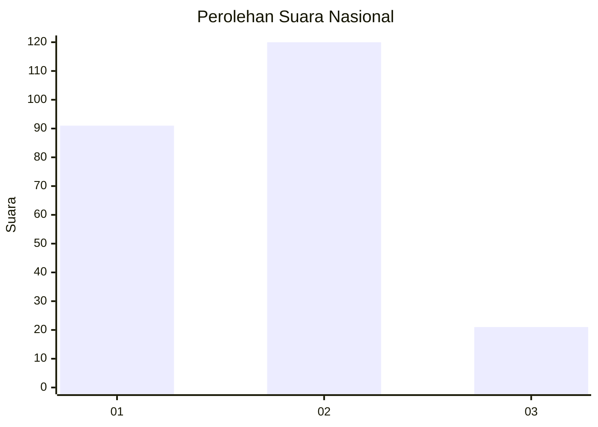
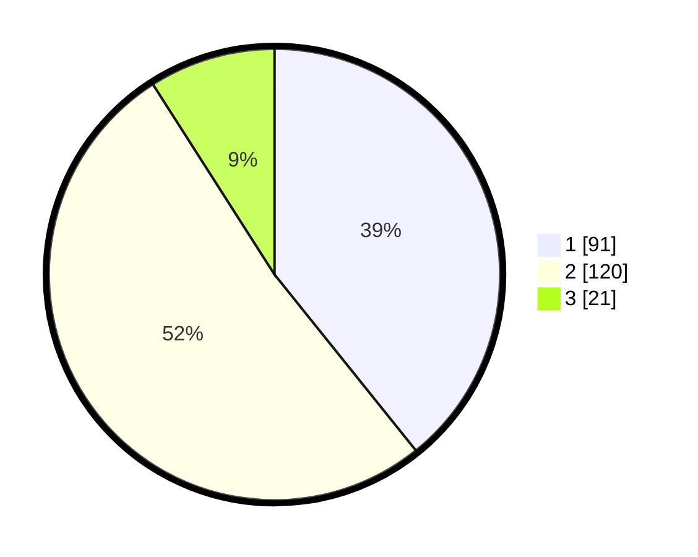

# Hasil

## Grafik

## Tabel

| No.    | Nama Paslon    | Suara | Suara (raw) | Persentase |
|:------ |:-------------- | -----:| -----------:| ----------:|
| 100025 | ANIES MUHAIMIN | 91    | [91][p-1]   | 39,22      |
| 100026 | PRABOWO GIBRAN | 120   | [120][p-2]  | 51,72      |
| 100027 | GANJAR MAHFUD  | 21    | [21][p-3]   | 9,05       |

[p-1]: https://github.com/gigit-pemilu/pemilu-2024/blob/main/pilpres/hitung-suara/sub/31-dki-jakarta/sub/75-jakarta-timur/sub/09-ciracas/sub/1002-cibubur/sub/203-tps/sub/paslon-1.txt
[p-2]: https://github.com/gigit-pemilu/pemilu-2024/blob/main/pilpres/hitung-suara/sub/31-dki-jakarta/sub/75-jakarta-timur/sub/09-ciracas/sub/1002-cibubur/sub/203-tps/sub/paslon-2.txt
[p-3]: https://github.com/gigit-pemilu/pemilu-2024/blob/main/pilpres/hitung-suara/sub/31-dki-jakarta/sub/75-jakarta-timur/sub/09-ciracas/sub/1002-cibubur/sub/203-tps/sub/paslon-3.txt

## Foto C Plano

https://sirekap-obj-formc.kpu.go.id/32b5/pemilu/ppwp/31/75/09/10/02/3175091002203-20240215-002153--c166bac6-f4ce-437b-bb1d-39e47e10e307.jpg

https://sirekap-obj-formc.kpu.go.id/32b5/pemilu/ppwp/31/75/09/10/02/3175091002203-20240215-002259--42b1d602-c368-4717-bbeb-f74aeba055c7.jpg

https://sirekap-obj-formc.kpu.go.id/32b5/pemilu/ppwp/31/75/09/10/02/3175091002203-20240215-002416--5200be8b-d03f-4841-8893-148b6f2c9aef.jpg

## Metadata

| Key        | Value               |
| ---------- | ------------------- |
| Time Stamp | 2024-02-24 22:31:28 |

