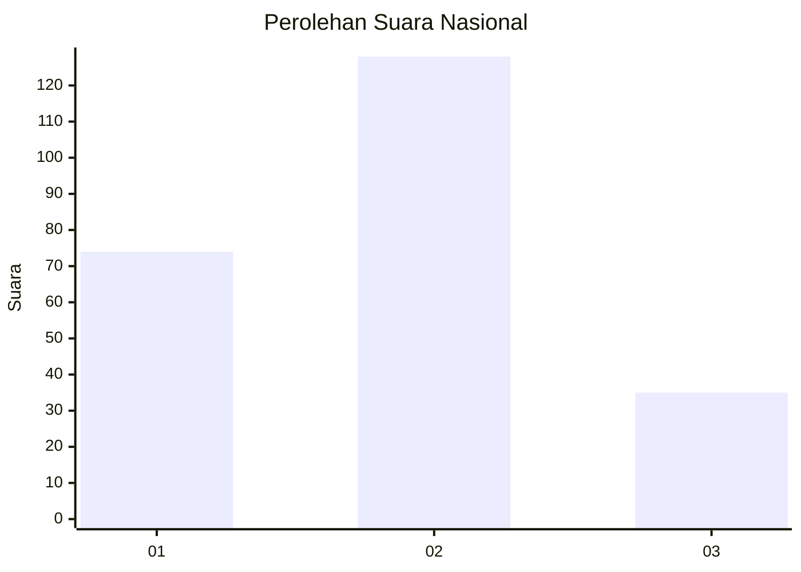
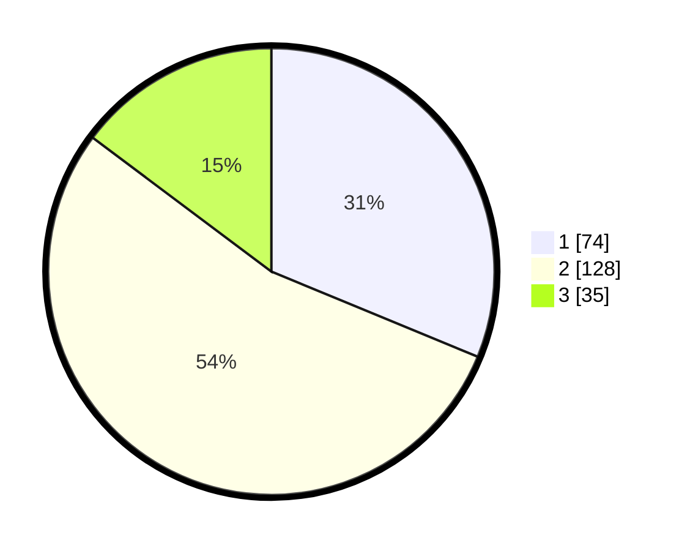

# Hasil

## Grafik

## Tabel

| No.    | Nama Paslon    | Suara | Suara (raw) | Persentase |
|:------ |:-------------- | -----:| -----------:| ----------:|
| 100025 | ANIES MUHAIMIN | 74    | [74][p-1]   | 31,22      |
| 100026 | PRABOWO GIBRAN | 128   | [128][p-2]  | 54,01      |
| 100027 | GANJAR MAHFUD  | 35    | [35][p-3]   | 14,77      |

[p-1]: https://github.com/gigit-pemilu/pemilu-2024/blob/main/pilpres/hitung-suara/sub/31-dki-jakarta/sub/75-jakarta-timur/sub/09-ciracas/sub/1002-cibubur/sub/206-tps/sub/paslon-1.txt
[p-2]: https://github.com/gigit-pemilu/pemilu-2024/blob/main/pilpres/hitung-suara/sub/31-dki-jakarta/sub/75-jakarta-timur/sub/09-ciracas/sub/1002-cibubur/sub/206-tps/sub/paslon-2.txt
[p-3]: https://github.com/gigit-pemilu/pemilu-2024/blob/main/pilpres/hitung-suara/sub/31-dki-jakarta/sub/75-jakarta-timur/sub/09-ciracas/sub/1002-cibubur/sub/206-tps/sub/paslon-3.txt

## Foto C Plano

https://sirekap-obj-formc.kpu.go.id/1e16/pemilu/ppwp/31/75/09/10/02/3175091002206-20240215-013042--1ca1a7ca-0723-4d67-8657-1efaa65ca2c6.jpg

https://sirekap-obj-formc.kpu.go.id/1e16/pemilu/ppwp/31/75/09/10/02/3175091002206-20240215-013147--3542caf9-b96c-4fb7-8157-c5bd947d29b3.jpg

https://sirekap-obj-formc.kpu.go.id/1e16/pemilu/ppwp/31/75/09/10/02/3175091002206-20240215-013242--9411d46a-219a-4893-acd6-5dc7c79368c8.jpg

## Metadata

| Key        | Value               |
| ---------- | ------------------- |
| Time Stamp | 2024-02-15 16:30:25 |

