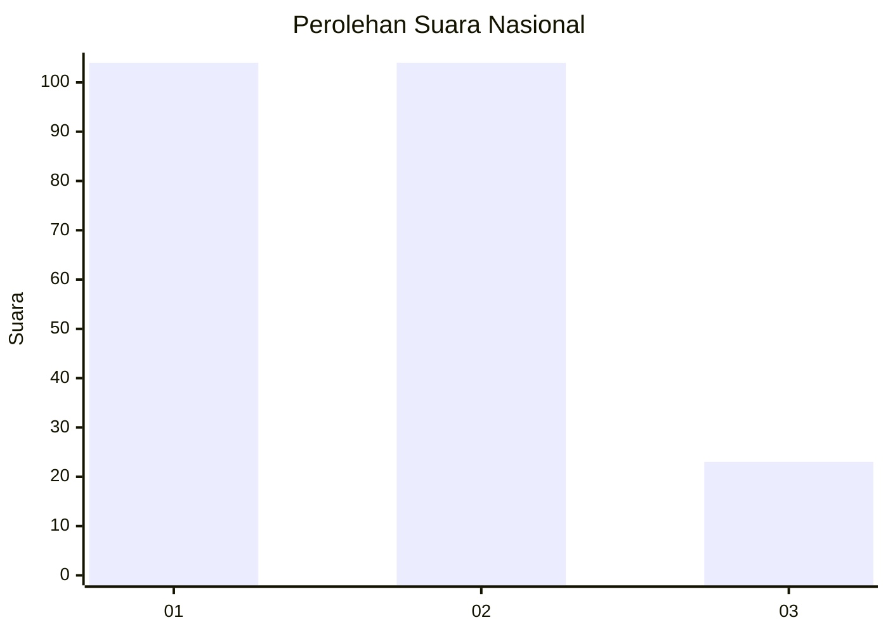
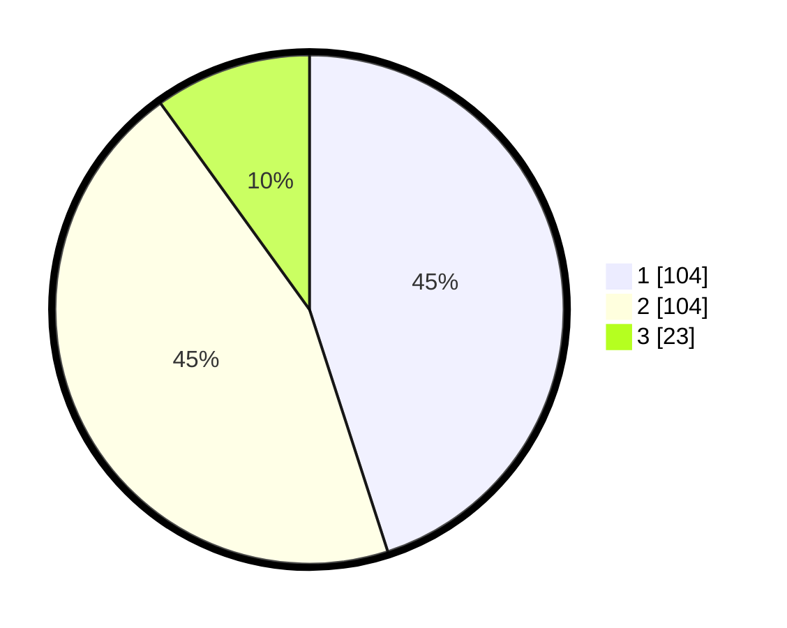

# Hasil

## Grafik

## Tabel

| No.    | Nama Paslon    | Suara | Suara (raw) | Persentase |
|:------ |:-------------- | -----:| -----------:| ----------:|
| 100025 | ANIES MUHAIMIN | 104   | [104][p-1]  | 45,02      |
| 100026 | PRABOWO GIBRAN | 104   | [104][p-2]  | 45,02      |
| 100027 | GANJAR MAHFUD  | 23    | [23][p-3]   | 9,96       |

[p-1]: https://github.com/gigit-pemilu/pemilu-2024/blob/main/pilpres/hitung-suara/sub/31-dki-jakarta/sub/75-jakarta-timur/sub/09-ciracas/sub/1002-cibubur/sub/211-tps/sub/paslon-1.txt
[p-2]: https://github.com/gigit-pemilu/pemilu-2024/blob/main/pilpres/hitung-suara/sub/31-dki-jakarta/sub/75-jakarta-timur/sub/09-ciracas/sub/1002-cibubur/sub/211-tps/sub/paslon-2.txt
[p-3]: https://github.com/gigit-pemilu/pemilu-2024/blob/main/pilpres/hitung-suara/sub/31-dki-jakarta/sub/75-jakarta-timur/sub/09-ciracas/sub/1002-cibubur/sub/211-tps/sub/paslon-3.txt

## Foto C Plano

https://sirekap-obj-formc.kpu.go.id/2623/pemilu/ppwp/31/75/09/10/02/3175091002211-20240214-225735--7ee12f85-d432-41c9-9afe-09e36d149612.jpg

https://sirekap-obj-formc.kpu.go.id/2623/pemilu/ppwp/31/75/09/10/02/3175091002211-20240214-225905--24998258-3c63-4ffc-b35a-0477f5592f7b.jpg

https://sirekap-obj-formc.kpu.go.id/2623/pemilu/ppwp/31/75/09/10/02/3175091002211-20240214-230022--26d8bec2-f30d-45ab-b8c5-4edd2172cefc.jpg

## Metadata

| Key        | Value               |
| ---------- | ------------------- |
| Time Stamp | 2024-02-20 12:00:00 |

