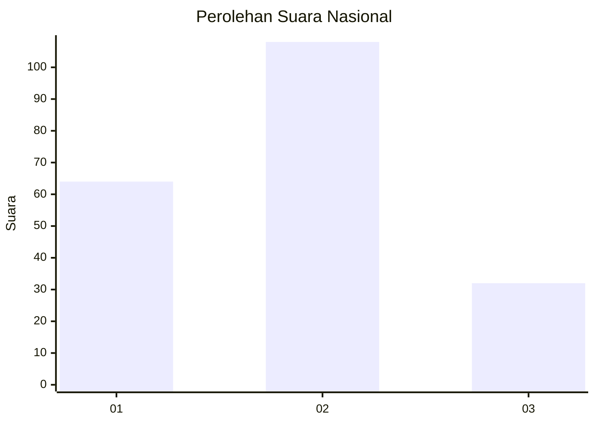
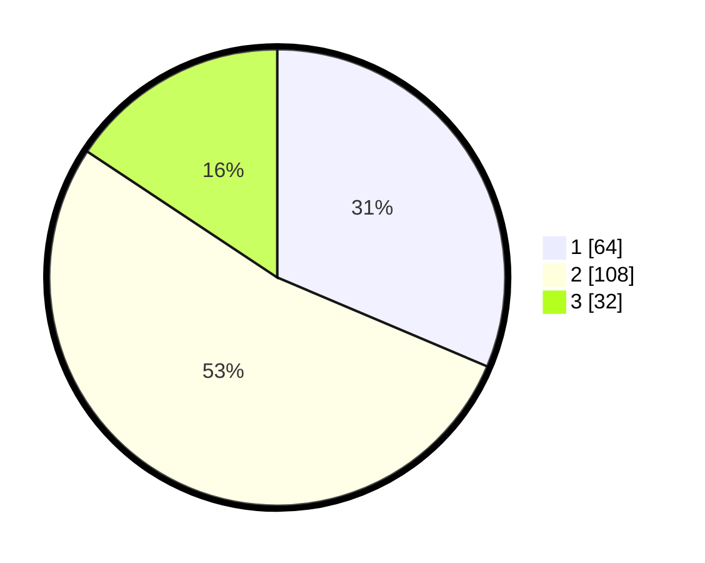

# Hasil

## Grafik

## Tabel

| No.    | Nama Paslon    | Suara | Suara (raw) | Persentase |
|:------ |:-------------- | -----:| -----------:| ----------:|
| 100025 | ANIES MUHAIMIN | 64    | [64][p-1]   | 31,37      |
| 100026 | PRABOWO GIBRAN | 108   | [108][p-2]  | 52,94      |
| 100027 | GANJAR MAHFUD  | 32    | [32][p-3]   | 15,69      |

[p-1]: https://github.com/gigit-pemilu/pemilu-2024/blob/main/pilpres/hitung-suara/sub/31-dki-jakarta/sub/75-jakarta-timur/sub/09-ciracas/sub/1003-kelapa-dua-wetan/sub/008-tps/sub/paslon-1.txt
[p-2]: https://github.com/gigit-pemilu/pemilu-2024/blob/main/pilpres/hitung-suara/sub/31-dki-jakarta/sub/75-jakarta-timur/sub/09-ciracas/sub/1003-kelapa-dua-wetan/sub/008-tps/sub/paslon-2.txt
[p-3]: https://github.com/gigit-pemilu/pemilu-2024/blob/main/pilpres/hitung-suara/sub/31-dki-jakarta/sub/75-jakarta-timur/sub/09-ciracas/sub/1003-kelapa-dua-wetan/sub/008-tps/sub/paslon-3.txt

## Foto C Plano

https://sirekap-obj-formc.kpu.go.id/bdaf/pemilu/ppwp/31/75/09/10/03/3175091003008-20240216-194335--ec835d39-806a-443d-a816-42522c84130d.jpg

https://sirekap-obj-formc.kpu.go.id/bdaf/pemilu/ppwp/31/75/09/10/03/3175091003008-20240216-194409--ca00ea5b-9e0e-426d-8d9d-8d0ab5a8238d.jpg

https://sirekap-obj-formc.kpu.go.id/bdaf/pemilu/ppwp/31/75/09/10/03/3175091003008-20240216-194525--09f26366-5fa7-4966-8d74-36ae423ec2c2.jpg

## Metadata

| Key        | Value               |
| ---------- | ------------------- |
| Time Stamp | 2024-02-24 22:31:28 |

