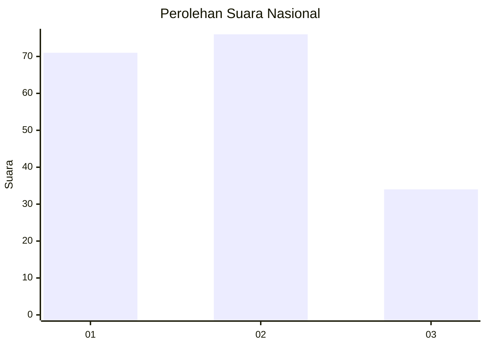
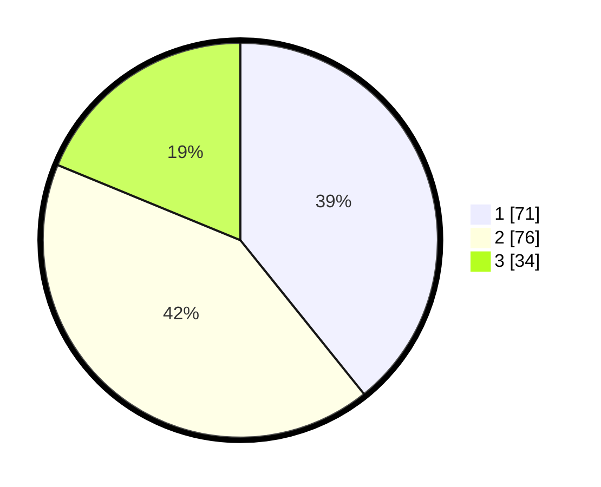

# Hasil

## Grafik

## Tabel

| No.    | Nama Paslon    | Suara | Suara (raw) | Persentase |
|:------ |:-------------- | -----:| -----------:| ----------:|
| 100025 | ANIES MUHAIMIN | 71    | [71][p-1]   | 39,23      |
| 100026 | PRABOWO GIBRAN | 76    | [76][p-2]   | 41,99      |
| 100027 | GANJAR MAHFUD  | 34    | [34][p-3]   | 18,78      |

[p-1]: https://github.com/gigit-pemilu/pemilu-2024/blob/main/pilpres/hitung-suara/sub/31-dki-jakarta/sub/75-jakarta-timur/sub/09-ciracas/sub/1003-kelapa-dua-wetan/sub/068-tps/sub/paslon-1.txt
[p-2]: https://github.com/gigit-pemilu/pemilu-2024/blob/main/pilpres/hitung-suara/sub/31-dki-jakarta/sub/75-jakarta-timur/sub/09-ciracas/sub/1003-kelapa-dua-wetan/sub/068-tps/sub/paslon-2.txt
[p-3]: https://github.com/gigit-pemilu/pemilu-2024/blob/main/pilpres/hitung-suara/sub/31-dki-jakarta/sub/75-jakarta-timur/sub/09-ciracas/sub/1003-kelapa-dua-wetan/sub/068-tps/sub/paslon-3.txt

## Foto C Plano

https://sirekap-obj-formc.kpu.go.id/861a/pemilu/ppwp/31/75/09/10/03/3175091003068-20240215-103956--e064456a-1a5c-4cc3-895f-0d43febfd619.jpg

https://sirekap-obj-formc.kpu.go.id/861a/pemilu/ppwp/31/75/09/10/03/3175091003068-20240214-193259--1b9d5568-8fc7-4c56-a46d-dda3772e2dad.jpg

https://sirekap-obj-formc.kpu.go.id/861a/pemilu/ppwp/31/75/09/10/03/3175091003068-20240214-193336--fcd23f1f-4a1c-4b33-aac3-f5ea136ccb55.jpg

## Metadata

| Key        | Value               |
| ---------- | ------------------- |
| Time Stamp | 2024-02-24 22:31:28 |

