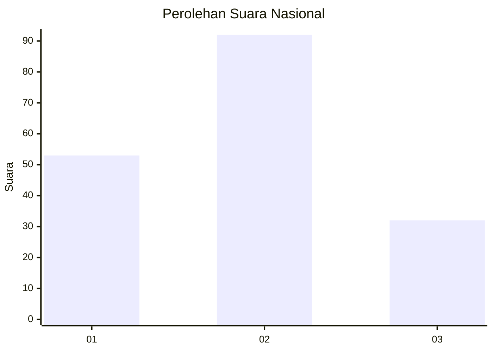
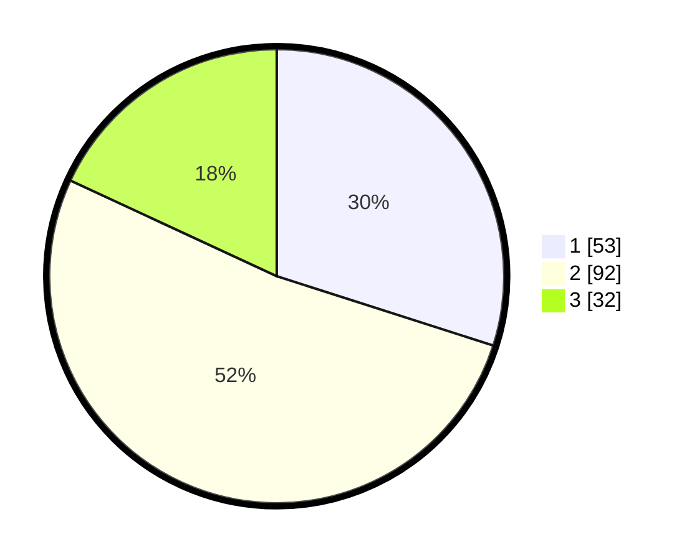

# Hasil

## Grafik

## Tabel

| No.    | Nama Paslon    | Suara | Suara (raw) | Persentase |
|:------ |:-------------- | -----:| -----------:| ----------:|
| 100025 | ANIES MUHAIMIN | 53    | [53][p-1]   | 29,94      |
| 100026 | PRABOWO GIBRAN | 92    | [92][p-2]   | 51,98      |
| 100027 | GANJAR MAHFUD  | 32    | [32][p-3]   | 18,08      |

[p-1]: https://github.com/gigit-pemilu/pemilu-2024/blob/main/pilpres/hitung-suara/sub/31-dki-jakarta/sub/75-jakarta-timur/sub/09-ciracas/sub/1003-kelapa-dua-wetan/sub/083-tps/sub/paslon-1.txt
[p-2]: https://github.com/gigit-pemilu/pemilu-2024/blob/main/pilpres/hitung-suara/sub/31-dki-jakarta/sub/75-jakarta-timur/sub/09-ciracas/sub/1003-kelapa-dua-wetan/sub/083-tps/sub/paslon-2.txt
[p-3]: https://github.com/gigit-pemilu/pemilu-2024/blob/main/pilpres/hitung-suara/sub/31-dki-jakarta/sub/75-jakarta-timur/sub/09-ciracas/sub/1003-kelapa-dua-wetan/sub/083-tps/sub/paslon-3.txt

## Foto C Plano

https://sirekap-obj-formc.kpu.go.id/5ec9/pemilu/ppwp/31/75/09/10/03/3175091003083-20240214-223621--1a28be25-bcc1-46ab-a4c6-36cbc41b5de7.jpg

https://sirekap-obj-formc.kpu.go.id/5ec9/pemilu/ppwp/31/75/09/10/03/3175091003083-20240214-222414--6cd51f9c-bac5-48f2-8f0c-63b0606e7e24.jpg

https://sirekap-obj-formc.kpu.go.id/5ec9/pemilu/ppwp/31/75/09/10/03/3175091003083-20240214-223718--7989da5c-ffcb-4165-b47e-419dd72f8ff6.jpg

## Metadata

| Key        | Value               |
| ---------- | ------------------- |
| Time Stamp | 2024-02-17 11:30:03 |

