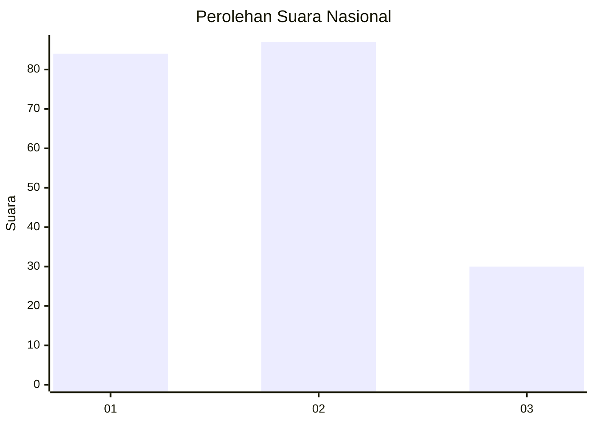
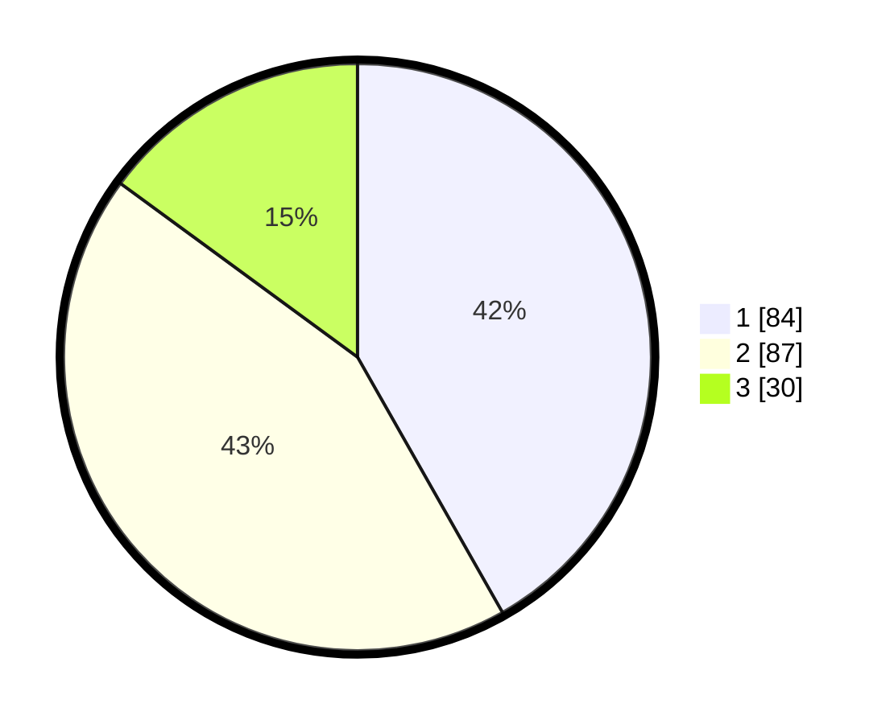

# Hasil

## Grafik

## Tabel

| No.    | Nama Paslon    | Suara | Suara (raw) | Persentase |
|:------ |:-------------- | -----:| -----------:| ----------:|
| 100025 | ANIES MUHAIMIN | 84    | [84][p-1]   | 41,79      |
| 100026 | PRABOWO GIBRAN | 87    | [87][p-2]   | 43,28      |
| 100027 | GANJAR MAHFUD  | 30    | [30][p-3]   | 14,93      |

[p-1]: https://github.com/gigit-pemilu/pemilu-2024/blob/main/pilpres/hitung-suara/sub/31-dki-jakarta/sub/75-jakarta-timur/sub/09-ciracas/sub/1003-kelapa-dua-wetan/sub/084-tps/sub/paslon-1.txt
[p-2]: https://github.com/gigit-pemilu/pemilu-2024/blob/main/pilpres/hitung-suara/sub/31-dki-jakarta/sub/75-jakarta-timur/sub/09-ciracas/sub/1003-kelapa-dua-wetan/sub/084-tps/sub/paslon-2.txt
[p-3]: https://github.com/gigit-pemilu/pemilu-2024/blob/main/pilpres/hitung-suara/sub/31-dki-jakarta/sub/75-jakarta-timur/sub/09-ciracas/sub/1003-kelapa-dua-wetan/sub/084-tps/sub/paslon-3.txt

## Foto C Plano

https://sirekap-obj-formc.kpu.go.id/56fa/pemilu/ppwp/31/75/09/10/03/3175091003084-20240214-222627--b74969c5-2279-4754-906a-100b706cf9d7.jpg

https://sirekap-obj-formc.kpu.go.id/56fa/pemilu/ppwp/31/75/09/10/03/3175091003084-20240214-235352--3ec32069-ffcb-445e-8035-395265952adb.jpg

https://sirekap-obj-formc.kpu.go.id/56fa/pemilu/ppwp/31/75/09/10/03/3175091003084-20240214-223105--ba61db23-1f8d-47d0-a947-461fca743bec.jpg

## Metadata

| Key        | Value               |
| ---------- | ------------------- |
| Time Stamp | 2024-02-24 22:31:28 |

