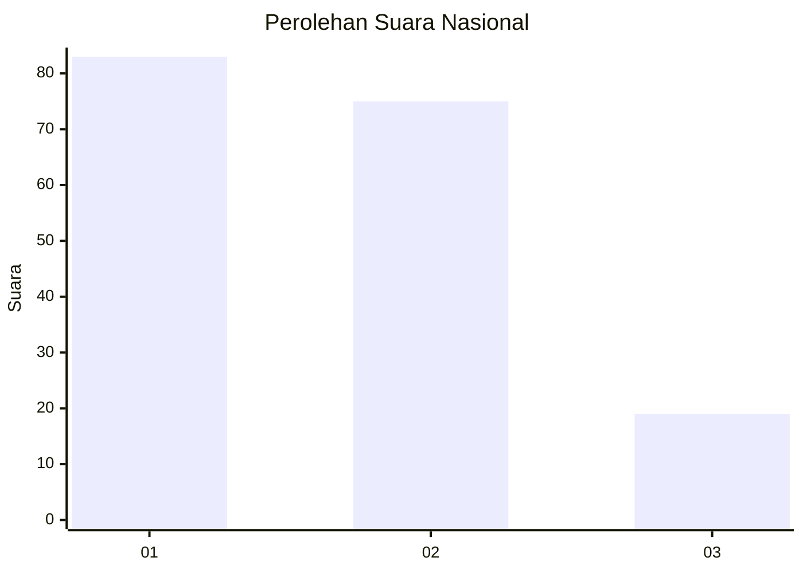
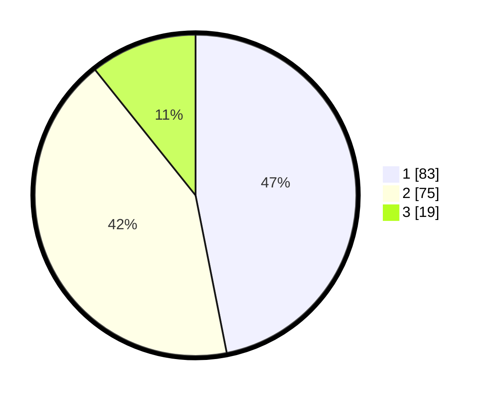

# Hasil

## Grafik

## Tabel

| No.    | Nama Paslon    | Suara | Suara (raw) | Persentase |
|:------ |:-------------- | -----:| -----------:| ----------:|
| 100025 | ANIES MUHAIMIN | 83    | [83][p-1]   | 46,89      |
| 100026 | PRABOWO GIBRAN | 75    | [75][p-2]   | 42,37      |
| 100027 | GANJAR MAHFUD  | 19    | [19][p-3]   | 10,73      |

[p-1]: https://github.com/gigit-pemilu/pemilu-2024/blob/main/pilpres/hitung-suara/sub/31-dki-jakarta/sub/75-jakarta-timur/sub/09-ciracas/sub/1003-kelapa-dua-wetan/sub/085-tps/sub/paslon-1.txt
[p-2]: https://github.com/gigit-pemilu/pemilu-2024/blob/main/pilpres/hitung-suara/sub/31-dki-jakarta/sub/75-jakarta-timur/sub/09-ciracas/sub/1003-kelapa-dua-wetan/sub/085-tps/sub/paslon-2.txt
[p-3]: https://github.com/gigit-pemilu/pemilu-2024/blob/main/pilpres/hitung-suara/sub/31-dki-jakarta/sub/75-jakarta-timur/sub/09-ciracas/sub/1003-kelapa-dua-wetan/sub/085-tps/sub/paslon-3.txt

## Foto C Plano

https://sirekap-obj-formc.kpu.go.id/6353/pemilu/ppwp/31/75/09/10/03/3175091003085-20240214-220211--15695bca-2571-406a-b650-a6e186f863a7.jpg

https://sirekap-obj-formc.kpu.go.id/6353/pemilu/ppwp/31/75/09/10/03/3175091003085-20240214-220706--354f2a15-b196-432e-857a-52444ba4fa69.jpg

https://sirekap-obj-formc.kpu.go.id/6353/pemilu/ppwp/31/75/09/10/03/3175091003085-20240214-220822--bdf92f0b-50c2-4216-b3d6-fd930585685e.jpg

## Metadata

| Key        | Value               |
| ---------- | ------------------- |
| Time Stamp | 2024-02-17 11:30:03 |

