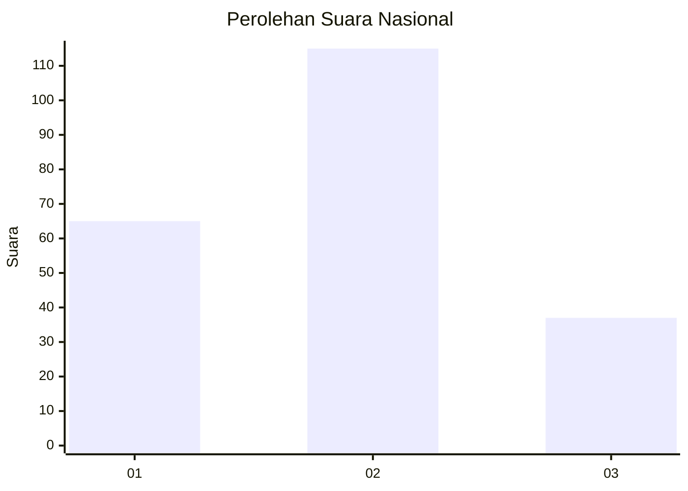
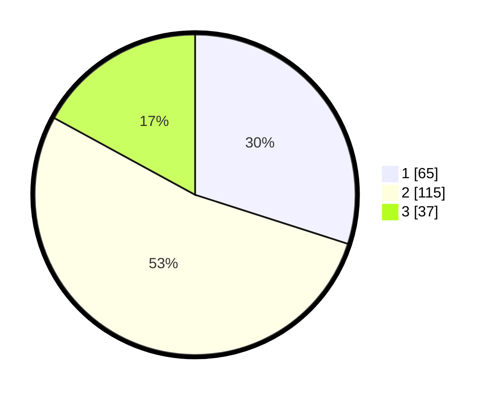

# Hasil

## Grafik

## Tabel

| No.    | Nama Paslon    | Suara | Suara (raw) | Persentase |
|:------ |:-------------- | -----:| -----------:| ----------:|
| 100025 | ANIES MUHAIMIN | 65    | [65][p-1]   | 29,95      |
| 100026 | PRABOWO GIBRAN | 115   | [115][p-2]  | 53,00      |
| 100027 | GANJAR MAHFUD  | 37    | [37][p-3]   | 17,05      |

[p-1]: https://github.com/gigit-pemilu/pemilu-2024/blob/main/pilpres/hitung-suara/sub/31-dki-jakarta/sub/75-jakarta-timur/sub/09-ciracas/sub/1003-kelapa-dua-wetan/sub/087-tps/sub/paslon-1.txt
[p-2]: https://github.com/gigit-pemilu/pemilu-2024/blob/main/pilpres/hitung-suara/sub/31-dki-jakarta/sub/75-jakarta-timur/sub/09-ciracas/sub/1003-kelapa-dua-wetan/sub/087-tps/sub/paslon-2.txt
[p-3]: https://github.com/gigit-pemilu/pemilu-2024/blob/main/pilpres/hitung-suara/sub/31-dki-jakarta/sub/75-jakarta-timur/sub/09-ciracas/sub/1003-kelapa-dua-wetan/sub/087-tps/sub/paslon-3.txt

## Foto C Plano

https://sirekap-obj-formc.kpu.go.id/13e2/pemilu/ppwp/31/75/09/10/03/3175091003087-20240214-202944--3233b9fb-cc78-43d9-af6b-6239c2bdbd93.jpg

https://sirekap-obj-formc.kpu.go.id/13e2/pemilu/ppwp/31/75/09/10/03/3175091003087-20240214-202947--1ce2e9a0-f56f-40e8-9d42-d865529a7b7a.jpg

https://sirekap-obj-formc.kpu.go.id/13e2/pemilu/ppwp/31/75/09/10/03/3175091003087-20240214-202950--78653583-d70b-4083-89dd-84f2b15c30f9.jpg

## Metadata

| Key        | Value               |
| ---------- | ------------------- |
| Time Stamp | 2024-02-26 12:00:00 |

