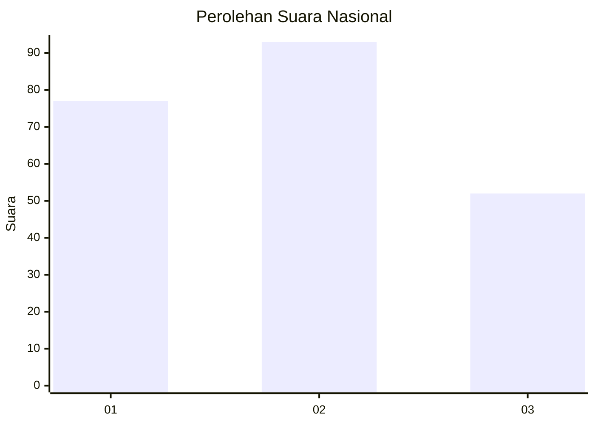
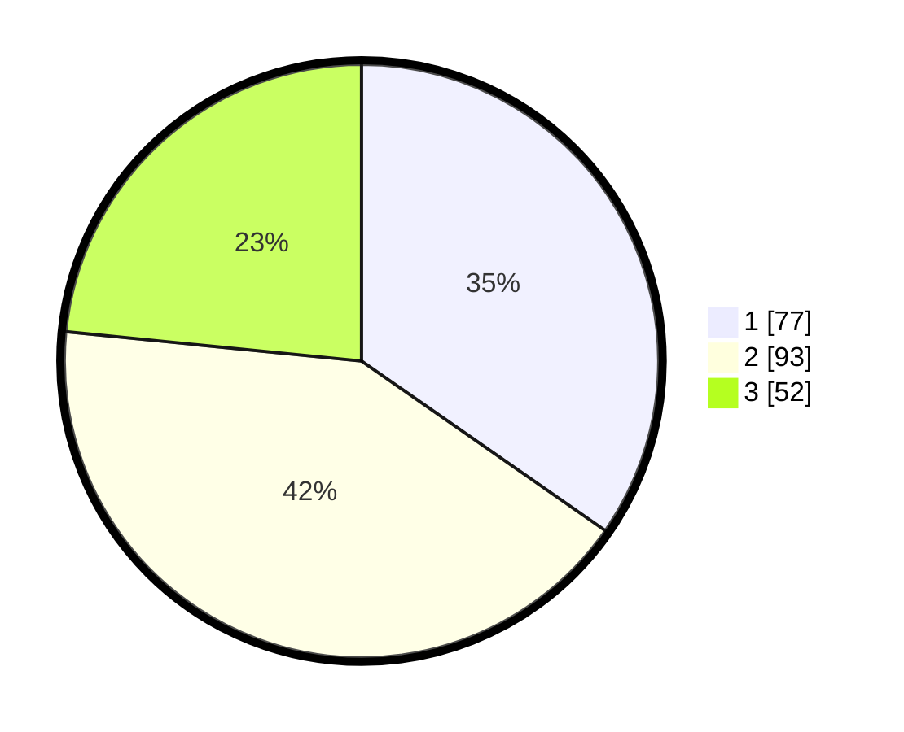

# Hasil

## Grafik

## Tabel

| No.    | Nama Paslon    | Suara | Suara (raw) | Persentase |
|:------ |:-------------- | -----:| -----------:| ----------:|
| 100025 | ANIES MUHAIMIN | 77    | [77][p-1]   | 34,68      |
| 100026 | PRABOWO GIBRAN | 93    | [93][p-2]   | 41,89      |
| 100027 | GANJAR MAHFUD  | 52    | [52][p-3]   | 23,42      |

[p-1]: https://github.com/gigit-pemilu/pemilu-2024/blob/main/pilpres/hitung-suara/sub/31-dki-jakarta/sub/75-jakarta-timur/sub/09-ciracas/sub/1004-susukan/sub/007-tps/sub/paslon-1.txt
[p-2]: https://github.com/gigit-pemilu/pemilu-2024/blob/main/pilpres/hitung-suara/sub/31-dki-jakarta/sub/75-jakarta-timur/sub/09-ciracas/sub/1004-susukan/sub/007-tps/sub/paslon-2.txt
[p-3]: https://github.com/gigit-pemilu/pemilu-2024/blob/main/pilpres/hitung-suara/sub/31-dki-jakarta/sub/75-jakarta-timur/sub/09-ciracas/sub/1004-susukan/sub/007-tps/sub/paslon-3.txt

## Foto C Plano

https://sirekap-obj-formc.kpu.go.id/0b3f/pemilu/ppwp/31/75/09/10/04/3175091004007-20240214-191349--d60e347a-b617-4707-902a-6245c9bde627.jpg

https://sirekap-obj-formc.kpu.go.id/0b3f/pemilu/ppwp/31/75/09/10/04/3175091004007-20240214-191448--b98e3050-dda0-4c20-bd14-c1a66d30be21.jpg

https://sirekap-obj-formc.kpu.go.id/0b3f/pemilu/ppwp/31/75/09/10/04/3175091004007-20240214-191615--2b6103be-00f1-4e2f-b1c4-451b300c3f10.jpg

## Metadata

| Key        | Value               |
| ---------- | ------------------- |
| Time Stamp | 2024-02-20 15:00:00 |

