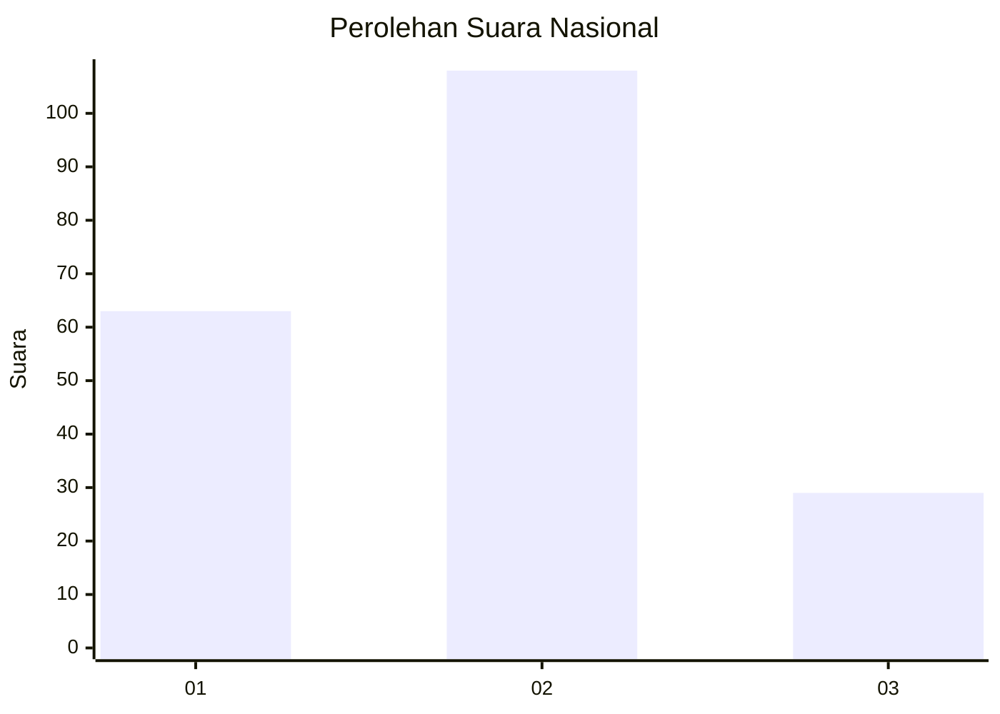
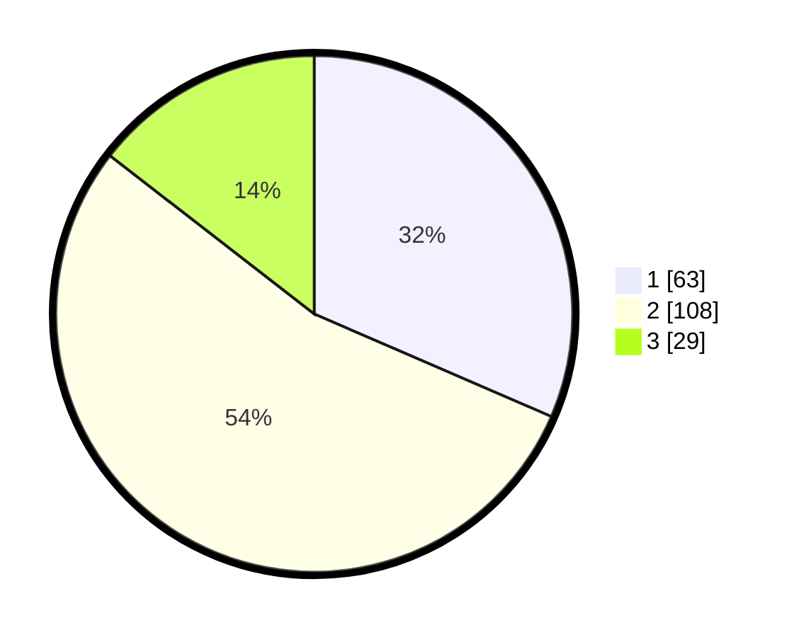

# Hasil

## Grafik

## Tabel

| No.    | Nama Paslon    | Suara | Suara (raw) | Persentase |
|:------ |:-------------- | -----:| -----------:| ----------:|
| 100025 | ANIES MUHAIMIN | 63    | [63][p-1]   | 31,50      |
| 100026 | PRABOWO GIBRAN | 108   | [108][p-2]  | 54,00      |
| 100027 | GANJAR MAHFUD  | 29    | [29][p-3]   | 14,50      |

[p-1]: https://github.com/gigit-pemilu/pemilu-2024/blob/main/pilpres/hitung-suara/sub/31-dki-jakarta/sub/75-jakarta-timur/sub/09-ciracas/sub/1004-susukan/sub/046-tps/sub/paslon-1.txt
[p-2]: https://github.com/gigit-pemilu/pemilu-2024/blob/main/pilpres/hitung-suara/sub/31-dki-jakarta/sub/75-jakarta-timur/sub/09-ciracas/sub/1004-susukan/sub/046-tps/sub/paslon-2.txt
[p-3]: https://github.com/gigit-pemilu/pemilu-2024/blob/main/pilpres/hitung-suara/sub/31-dki-jakarta/sub/75-jakarta-timur/sub/09-ciracas/sub/1004-susukan/sub/046-tps/sub/paslon-3.txt

## Foto C Plano

https://sirekap-obj-formc.kpu.go.id/93fc/pemilu/ppwp/31/75/09/10/04/3175091004046-20240214-202228--eec53b45-e9d3-42e1-ad48-6592ccd3333a.jpg

https://sirekap-obj-formc.kpu.go.id/93fc/pemilu/ppwp/31/75/09/10/04/3175091004046-20240214-185454--4d7879ab-17db-4eff-a146-3a0441325f63.jpg

https://sirekap-obj-formc.kpu.go.id/93fc/pemilu/ppwp/31/75/09/10/04/3175091004046-20240214-195524--d425539a-c546-4c16-9dc2-fd5a4662a4a5.jpg

## Metadata

| Key        | Value               |
| ---------- | ------------------- |
| Time Stamp | 2024-02-24 22:31:28 |

