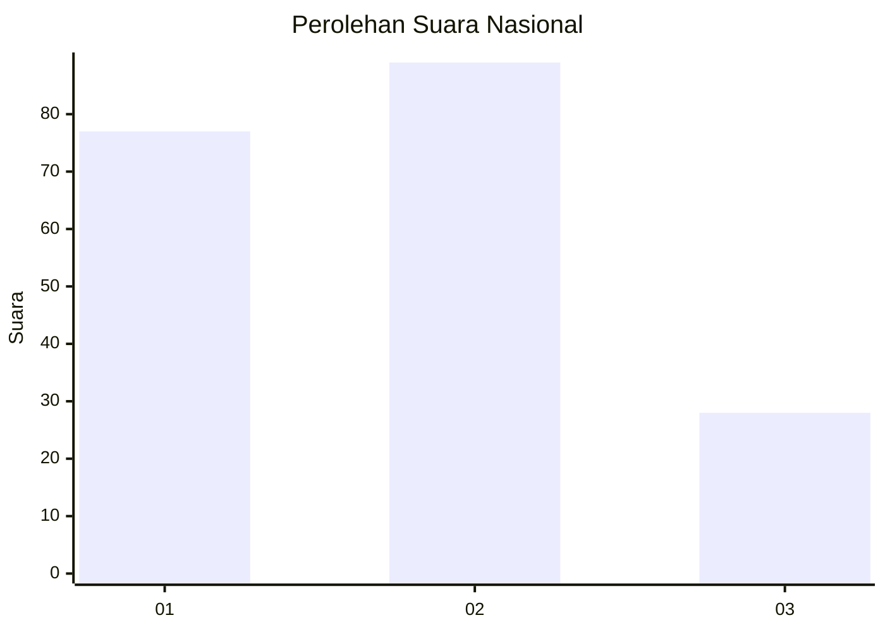
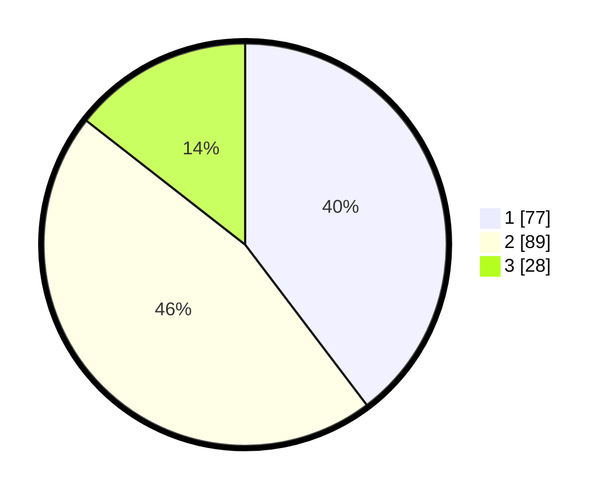

# Hasil

## Grafik

## Tabel

| No.    | Nama Paslon    | Suara | Suara (raw) | Persentase |
|:------ |:-------------- | -----:| -----------:| ----------:|
| 100025 | ANIES MUHAIMIN | 77    | [77][p-1]   | 39,69      |
| 100026 | PRABOWO GIBRAN | 89    | [89][p-2]   | 45,88      |
| 100027 | GANJAR MAHFUD  | 28    | [28][p-3]   | 14,43      |

[p-1]: https://github.com/gigit-pemilu/pemilu-2024/blob/main/pilpres/hitung-suara/sub/31-dki-jakarta/sub/75-jakarta-timur/sub/09-ciracas/sub/1004-susukan/sub/051-tps/sub/paslon-1.txt
[p-2]: https://github.com/gigit-pemilu/pemilu-2024/blob/main/pilpres/hitung-suara/sub/31-dki-jakarta/sub/75-jakarta-timur/sub/09-ciracas/sub/1004-susukan/sub/051-tps/sub/paslon-2.txt
[p-3]: https://github.com/gigit-pemilu/pemilu-2024/blob/main/pilpres/hitung-suara/sub/31-dki-jakarta/sub/75-jakarta-timur/sub/09-ciracas/sub/1004-susukan/sub/051-tps/sub/paslon-3.txt

## Foto C Plano

https://sirekap-obj-formc.kpu.go.id/0767/pemilu/ppwp/31/75/09/10/04/3175091004051-20240214-214755--5b6113bd-fb11-4e62-b8a0-f89835b72296.jpg

https://sirekap-obj-formc.kpu.go.id/0767/pemilu/ppwp/31/75/09/10/04/3175091004051-20240214-215230--b2d3f57e-f35b-4289-8fcc-507d407e9269.jpg

https://sirekap-obj-formc.kpu.go.id/0767/pemilu/ppwp/31/75/09/10/04/3175091004051-20240214-231838--4992b1f8-3a23-4d35-9277-10644c0a918b.jpg

## Metadata

| Key        | Value               |
| ---------- | ------------------- |
| Time Stamp | 2024-02-20 15:00:00 |

