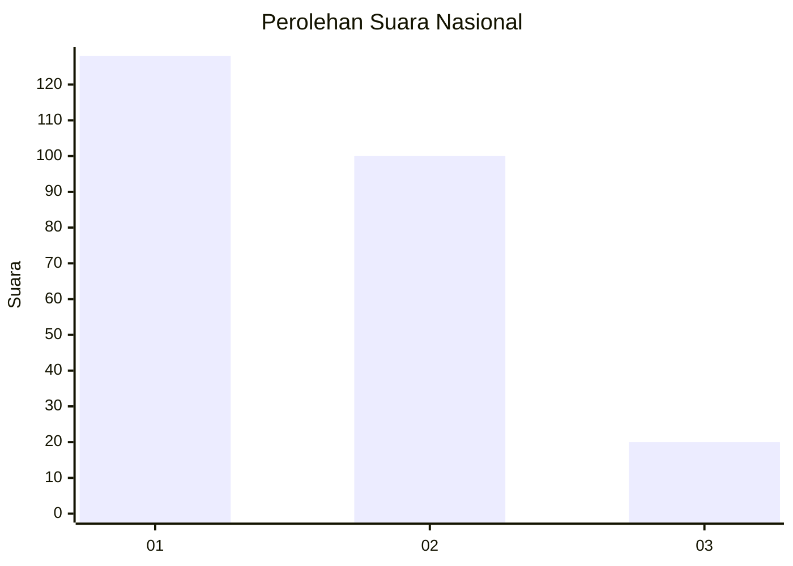
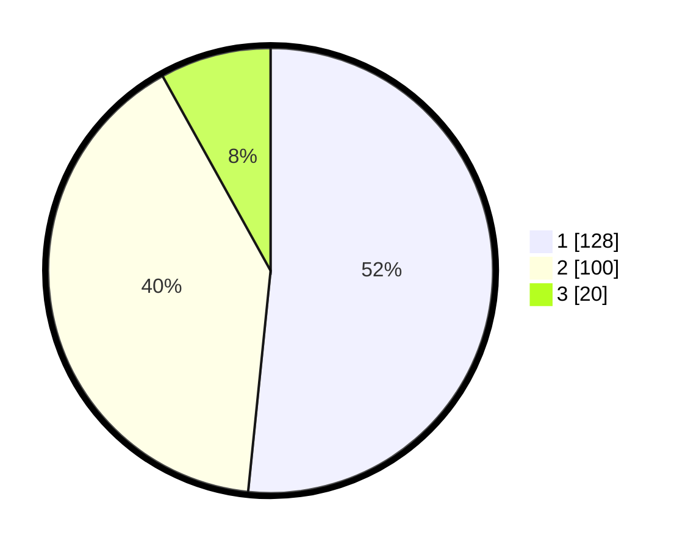

# Hasil

## Grafik

## Tabel

| No.    | Nama Paslon    | Suara | Suara (raw) | Persentase |
|:------ |:-------------- | -----:| -----------:| ----------:|
| 100025 | ANIES MUHAIMIN | 128   | [128][p-1]  | 51,61      |
| 100026 | PRABOWO GIBRAN | 100   | [100][p-2]  | 40,32      |
| 100027 | GANJAR MAHFUD  | 20    | [20][p-3]   | 8,06       |

[p-1]: https://github.com/gigit-pemilu/pemilu-2024/blob/main/pilpres/hitung-suara/sub/31-dki-jakarta/sub/75-jakarta-timur/sub/09-ciracas/sub/1004-susukan/sub/055-tps/sub/paslon-1.txt
[p-2]: https://github.com/gigit-pemilu/pemilu-2024/blob/main/pilpres/hitung-suara/sub/31-dki-jakarta/sub/75-jakarta-timur/sub/09-ciracas/sub/1004-susukan/sub/055-tps/sub/paslon-2.txt
[p-3]: https://github.com/gigit-pemilu/pemilu-2024/blob/main/pilpres/hitung-suara/sub/31-dki-jakarta/sub/75-jakarta-timur/sub/09-ciracas/sub/1004-susukan/sub/055-tps/sub/paslon-3.txt

## Foto C Plano

https://sirekap-obj-formc.kpu.go.id/32bc/pemilu/ppwp/31/75/09/10/04/3175091004055-20240214-233241--78ab6e4f-611e-45d9-88df-916a9a434019.jpg

https://sirekap-obj-formc.kpu.go.id/32bc/pemilu/ppwp/31/75/09/10/04/3175091004055-20240214-233452--b034a905-d256-4680-b4da-b21992333f0d.jpg

https://sirekap-obj-formc.kpu.go.id/32bc/pemilu/ppwp/31/75/09/10/04/3175091004055-20240214-233544--bfa42f5b-969d-4a30-9807-7c14e1c9a8eb.jpg

## Metadata

| Key        | Value               |
| ---------- | ------------------- |
| Time Stamp | 2024-02-20 15:00:00 |

