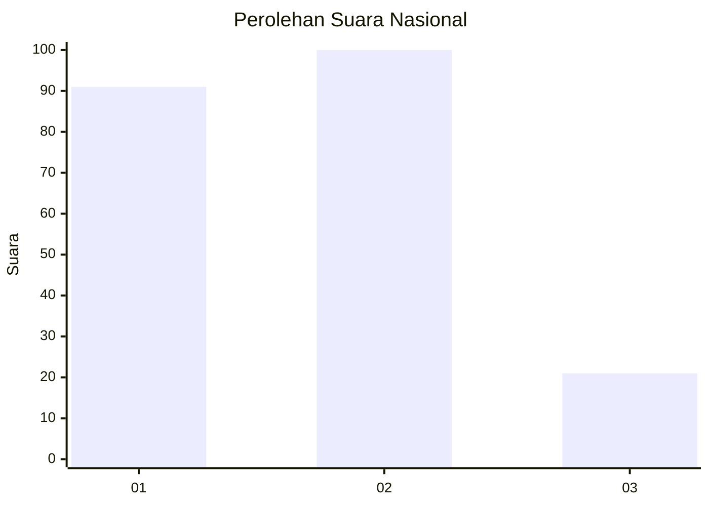
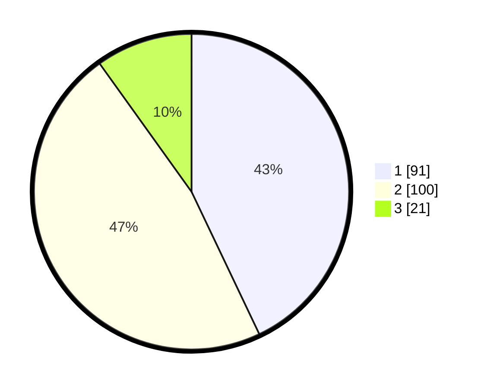

# Hasil

## Grafik

## Tabel

| No.    | Nama Paslon    | Suara | Suara (raw) | Persentase |
|:------ |:-------------- | -----:| -----------:| ----------:|
| 100025 | ANIES MUHAIMIN | 91    | [91][p-1]   | 42,92      |
| 100026 | PRABOWO GIBRAN | 100   | [100][p-2]  | 47,17      |
| 100027 | GANJAR MAHFUD  | 21    | [21][p-3]   | 9,91       |

[p-1]: https://github.com/gigit-pemilu/pemilu-2024/blob/main/pilpres/hitung-suara/sub/31-dki-jakarta/sub/75-jakarta-timur/sub/09-ciracas/sub/1004-susukan/sub/058-tps/sub/paslon-1.txt
[p-2]: https://github.com/gigit-pemilu/pemilu-2024/blob/main/pilpres/hitung-suara/sub/31-dki-jakarta/sub/75-jakarta-timur/sub/09-ciracas/sub/1004-susukan/sub/058-tps/sub/paslon-2.txt
[p-3]: https://github.com/gigit-pemilu/pemilu-2024/blob/main/pilpres/hitung-suara/sub/31-dki-jakarta/sub/75-jakarta-timur/sub/09-ciracas/sub/1004-susukan/sub/058-tps/sub/paslon-3.txt

## Foto C Plano

https://sirekap-obj-formc.kpu.go.id/96cb/pemilu/ppwp/31/75/09/10/04/3175091004058-20240214-223325--f7e1b8ee-e5d1-4f50-83fb-fe08650c812f.jpg

https://sirekap-obj-formc.kpu.go.id/96cb/pemilu/ppwp/31/75/09/10/04/3175091004058-20240214-223525--253ce5bd-71d3-42de-8351-6c9cff4ba0f5.jpg

https://sirekap-obj-formc.kpu.go.id/96cb/pemilu/ppwp/31/75/09/10/04/3175091004058-20240214-223658--234bffc4-45b2-422a-8ad2-dae9b5cb3947.jpg

## Metadata

| Key        | Value               |
| ---------- | ------------------- |
| Time Stamp | 2024-02-24 22:31:28 |

