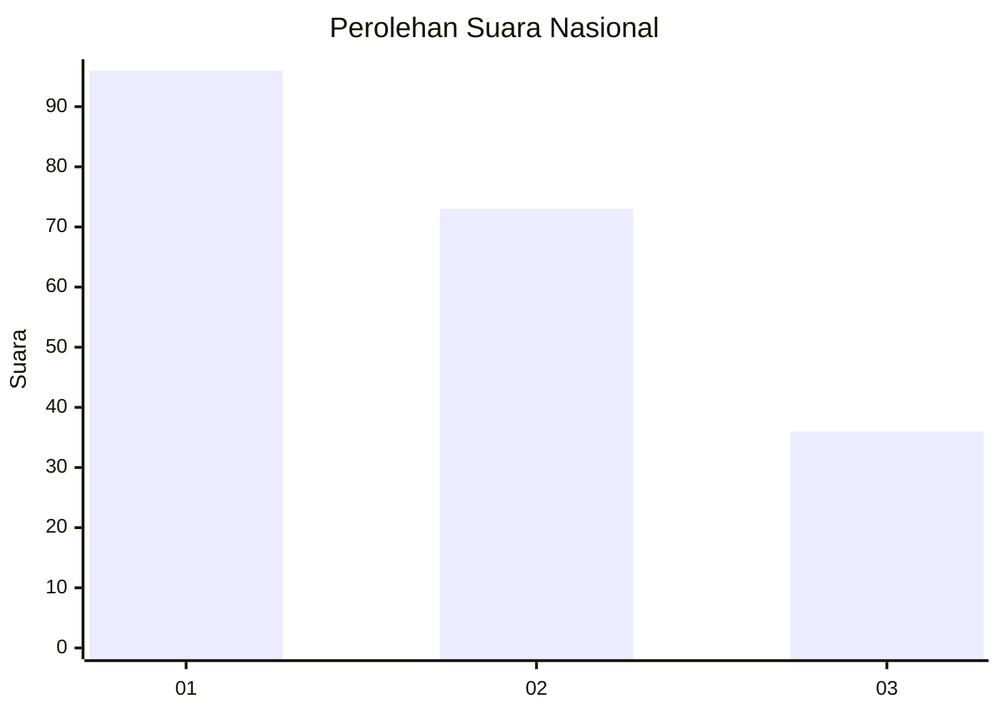
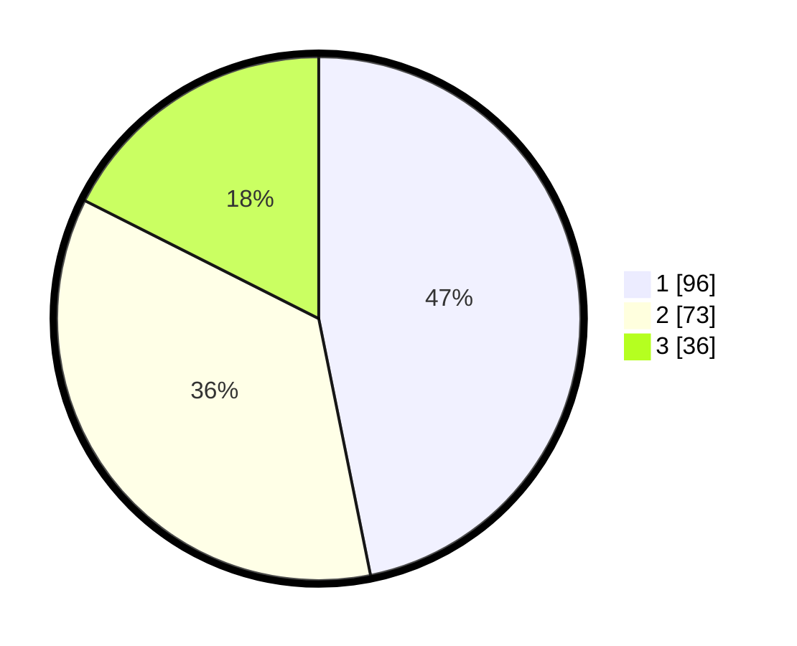

# Hasil

## Grafik

## Tabel

| No.    | Nama Paslon    | Suara | Suara (raw) | Persentase |
|:------ |:-------------- | -----:| -----------:| ----------:|
| 100025 | ANIES MUHAIMIN | 96    | [96][p-1]   | 46,83      |
| 100026 | PRABOWO GIBRAN | 73    | [73][p-2]   | 35,61      |
| 100027 | GANJAR MAHFUD  | 36    | [36][p-3]   | 17,56      |

[p-1]: https://github.com/gigit-pemilu/pemilu-2024/blob/main/pilpres/hitung-suara/sub/31-dki-jakarta/sub/75-jakarta-timur/sub/09-ciracas/sub/1004-susukan/sub/072-tps/sub/paslon-1.txt
[p-2]: https://github.com/gigit-pemilu/pemilu-2024/blob/main/pilpres/hitung-suara/sub/31-dki-jakarta/sub/75-jakarta-timur/sub/09-ciracas/sub/1004-susukan/sub/072-tps/sub/paslon-2.txt
[p-3]: https://github.com/gigit-pemilu/pemilu-2024/blob/main/pilpres/hitung-suara/sub/31-dki-jakarta/sub/75-jakarta-timur/sub/09-ciracas/sub/1004-susukan/sub/072-tps/sub/paslon-3.txt

## Foto C Plano

https://sirekap-obj-formc.kpu.go.id/8ee1/pemilu/ppwp/31/75/09/10/04/3175091004072-20240214-193357--415f2ac8-aa67-4c82-8ef0-8d89657542dc.jpg

https://sirekap-obj-formc.kpu.go.id/8ee1/pemilu/ppwp/31/75/09/10/04/3175091004072-20240214-200452--07328bed-1bf2-4ec3-adff-88ebde9c1a2e.jpg

https://sirekap-obj-formc.kpu.go.id/8ee1/pemilu/ppwp/31/75/09/10/04/3175091004072-20240214-200605--79fba44b-4918-4b80-b49a-0a7701c90f1d.jpg

## Metadata

| Key        | Value               |
| ---------- | ------------------- |
| Time Stamp | 2024-02-15 00:41:44 |

