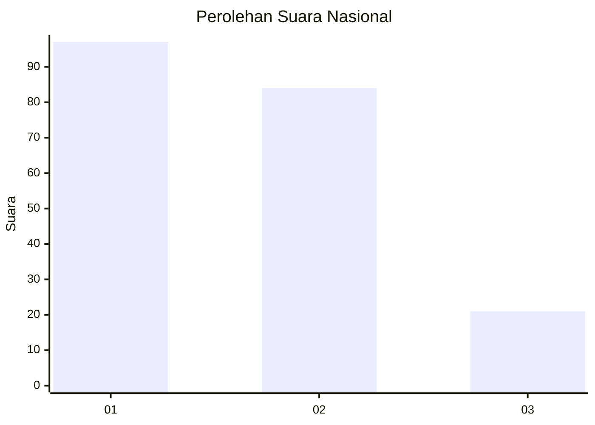
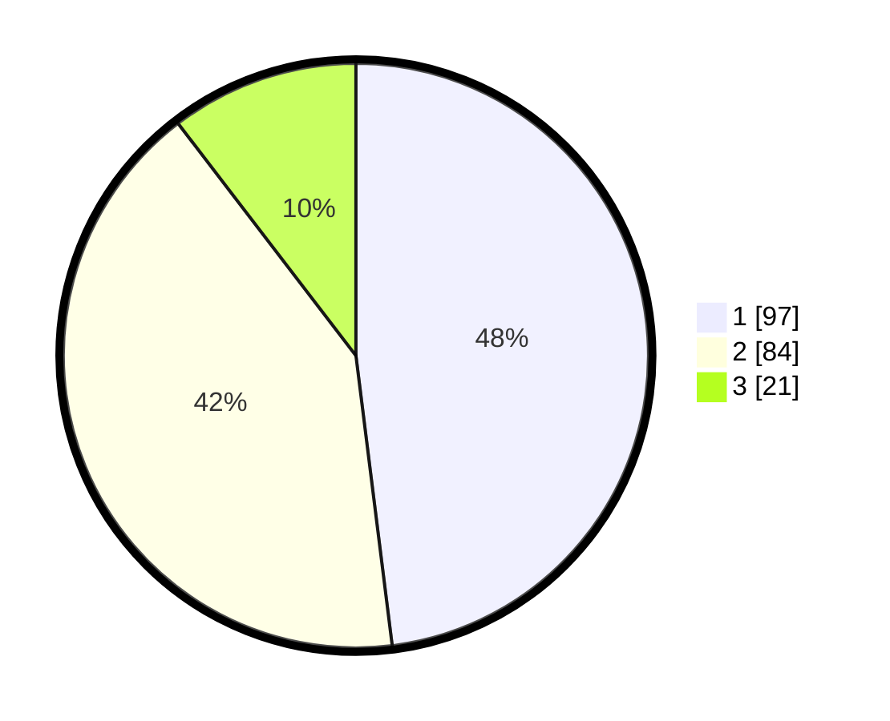

# Hasil

## Grafik

## Tabel

| No.    | Nama Paslon    | Suara | Suara (raw) | Persentase |
|:------ |:-------------- | -----:| -----------:| ----------:|
| 100025 | ANIES MUHAIMIN | 97    | [97][p-1]   | 48,02      |
| 100026 | PRABOWO GIBRAN | 84    | [84][p-2]   | 41,58      |
| 100027 | GANJAR MAHFUD  | 21    | [21][p-3]   | 10,40      |

[p-1]: https://github.com/gigit-pemilu/pemilu-2024/blob/main/pilpres/hitung-suara/sub/31-dki-jakarta/sub/75-jakarta-timur/sub/09-ciracas/sub/1004-susukan/sub/074-tps/sub/paslon-1.txt
[p-2]: https://github.com/gigit-pemilu/pemilu-2024/blob/main/pilpres/hitung-suara/sub/31-dki-jakarta/sub/75-jakarta-timur/sub/09-ciracas/sub/1004-susukan/sub/074-tps/sub/paslon-2.txt
[p-3]: https://github.com/gigit-pemilu/pemilu-2024/blob/main/pilpres/hitung-suara/sub/31-dki-jakarta/sub/75-jakarta-timur/sub/09-ciracas/sub/1004-susukan/sub/074-tps/sub/paslon-3.txt

## Foto C Plano

https://sirekap-obj-formc.kpu.go.id/1a55/pemilu/ppwp/31/75/09/10/04/3175091004074-20240214-200810--793f11e5-efd3-4c00-8ccc-fe9d5796f3bd.jpg

https://sirekap-obj-formc.kpu.go.id/1a55/pemilu/ppwp/31/75/09/10/04/3175091004074-20240214-195548--5a58f4f4-73bc-483c-b358-e3ee2d29ef93.jpg

https://sirekap-obj-formc.kpu.go.id/1a55/pemilu/ppwp/31/75/09/10/04/3175091004074-20240214-195718--01510c24-3db0-472f-bccf-6561fcb55119.jpg

## Metadata

| Key        | Value               |
| ---------- | ------------------- |
| Time Stamp | 2024-02-20 15:00:00 |

