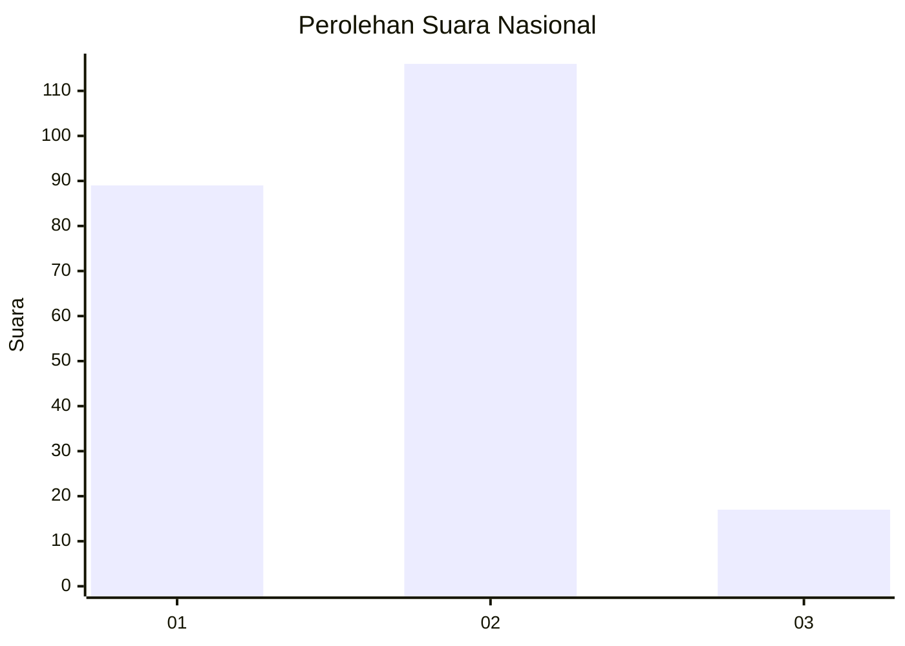
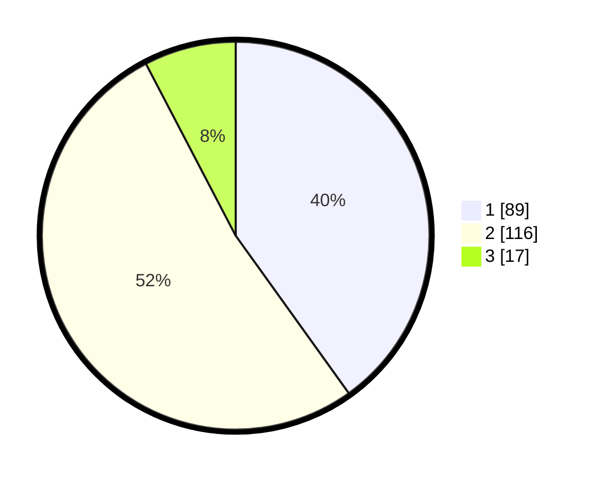

# Hasil

## Grafik

## Tabel

| No.    | Nama Paslon    | Suara | Suara (raw) | Persentase |
|:------ |:-------------- | -----:| -----------:| ----------:|
| 100025 | ANIES MUHAIMIN | 89    | [89][p-1]   | 40,09      |
| 100026 | PRABOWO GIBRAN | 116   | [116][p-2]  | 52,25      |
| 100027 | GANJAR MAHFUD  | 17    | [17][p-3]   | 7,66       |

[p-1]: https://github.com/gigit-pemilu/pemilu-2024/blob/main/pilpres/hitung-suara/sub/31-dki-jakarta/sub/75-jakarta-timur/sub/09-ciracas/sub/1004-susukan/sub/079-tps/sub/paslon-1.txt
[p-2]: https://github.com/gigit-pemilu/pemilu-2024/blob/main/pilpres/hitung-suara/sub/31-dki-jakarta/sub/75-jakarta-timur/sub/09-ciracas/sub/1004-susukan/sub/079-tps/sub/paslon-2.txt
[p-3]: https://github.com/gigit-pemilu/pemilu-2024/blob/main/pilpres/hitung-suara/sub/31-dki-jakarta/sub/75-jakarta-timur/sub/09-ciracas/sub/1004-susukan/sub/079-tps/sub/paslon-3.txt

## Foto C Plano

https://sirekap-obj-formc.kpu.go.id/2bc6/pemilu/ppwp/31/75/09/10/04/3175091004079-20240214-192236--edb07200-3e9b-408a-9e2a-6c7bdac48c75.jpg

https://sirekap-obj-formc.kpu.go.id/2bc6/pemilu/ppwp/31/75/09/10/04/3175091004079-20240214-192402--e163e673-48de-453e-ae45-42638ac8e69b.jpg

https://sirekap-obj-formc.kpu.go.id/2bc6/pemilu/ppwp/31/75/09/10/04/3175091004079-20240214-192506--93a03c5c-ba33-4520-abd9-7d3a5037f05e.jpg

## Metadata

| Key        | Value               |
| ---------- | ------------------- |
| Time Stamp | 2024-02-14 21:46:01 |

