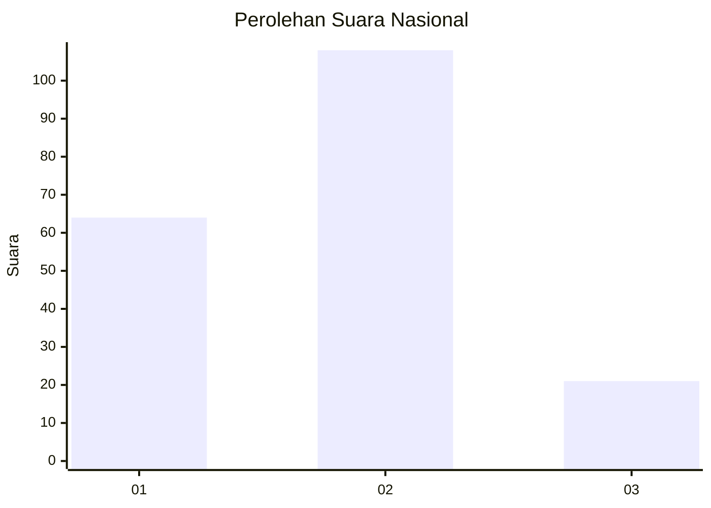
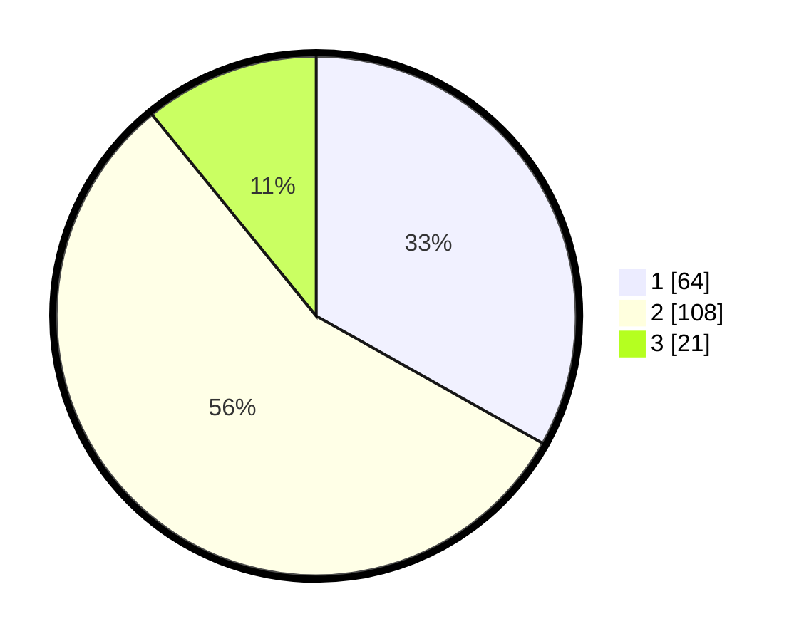

# Hasil

## Grafik

## Tabel

| No.    | Nama Paslon    | Suara | Suara (raw) | Persentase |
|:------ |:-------------- | -----:| -----------:| ----------:|
| 100025 | ANIES MUHAIMIN | 64    | [64][p-1]   | 33,16      |
| 100026 | PRABOWO GIBRAN | 108   | [108][p-2]  | 55,96      |
| 100027 | GANJAR MAHFUD  | 21    | [21][p-3]   | 10,88      |

[p-1]: https://github.com/gigit-pemilu/pemilu-2024/blob/main/pilpres/hitung-suara/sub/31-dki-jakarta/sub/75-jakarta-timur/sub/09-ciracas/sub/1004-susukan/sub/096-tps/sub/paslon-1.txt
[p-2]: https://github.com/gigit-pemilu/pemilu-2024/blob/main/pilpres/hitung-suara/sub/31-dki-jakarta/sub/75-jakarta-timur/sub/09-ciracas/sub/1004-susukan/sub/096-tps/sub/paslon-2.txt
[p-3]: https://github.com/gigit-pemilu/pemilu-2024/blob/main/pilpres/hitung-suara/sub/31-dki-jakarta/sub/75-jakarta-timur/sub/09-ciracas/sub/1004-susukan/sub/096-tps/sub/paslon-3.txt

## Foto C Plano

https://sirekap-obj-formc.kpu.go.id/bce9/pemilu/ppwp/31/75/09/10/04/3175091004096-20240215-022222--45fd0521-a9e7-4999-882a-7f7eb98b991c.jpg

https://sirekap-obj-formc.kpu.go.id/bce9/pemilu/ppwp/31/75/09/10/04/3175091004096-20240214-224640--c02fb843-223d-403a-9b99-f2c2995e74b1.jpg

https://sirekap-obj-formc.kpu.go.id/bce9/pemilu/ppwp/31/75/09/10/04/3175091004096-20240214-223456--175aadf4-19ea-44d0-ba42-d586285932b6.jpg

## Metadata

| Key        | Value               |
| ---------- | ------------------- |
| Time Stamp | 2024-02-24 22:31:28 |

