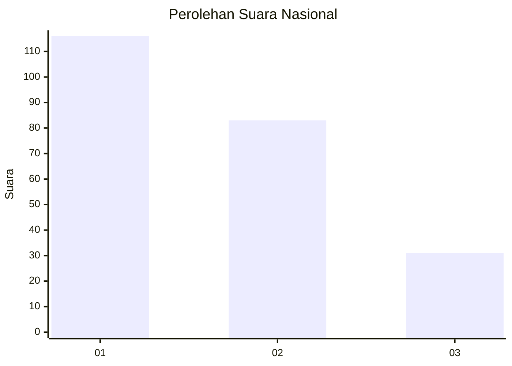
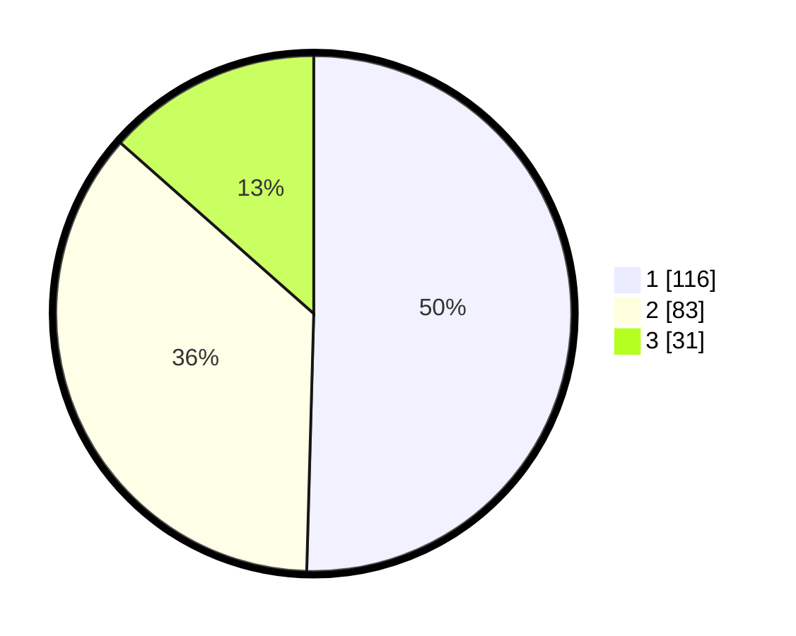

# Hasil

## Grafik

## Tabel

| No.    | Nama Paslon    | Suara | Suara (raw) | Persentase |
|:------ |:-------------- | -----:| -----------:| ----------:|
| 100025 | ANIES MUHAIMIN | 116   | [116][p-1]  | 50,43      |
| 100026 | PRABOWO GIBRAN | 83    | [83][p-2]   | 36,09      |
| 100027 | GANJAR MAHFUD  | 31    | [31][p-3]   | 13,48      |

[p-1]: https://github.com/gigit-pemilu/pemilu-2024/blob/main/pilpres/hitung-suara/sub/31-dki-jakarta/sub/75-jakarta-timur/sub/09-ciracas/sub/1004-susukan/sub/102-tps/sub/paslon-1.txt
[p-2]: https://github.com/gigit-pemilu/pemilu-2024/blob/main/pilpres/hitung-suara/sub/31-dki-jakarta/sub/75-jakarta-timur/sub/09-ciracas/sub/1004-susukan/sub/102-tps/sub/paslon-2.txt
[p-3]: https://github.com/gigit-pemilu/pemilu-2024/blob/main/pilpres/hitung-suara/sub/31-dki-jakarta/sub/75-jakarta-timur/sub/09-ciracas/sub/1004-susukan/sub/102-tps/sub/paslon-3.txt

## Foto C Plano

https://sirekap-obj-formc.kpu.go.id/7b30/pemilu/ppwp/31/75/09/10/04/3175091004102-20240214-200451--0405d431-3976-48f5-a9e2-399ccc27e1aa.jpg

https://sirekap-obj-formc.kpu.go.id/7b30/pemilu/ppwp/31/75/09/10/04/3175091004102-20240214-200627--d2638c26-fe92-4fd7-9719-286c39ce9474.jpg

https://sirekap-obj-formc.kpu.go.id/7b30/pemilu/ppwp/31/75/09/10/04/3175091004102-20240214-200738--b23cd471-c14e-4276-99c2-462b4924882c.jpg

## Metadata

| Key        | Value               |
| ---------- | ------------------- |
| Time Stamp | 2024-02-24 22:31:28 |

