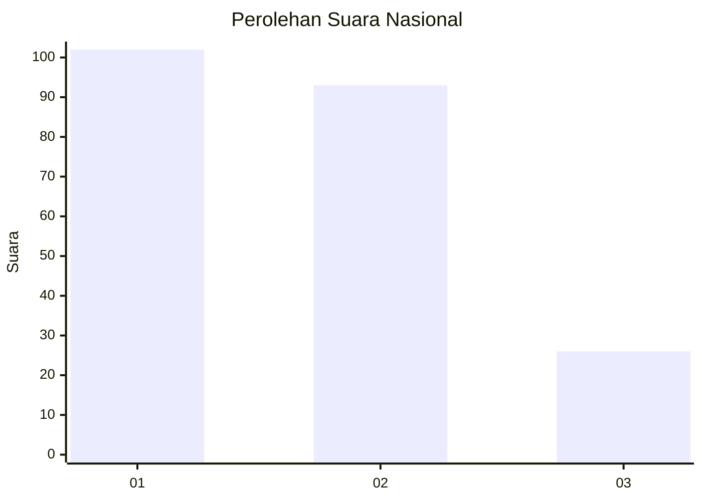
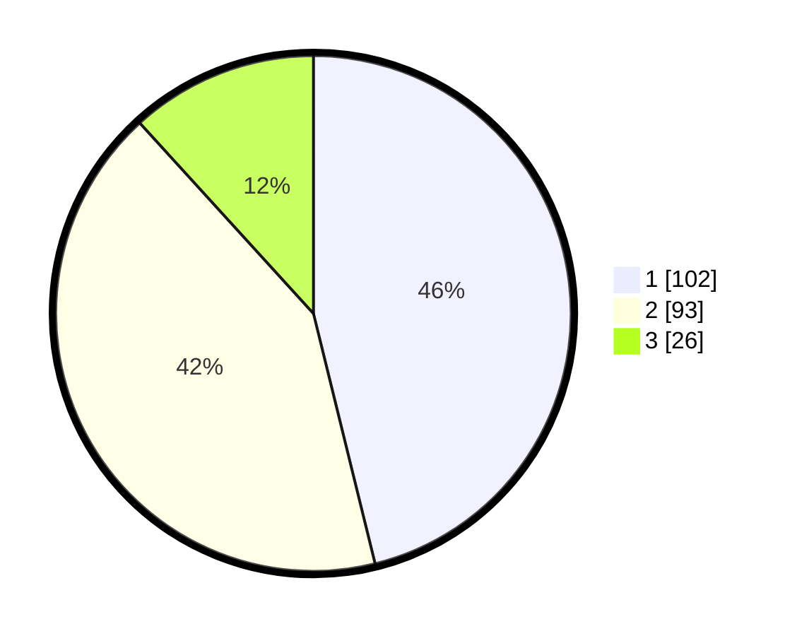

# Hasil

## Grafik

## Tabel

| No.    | Nama Paslon    | Suara | Suara (raw) | Persentase |
|:------ |:-------------- | -----:| -----------:| ----------:|
| 100025 | ANIES MUHAIMIN | 102   | [102][p-1]  | 46,15      |
| 100026 | PRABOWO GIBRAN | 93    | [93][p-2]   | 42,08      |
| 100027 | GANJAR MAHFUD  | 26    | [26][p-3]   | 11,76      |

[p-1]: https://github.com/gigit-pemilu/pemilu-2024/blob/main/pilpres/hitung-suara/sub/31-dki-jakarta/sub/75-jakarta-timur/sub/09-ciracas/sub/1004-susukan/sub/110-tps/sub/paslon-1.txt
[p-2]: https://github.com/gigit-pemilu/pemilu-2024/blob/main/pilpres/hitung-suara/sub/31-dki-jakarta/sub/75-jakarta-timur/sub/09-ciracas/sub/1004-susukan/sub/110-tps/sub/paslon-2.txt
[p-3]: https://github.com/gigit-pemilu/pemilu-2024/blob/main/pilpres/hitung-suara/sub/31-dki-jakarta/sub/75-jakarta-timur/sub/09-ciracas/sub/1004-susukan/sub/110-tps/sub/paslon-3.txt

## Foto C Plano

https://sirekap-obj-formc.kpu.go.id/66dc/pemilu/ppwp/31/75/09/10/04/3175091004110-20240214-204759--d547bb6d-6e90-46c9-89f9-971a1e1f956c.jpg

https://sirekap-obj-formc.kpu.go.id/66dc/pemilu/ppwp/31/75/09/10/04/3175091004110-20240214-204949--56779f6e-e766-4795-bbc4-025005cb5a6a.jpg

https://sirekap-obj-formc.kpu.go.id/66dc/pemilu/ppwp/31/75/09/10/04/3175091004110-20240214-205221--bdc230ce-ca63-461f-9251-c1c024273ce9.jpg

## Metadata

| Key        | Value               |
| ---------- | ------------------- |
| Time Stamp | 2024-02-20 15:00:00 |

