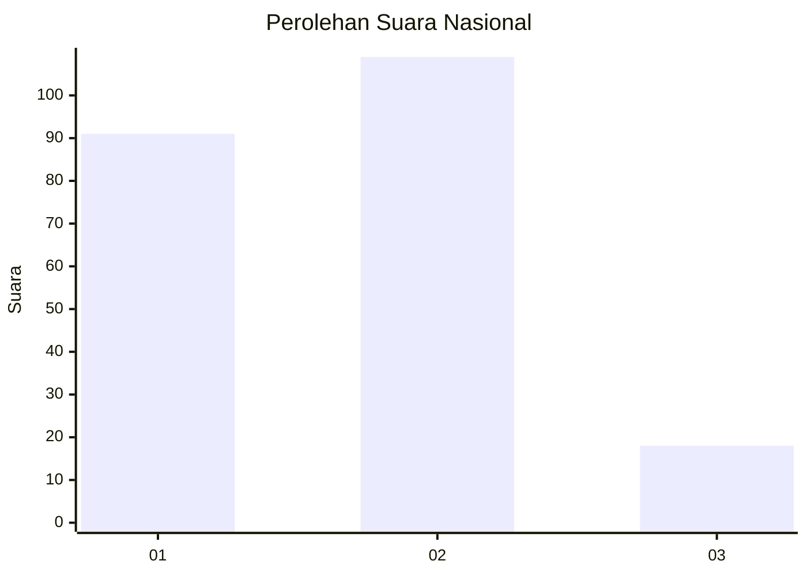
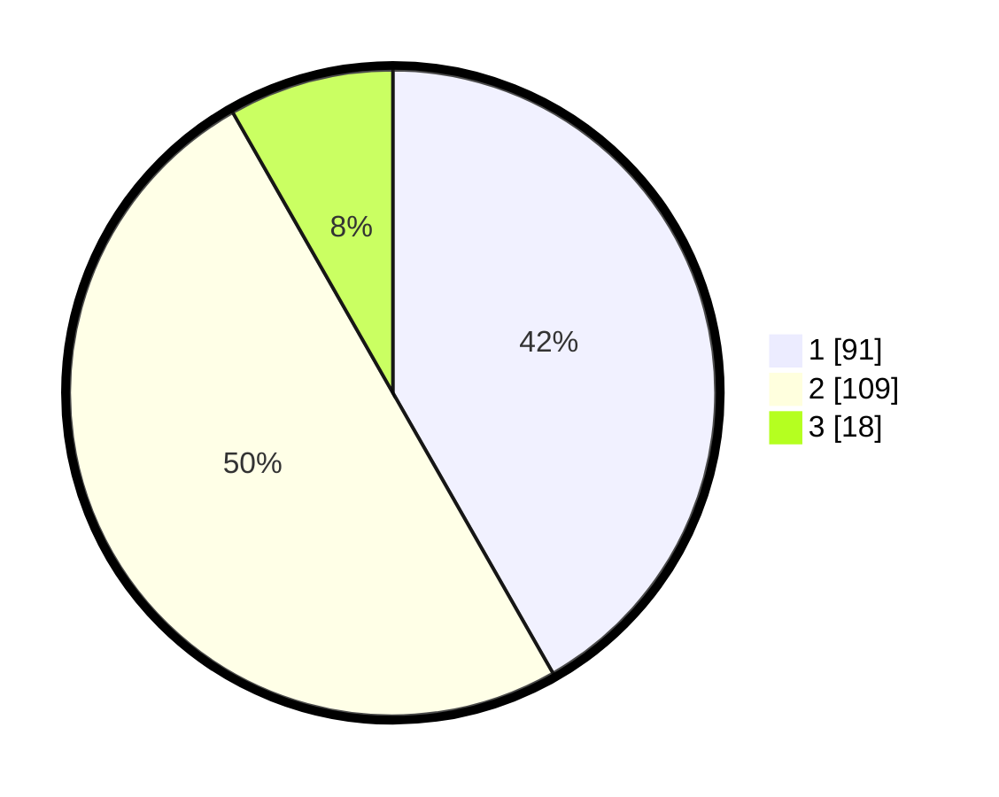

# Hasil

## Grafik

## Tabel

| No.    | Nama Paslon    | Suara | Suara (raw) | Persentase |
|:------ |:-------------- | -----:| -----------:| ----------:|
| 100025 | ANIES MUHAIMIN | 91    | [91][p-1]   | 41,74      |
| 100026 | PRABOWO GIBRAN | 109   | [109][p-2]  | 50,00      |
| 100027 | GANJAR MAHFUD  | 18    | [18][p-3]   | 8,26       |

[p-1]: https://github.com/gigit-pemilu/pemilu-2024/blob/main/pilpres/hitung-suara/sub/31-dki-jakarta/sub/75-jakarta-timur/sub/09-ciracas/sub/1004-susukan/sub/111-tps/sub/paslon-1.txt
[p-2]: https://github.com/gigit-pemilu/pemilu-2024/blob/main/pilpres/hitung-suara/sub/31-dki-jakarta/sub/75-jakarta-timur/sub/09-ciracas/sub/1004-susukan/sub/111-tps/sub/paslon-2.txt
[p-3]: https://github.com/gigit-pemilu/pemilu-2024/blob/main/pilpres/hitung-suara/sub/31-dki-jakarta/sub/75-jakarta-timur/sub/09-ciracas/sub/1004-susukan/sub/111-tps/sub/paslon-3.txt

## Foto C Plano

https://sirekap-obj-formc.kpu.go.id/bd93/pemilu/ppwp/31/75/09/10/04/3175091004111-20240214-220834--77b44971-d906-481a-8217-84e3cbf8529b.jpg

https://sirekap-obj-formc.kpu.go.id/bd93/pemilu/ppwp/31/75/09/10/04/3175091004111-20240214-220832--bfb63281-8639-4cb9-9ffa-9ffb000538ef.jpg

https://sirekap-obj-formc.kpu.go.id/bd93/pemilu/ppwp/31/75/09/10/04/3175091004111-20240214-220829--224a58ac-21e9-481a-b501-4df820883504.jpg

## Metadata

| Key        | Value               |
| ---------- | ------------------- |
| Time Stamp | 2024-02-20 15:00:00 |

