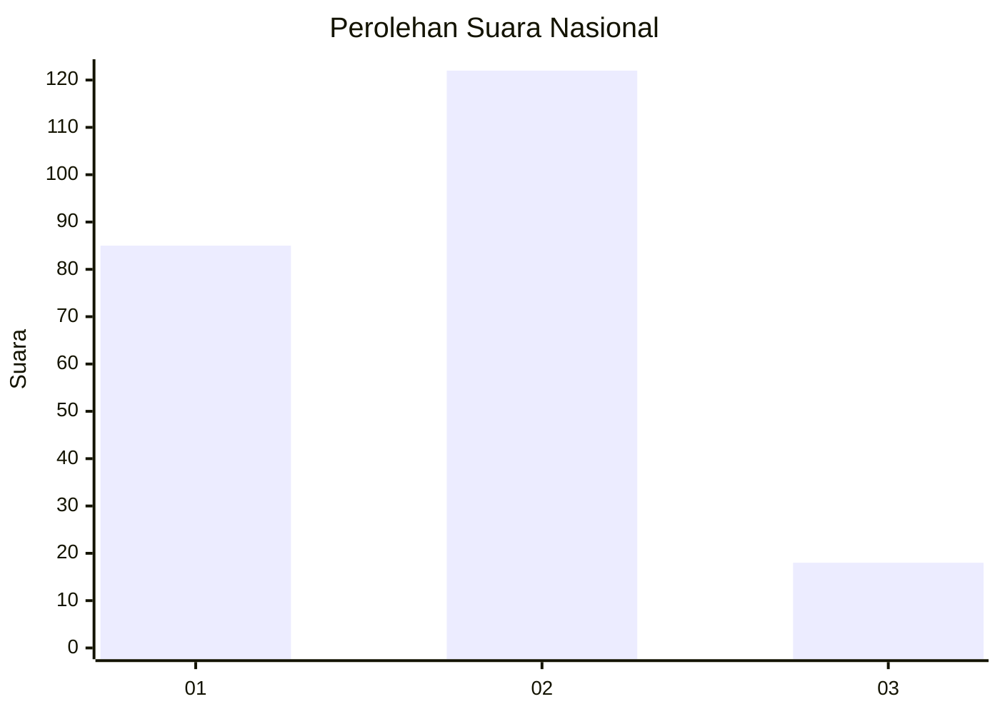

# Hasil

## Grafik

## Tabel

| No.    | Nama Paslon    | Suara | Suara (raw) | Persentase |
|:------ |:-------------- | -----:| -----------:| ----------:|
| 100025 | ANIES MUHAIMIN | 85    | [85][p-1]   | 37,78      |
| 100026 | PRABOWO GIBRAN | 122   | [122][p-2]  | 54,22      |
| 100027 | GANJAR MAHFUD  | 18    | [18][p-3]   | 8,00       |

[p-1]: https://github.com/gigit-pemilu/pemilu-2024/blob/main/pilpres/hitung-suara/sub/31-dki-jakarta/sub/75-jakarta-timur/sub/09-ciracas/sub/1004-susukan/sub/114-tps/sub/paslon-1.txt
[p-2]: https://github.com/gigit-pemilu/pemilu-2024/blob/main/pilpres/hitung-suara/sub/31-dki-jakarta/sub/75-jakarta-timur/sub/09-ciracas/sub/1004-susukan/sub/114-tps/sub/paslon-2.txt
[p-3]: https://github.com/gigit-pemilu/pemilu-2024/blob/main/pilpres/hitung-suara/sub/31-dki-jakarta/sub/75-jakarta-timur/sub/09-ciracas/sub/1004-susukan/sub/114-tps/sub/paslon-3.txt

## Foto C Plano

https://sirekap-obj-formc.kpu.go.id/03f4/pemilu/ppwp/31/75/09/10/04/3175091004114-20240214-214933--fcd02fa2-f6ab-4eb9-845e-de5a2015674e.jpg

https://sirekap-obj-formc.kpu.go.id/03f4/pemilu/ppwp/31/75/09/10/04/3175091004114-20240214-215018--f6555295-ce30-4326-a8b6-122cf6914aba.jpg

https://sirekap-obj-formc.kpu.go.id/03f4/pemilu/ppwp/31/75/09/10/04/3175091004114-20240214-195143--0e81c350-ef3d-4b74-a52d-1e7041343cdc.jpg

## Metadata

| Key        | Value               |
| ---------- | ------------------- |
| Time Stamp | 2024-02-20 15:00:00 |

