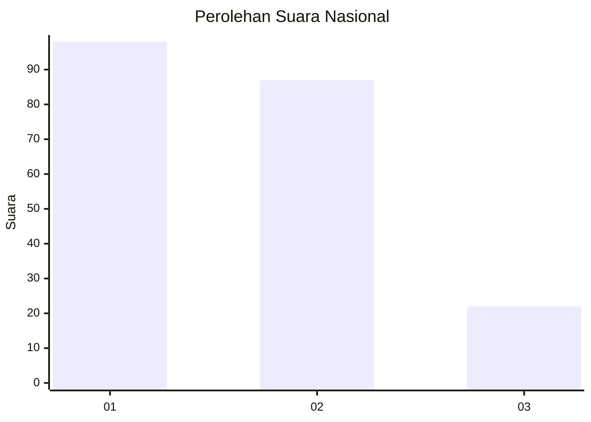
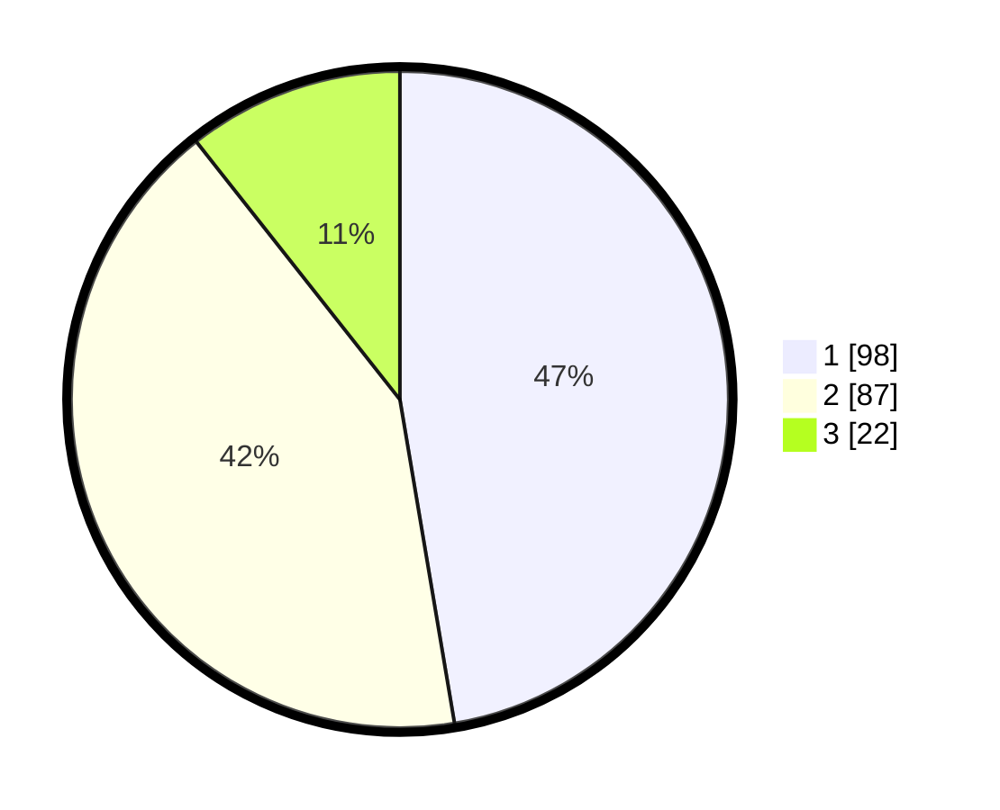

# Hasil

## Grafik

## Tabel

| No.    | Nama Paslon    | Suara | Suara (raw) | Persentase |
|:------ |:-------------- | -----:| -----------:| ----------:|
| 100025 | ANIES MUHAIMIN | 98    | [98][p-1]   | 47,34      |
| 100026 | PRABOWO GIBRAN | 87    | [87][p-2]   | 42,03      |
| 100027 | GANJAR MAHFUD  | 22    | [22][p-3]   | 10,63      |

[p-1]: https://github.com/gigit-pemilu/pemilu-2024/blob/main/pilpres/hitung-suara/sub/31-dki-jakarta/sub/75-jakarta-timur/sub/09-ciracas/sub/1005-rambutan/sub/093-tps/sub/paslon-1.txt
[p-2]: https://github.com/gigit-pemilu/pemilu-2024/blob/main/pilpres/hitung-suara/sub/31-dki-jakarta/sub/75-jakarta-timur/sub/09-ciracas/sub/1005-rambutan/sub/093-tps/sub/paslon-2.txt
[p-3]: https://github.com/gigit-pemilu/pemilu-2024/blob/main/pilpres/hitung-suara/sub/31-dki-jakarta/sub/75-jakarta-timur/sub/09-ciracas/sub/1005-rambutan/sub/093-tps/sub/paslon-3.txt

## Foto C Plano

https://sirekap-obj-formc.kpu.go.id/4c6e/pemilu/ppwp/31/75/09/10/05/3175091005093-20240214-213025--9e20bc81-9bad-4aa2-9c2d-2fb3ab099b53.jpg

https://sirekap-obj-formc.kpu.go.id/4c6e/pemilu/ppwp/31/75/09/10/05/3175091005093-20240214-213140--63b505da-0af1-42ec-88ad-0a8db4e84a6c.jpg

https://sirekap-obj-formc.kpu.go.id/4c6e/pemilu/ppwp/31/75/09/10/05/3175091005093-20240214-213227--51ea7694-8666-4ac2-8ce4-761c7e7f8458.jpg

## Metadata

| Key        | Value               |
| ---------- | ------------------- |
| Time Stamp | 2024-02-24 22:31:28 |

